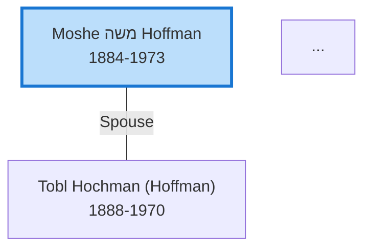

# מפרט מפורט - אתר היסטוריה משפחתית

**גרסה**: 3.3  
**תאריך**: נובמבר 26, 2025  
**סטטוס**: מימוש פעיל

**עדכון אחרון**: Backend Refactoring - ארכיטקטורה מודולרית מלאה (11 modules, OOP design, ~800 → 203 lines in doit.py)

---

## 1. סקירה כללית

### 1.1 מטרת הפרויקט
אתר סטטי לתיעוד והצגת היסטוריה משפחתית, מבוסס על נתוני GEDCOM, עם ביוגרפיות מפורטות, תמונות ומסמכים היסטוריים.

### 1.2 עקרונות מרכזיים
- **אתר סטטי**: ללא שרת backend, ללא database
- **ממשק אנגלי**: כל ה-GUI באנגלית בלבד
- **תוכן רב-לשוני**: תוכן בעברית/אנגלית לפי המקור
- **פשטות**: ללא תכונות מורכבות מיותרות (ללא מערכת תגובות)
- **קריאות**: עיצוב נקי ומקצועי, דומה לספר

---

## 2. ארכיטקטורה טכנית

### 2.1 טכנולוגיות

**Frontend**:
- **Static Site Generator**: Quartz 4.5.2
- **Framework**: React + TypeScript + SCSS
- **Diagrams**: Mermaid.js
- **Custom Components**: 
  - ProfileTabs v2.0 (21 TypeScript modules, 147KB bundle)
  - NavBar, ArticleTitle, PageTitle, Footer

**Backend (Build System)**:
- **Language**: Python 3.8+
- **Main Script**: `doit.py` (203 lines, orchestrator)
- **Architecture**: Modular OOP design (11 modules)
  - `gedcom/` - GEDCOM parsing (2 modules)
  - `generators/` - Content generators (5 modules)
  - `utils/` - Utilities (4 modules)
- **Logging**: Advanced colored logging with progress tracking

**Data Sources**:
- **Primary**: GEDCOM file (`data/tree.ged`) - 546 individuals, families
- **Biographies**: Markdown files in `bios/{ID}/` directories
- **Media**: Images & documents in `documents/{ID}/` directories
- **Static Pages**: Markdown files in `content/` directory

**Build Tools**:
- **Python**: `scripts/doit.py` - Main site generation
- **Node.js**: `ProfileTabs/build-bundle.js` - Component bundling
- **Quartz**: `npx quartz build` - Static site compilation

**Generated Outputs**:
- 546 profile pages (`site/content/profiles/*.md`)
- Media index (`site/quartz/static/media-index.json`)
- Chapters index (`site/quartz/static/chapters-index.json`)
- Family data (`site/quartz/static/family-data.json`)
- Static HTML/CSS/JS (`site/public/`)

### 2.2 תהליך בנייה

```
┌─────────────┐
│ tree.ged    │ (GEDCOM data)
└──────┬──────┘
       │
       v
┌─────────────┐
│  doit.py    │ (Python script)
└──────┬──────┘
       │
       ├──> Parses GEDCOM
       ├──> Generates Markdown profiles
       ├──> Creates family diagrams
       ├──> Copies bios/ to site/content/
       ├──> Copies images to site/content/
       ├──> Creates media-index.json
       └──> Copies documents/ to site/quartz/static/documents/
       │
       v
┌─────────────┐
│site/content/│ (Generated Markdown)
└──────┬──────┘
       │
       v
┌─────────────┐
│Quartz Build │ (npx quartz build)
└──────┬──────┘
       │
       v
┌─────────────┐
│site/public/ │ (Static HTML/CSS/JS)
└─────────────┘
```

#### 2.2.1 ארכיטקטורה מודולרית (Refactored 2024)

`doit.py` הוא orchestrator מרכזי (203 שורות) שמשתמש במודולים נפרדים:

**מבנה מודולים**:
```
scripts/
├── doit.py                 # Main orchestrator (203 lines)
├── config.py              # Configuration & constants
├── gedcom/               # GEDCOM parsing
│   ├── parser.py         # Read .ged files
│   └── normalizer.py     # Normalize data structures
├── generators/           # Content generators
│   ├── profile_generator.py    # Profile pages (579 lines, OOP)
│   ├── mermaid_builder.py      # Family diagrams
│   ├── media_handler.py        # Gallery system
│   ├── chapters_handler.py     # Biography chapters
│   └── index_generators.py     # Index pages
└── utils/                # Utilities
    ├── logger.py         # Advanced logging system
    ├── file_utils.py     # File operations
    ├── link_converter.py # HTML link generation
    └── place_mappings.py # Place → Wikipedia mapping
```

**Command-line Arguments**:
- `gedcom_file` - Path to .ged file (required)
- `--clean` - Clean all generated files only
- `-o, --output` - Output directory (default: `site/content/profiles`)
- `--bios-dir` - Biography directory (default: `bios`)
- `--src-content-dir` - Source content (default: `content`)
- `--analyze-places` - Analyze unique places in GEDCOM
- `--debug` - Enable debug logging
- `--quiet` - Minimal output (warnings/errors only)
- `--log-file PATH` - Write log to file

#### 2.2.2 שלבי `doit.py` (מפורט)

1. **Clean**: מחיקת כל הקבצים הקודמים
   - קריאה ל-`clean_project()` מ-`index_generators.py`
   - מחיקת directories: `site/content/`, `site/public/`, `.quartz-cache/`
   - מחיקת files: `family-data.json`, `media-index.json`, `documents/`, `chapters/`
   - רץ **תמיד** לפני כל build (למניעת קבצים ישנים)

2. **Parse GEDCOM**: קריאת `tree.ged`
   - שימוש ב-`gedcom.parser.parse_gedcom_file()`
   - פרסור level-based: זיהוי records (INDI, FAM) ו-tags (BIRT, DEAT, NAME, etc.)
   - **פלט**: 2 dictionaries
     - `individuals`: `{"@I123@": {...}, "@I456@": {...}}`
     - `families`: `{"@F1@": {...}, "@F2@": {...}}`

3. **Copy Source Content**: העתקת תוכן סטטי
   - `copy_source_content()` מ-`index_generators.py`
   - מעתיק: `content/index.md` → `site/content/index.md`
   - מעתיק: `content/pages/*.md` → `site/content/pages/*.md`

4. **Generate Profiles**: יצירת דפי פרופיל (546 profiles)
   - יצירת instance: `ProfileGenerator(individuals, families, bios_dir)`
   - **Slug Mapping** (טיפול בשמות כפולים):
     - זיהוי שמות כפולים (e.g., "Leah Hoffman" מופיע 3 פעמים)
     - יצירת slugs ייחודיים עם suffixes:
       1. **Spouse name**: `Leah-Hoffman-Nate` (בעל/אישה ראשונים)
       2. **Parent name**: `Leah-Hoffman-Hymie` (שם הורה ראשון)
       3. **Birth year**: `Leah-Hoffman-1920`
       4. **ID**: `Leah-Hoffman-I123` (מוצא אחרון)
     - תיקון collisions נותרים (אם יש)
   - **יצירת תוכן לכל profile**:
     - Frontmatter: `type: profile`, `title`, `ID`
     - Profile info box: HTML `<dl class="profile-info-list">` עם CSS Grid
     - קישורים: HTML `<a>` tags (לא Markdown wikilinks!)
     - 3 דיאגרמות Mermaid: Immediate Family, Ancestors, Descendants
   - **פלט**: `site/content/profiles/{slug}.md` (546 קבצים)
   - **Return**: `id_to_slug` dictionary למיפוי ID → slug

5. **Create Media Index**: מערכת גלריה עם cross-tagging
   - `MediaIndexHandler.create_media_index()`
   - סריקת `documents/{ID}/` directories
   - קריאת caption files (`.md` עם אותו שם כתמונה)
   - זיהוי תיוגים בשני formats:
     - **חדש (preferred)**: `[Name|ID]` - שומר שם מקורי מהתמונה
     - **Legacy**: `I12345` - משתמש בשם מלא מ-GEDCOM
   - המרת IDs → HTML links אוטומטית
   - **Cross-tagging**: תמונה ב-`documents/I10/` עם תיוג `[Bruce|I20]` תופיע גם ב-gallery של I20
   - **פלט**: `site/quartz/static/media-index.json`

6. **Create Chapters Index**: אינדקס פרקי ביוגרפיה
   - `ChaptersIndexHandler.create_chapters_index()`
   - סריקת `bios/{ID}/` directories
   - זיהוי:
     - `{ID}.md` - Introduction (פרק ראשון)
     - `##-chapter_name.md` - פרקים נוספים (e.g., `01-in_russia.md`)
   - **פלט**: `site/quartz/static/chapters-index.json`
   - **פלט נוסף**: העתקת `.md` files → `site/quartz/static/chapters/{ID}/`

7. **Generate Index Pages**: דפי ניווט
   - `write_people_index()` → `pages/all-profiles.md` (כל 546 הפרופילים)
   - `write_bios_index()` → `pages/profiles-of-interest.md` (רק פרופילים עם ביוגרפיות)
   - `write_gallery_index()` → `pages/gallery.md` (רשימת פרופילים עם תמונות)

8. **Copy Documents**: העתקת מדיה
   - העתקה: `documents/` → `site/quartz/static/documents/`
   - שמירת מבנה directories: `documents/I10/*.jpg` → `static/documents/I10/*.jpg`

9. **Copy Images**: העתקת תמונות מביוגרפיות
   - סריקת `bios/{ID}/*.png`, `bios/{ID}/*.jpg`
   - העתקה: `bios/I10/img_savran.png` → `site/content/img_savran.png`
   - תמיכה ברווחים ומקפים בשמות קבצים (עותק כפול לתאימות)

10. **Generate Family Data**: JSON לעץ משפחתי גדול (עתידי)
    - `write_family_data_json()` → `site/quartz/static/family-data.json`
    - מכיל: כל ה-individuals + families במבנה JSON
    - **סטטוס**: נוצר אך לא בשימוש כרגע (עתידי - עץ משפחתי אינטראקטיבי גדול)

---

## 3. מבנה קבצים

```
V4/
├── data/
│   ├── tree.ged                    # GEDCOM source file
│   ├── tree.ged.backup             # Backups
│   └── tree.ged.backup2
│
├── bios/                           # Extended biographies (Markdown)
│   ├── I11052340/                  # Moshe Hoffman's biography
│   │   ├── I11052340.md            # Introduction
│   │   ├── 01-in_russia.md        # Chapter 1
│   │   ├── 02-savran_progrom.md   # Chapter 2
│   │   ├── img_savran_ukraine.png # Images
│   │   └── ...
│   ├── I11032861/                  # Hyam Yudl's biography
│   │   ├── I11032861.md            # Introduction
│   │   ├── 01-background.md       # Chapter 1
│   │   └── ...
│   └── ...
│
├── documents/                      # Media files for profiles
│   └── I10/                        # Moshe Hoffman's media
│       ├── Tubble & Moishe 1957.jpg
│       └── Tubble & Moishe 1957.md # Caption/description
│
├── content/                        # Static pages (NOT generated)
│   ├── index.md                    # Homepage
│   └── pages/
│       └── about.md                # About page
│
├── site/                           # Quartz site
│   ├── content/                    # Generated content (DO NOT EDIT)
│   │   ├── index.md                # Copied from content/
│   │   ├── pages/                  # Copied from content/pages/
│   │   │   ├── about.md
│   │   │   ├── all-profiles.md     # Generated by doit.py
│   │   │   └── profiles-of-interest.md  # Generated by doit.py
│   │   └── profiles/               # Generated by doit.py
│   │       ├── Moshe משה Hoffman.md
│   │       ├── Edith צירל Hoffman.md
│   │       └── ...
│   │
│   ├── quartz/
│   │   ├── components/             # Custom React components
│   │   │   ├── NavBar.tsx          # Top navigation bar
│   │   │   ├── ProfileTabs/        # Biography/Gallery tabs (v2.0 modular)
│   │   │   │   ├── ProfileTabs.tsx        # Main component
│   │   │   │   ├── ProfileTabs.css        # Styles
│   │   │   │   ├── ProfileTabsManager.ts  # Orchestrator
│   │   │   │   ├── types.ts              # TypeScript interfaces
│   │   │   │   ├── constants.ts          # Configuration
│   │   │   │   ├── core/                 # State & events (3 modules)
│   │   │   │   ├── chapters/             # Chapter logic (3 modules)
│   │   │   │   ├── media/                # Gallery logic (2 modules)
│   │   │   │   ├── content/              # Content processing (3 modules)
│   │   │   │   ├── utils/                # Utilities (4 modules)
│   │   │   │   ├── dist/                 # Compiled bundle
│   │   │   │   └── [9 documentation files]
│   │   │   ├── ArticleTitle.tsx    # Page title (only for profiles)
│   │   │   ├── PageTitle.tsx       # Site title
│   │   │   ├── ContentMeta.tsx     # Metadata (disabled)
│   │   │   └── Footer.tsx          # Footer with links
│   │   │
│   │   ├── styles/                 # SCSS styles
│   │   │   ├── base.scss           # Quartz base styles
│   │   │   ├── custom.scss         # Custom global styles
│   │   │   ├── family-profiles.scss # Profile-specific styles
│   │   │   └── explorer.scss       # Explorer sidebar styles
│   │   │
│   │   ├── scripts/
│   │   │   └── util.ts             # Utilities (cache busting)
│   │   │
│   │   └── static/                 # Static assets
│   │       ├── family-data.json    # Generated by doit.py
│   │       ├── media-index.json    # Generated by doit.py
│   │       └── documents/          # Copied by doit.py
│   │
│   ├── quartz.config.ts            # Quartz configuration
│   ├── quartz.layout.ts            # Page layouts
│   └── public/                     # Build output (DO NOT EDIT)
│
├── scripts/
│   └── doit.py                     # Main build script
│
└── .gitignore                      # Ignore generated files
```

---

## 4. ממשק משתמש (UI)

### 4.1 מבנה כללי

```
┌─────────────────────────────────────────────────────────┐
│ [Family History]  Home | All Profiles | ... | About    │ ← Top Navigation
├──────────┬──────────────────────────────────────────────┤
│          │                                              │
│ Explorer │         Main Content Area                    │
│          │                                              │
│ - pages  │  ┌────────────────────────────────────┐     │
│   - about│  │  Profile: Moshe משה Hoffman        │     │
│   - all  │  ├────────────────────────────────────┤     │
│ - profiles│ │ [Biography] [Gallery]              │     │
│   - Moshe│  ├────────────────────────────────────┤     │
│   - Edith│  │                                    │     │
│   - ...  │  │  Birth: circa 1884 at Savran...    │     │
│          │  │  Death: April 7, 1973...           │     │
│          │  │                                    │     │
│          │  │  ## Nuclear Family                 │     │
│          │  │  [Mermaid diagram]                 │     │
│          │  │                                    │     │
│          │  │  ## Biography                      │     │
│          │  │  Biography text...                 │     │
│          │  │                                    │     │
│          │  └────────────────────────────────────┘     │
│          │                                              │
└──────────┴──────────────────────────────────────────────┘
```

### 4.2 Navigation Bar (סרגל ניווט עליון)

**קישורים**:
- **Home**: דף הבית
- **All Profiles**: כל הפרופילים (546 members)
- **Profiles of Interest**: פרופילים עם ביוגרפיות מורחבות
- **About**: אודות האתר

**עיצוב**:
- מיקום: צמוד לחלק העליון
- התנהגות: סטטי (לא sticky, נעלם בגלילה)
- צבע: רקע לבן, טקסט שחור (#1a1a1a)
- פונט: 1rem, font-weight 500
- Hover: צבע tertiary
- מובייל: תפריט המבורגר (☰)

**קוד**: `site/quartz/components/NavBar.tsx`

### 4.3 Explorer (תפריט צד)

**תוכן**:
- תיקייה `pages/`: about, all-profiles, profiles-of-interest
- תיקייה `profiles/`: כל הפרופילים (21 profiles)

**עיצוב**:
- פונט: Segoe UI, 14px (0.875rem)
- צבע: שחור כהה (#1a1a1a)
- Hover: צבע tertiary
- Active: צבע tertiary

**קוד**: `site/quartz/components/styles/explorer.scss`

### 4.4 דף פרופיל

#### 4.4.1 מבנה
```
┌──────────────────────────────────────┐
│ Moshe משה Hoffman                    │ ← Title (ArticleTitle)
├──────────────────────────────────────┤
│ [Biography] [Gallery]                │ ← Tabs (ProfileTabs)
├──────────────────────────────────────┤
│ Birth: circa 1884 at Savran...       │ ← Profile Info (<dl> structure)
│ Death: April 7, 1973 at Perth...     │
│ Occupation: wheelwright, publican... │
│ Parents: —                           │
│ Siblings: —                          │
│ Spouse: Tobl Hochman (Hoffman)       │
│ Children: Aaron, Bella, Hyman...     │
│ Notes: Created by: https://...      │
├──────────────────────────────────────┤
│ ## Nuclear Family                    │ ← Mermaid diagram
│ [Mermaid diagram]                    │
│                                      │
│ ## Ancestors (up to 2 Gen.)          │
│ [Mermaid diagram]                    │
│                                      │
│ ## Descendants (up to 2 Gen.)        │
│ [Mermaid diagram]                    │
└──────────────────────────────────────┘
│ ← Biographies are handled by Quartz ProfileTabs
│ ← Content loaded from bios/{ID}/{ID}.md + chapters
```

#### 4.4.2 Profile Info Structure
- **HTML**: `<dl class="profile-info-list">` עם `<dt>` ו-`<dd>`
- **CSS Grid**: 2 columns (auto, 1fr) לעימוד עקבי
- **Links**: HTML `<a>` tags (לא Markdown wikilinks)
  - Person links: `/profiles/{encoded_name}`
  - Place links: Wikipedia URLs

**קוד**:
- Generation: `scripts/doit.py` (uses `LinkConverter.person_id_to_html()`)
- Styling: `site/quartz/styles/custom.scss` (`.profile-info-list`)

#### 4.4.3 Tabs System

**טאב 1: Biography** (ברירת מחדל)
- פרטי פרופיל בסיסיים
- 3 דיאגרמות Mermaid
- ביוגרפיה מפורטת (אם קיימת)

**טאב 2: Gallery** (רק אם יש תמונות/מסמכים)
- תמונות עם captions
- מסמכים עם קישורים להורדה
- נטען דינמית מ-`media-index.json`

**קוד**: `site/quartz/components/ProfileTabs.tsx`

**התנהגות**:
- הטאבים מאותחלים ב-`afterDOMLoaded`
- מאותחלים מחדש בכל navigation (event `"nav"`)
- Gallery tab מוסתר אם אין מדיה

### 4.5 Page Title

**התנהגות**:
- **Profile pages**: מציג את שם הפרופיל ככותרת
- **Other pages**: לא מציג כותרת (מוסתר)

**קוד**: `site/quartz/components/ArticleTitle.tsx`

### 4.6 Site Title

**עיצוב**:
- פונט: 1.1rem, bold (700)
- צבע: `var(--secondary)`
- Hover: `var(--tertiary)`

**קוד**: `site/quartz/components/PageTitle.tsx`

---

## 3. מבנה נתונים

### 3.1 GEDCOM File

**מיקום**: `data/tree.ged`

**תוכן**:
- Individuals (INDI records)
- Families (FAM records)
- Events (BIRT, DEAT, etc.)
- Places, dates, occupations, notes

**Parsing**: `scripts/doit.py` → `parse_gedcom_file()`

### 3.2 Profile Markdown

**מיקום**: `site/content/profiles/{Name}.md` (generated)

**מבנה**:
```markdown
---
type: profile
title: Moshe משה Hoffman
ID: I10
---

<div class="profile-info-box">
<dl class="profile-info-list">
<dt>Birth:</dt><dd>circa 1884 at <a href="...">Savran</a></dd>
<dt>Death:</dt><dd>April 7, 1973 at <a href="...">Perth</a></dd>
<dt>Occupation:</dt><dd>wheelwright, publican, businessman</dd>
<dt>Parents:</dt><dd>—</dd>
<dt>Siblings:</dt><dd>—</dd>
<dt>Spouse:</dt><dd><a href="...">Tobl Hochman (Hoffman)</a></dd>
<dt>Children:</dt><dd><a href="...">Aaron</a>, <a href="...">Bella</a>, ...</dd>
<dt>Notes:</dt><dd>Created by: https://...</dd>
</dl>
</div>

---

## Nuclear Family
```mermaid
...
```

## Ancestors (up to 2 Gen.)
```mermaid
...
```

## Descendants (up to 2 Gen.)
```mermaid
...
```

---

## Biography
[Extended biography with chapters - see section 3.3]
```

### 3.3 Biography Files

**⚠️ חשוב**: האתר תומך **רק** בביוגרפיות מורחבת עם תיקייה ופרקים. ביוגרפיות פשוטות (קובץ יחיד) **אינן נתמכות**.

#### 3.3.1 Biography מורחבת עם פרקים (Extended Biography with Chapters)

**מבנה תיקיות**:
```
bios/
  I10/
    I10.md              ← Introduction (מופיע כטאב ראשון)
    01-in_russia.md     ← פרק 1
    02-savran_pogrom.md ← פרק 2
    03-trans_siberian.md ← פרק 3
    img_savran.png      ← תמונות לפרקים
    img_podolia.png
    ...
```

**כללי שמות קבצים**:
- קובץ ה-Introduction: `{ID}.md` (למשל `I10.md`)
- קבצי פרקים: `##-chapter_name.md` (מספר + מקף + שם באנגלית עם קווים תחתונים)
- תמונות: `img_name.png/jpg` (כל שם תקין)

**תוכן קובץ Introduction** (`I10.md`):
```markdown
## MOSHE HOCHMAN  Introduction

[טקסט מבוא כללי על האדם]

## Chapters

1. [[01-in_russia|Moshe Hoffman In Russia]]
2. [[02-savran_progrom|1917 Savran Pogrom]]
3. [[03-trans_siberian|Trans Sibirian Railway]]

_**Author Name, Location, Date**_
```

**הערות חשובות**:
- הכותרת הראשונה תהיה שם הפרק (מתפרסר אוטומטית לשמות הטאבים)
- רשימת הפרקים משתמשת ב-wikilinks עם תחביר: `[[filename-without-md|Display Name]]`
- הקישורים יעבדו כפתרונות לחיצה ש פותחים את הפרקים בטאבים

**תצוגה באתר**:

כאשר פרופיל כולל ביוגרפיה מורחבת עם פרקים, התצוגה תהיה:

```
┌─────────────────────────────────────────┐
│ Moshe משה Hoffman                       │ ← Page Title
├─────────────────────────────────────────┤
│ [📖 Biography] [🖼️ Gallery]             │ ← Main Tabs
├─────────────────────────────────────────┤
│ Birth: circa 1884...                    │ ← Profile Info
│ Death: April 7, 1973...                 │
│ ...                                     │
├─────────────────────────────────────────┤
│ ## Nuclear Family                       │ ← Diagrams
│ [Mermaid diagram]                       │
├─────────────────────────────────────────┤
│ Biography                               │ ← Heading (h2)
│ ─────────────────────────────────────   │
│                                         │
│ [📖 Introduction] [📄 In Russia]        │ ← Chapter Tabs
│ [📄 Savran Pogrom] [📄 Trans-Siberian]  │   (Bold, colored,
│                                         │    with backgrounds)
├─────────────────────────────────────────┤
│ ## MOSHE HOCHMAN Introduction           │ ← Chapter Content
│                                         │
│ [Biography text and images...]          │
│                                         │
└─────────────────────────────────────────┘
```

**עיצוב הטאבים של הפרקים**:
- רקע: `#f5f5f5` (אפור בהיר)
- גבול: `2px solid #ddd` + `border-radius: 8px 8px 0 0` (עגול מלמעלה)
- פונט: `1rem`, `font-weight: 600`
- צבע: `#555` (אפור כהה)
- Hover: רקע `#e8e8e8`, `transform: translateY(-2px)` (הרמה קלה)
- Active: רקע לבן, גבול צבעוני (secondary), `box-shadow`, `font-weight: 700`

#### 3.3.3 סינטקס Markdown לכתיבת ביוגרפיות

##### שבירת שורות (Line Breaks)
```markdown
שורה ראשונה  
שורה שנייה

[שימו לב: שתי רווחים בסוף שורה ראשונה!]
```
**חשוב מאוד**: שבירת שורה ב-Markdown דורשת **שתי רווחים** בסוף השורה. אחרת, השורות ימוזגו לפסקה אחת.

##### טקסט בעברית (RTL - Right-to-Left)

**כברירת מחדל**: כל הטקסט בפרקים מיושר **שמאלה** (LTR), כולל טקסט אנגלי עם שמות עבריים מוטבעים.

**דוגמה** - טקסט רגיל (מיושר שמאלה):
```markdown
On the 1st of January 1901, Haim Yehuda חיים יהודה Hochman arrived in Perth.
```
↑ זה יוצג מיושר שמאלה למרות השמות העבריים.

---

**לפסקאות שלמות בעברית**, השתמש ב-`<div dir="rtl">`:

```markdown
<div dir="rtl">
זו פסקה שלמה בעברית שתהיה מיושרת ימינה.
אפשר להוסיף כאן עוד שורות בעברית.
כל התוכן בתוך ה-div יהיה מיושר ימינה.
</div>
```

**אלטרנטיבה** - עם class:
```markdown
<div class="rtl-paragraph">
פסקה בעברית עם class במקום attribute.
</div>
```

**דוגמה מעורבת**:
```markdown
This is an English paragraph aligned to the left.

<div dir="rtl">
זו פסקה בעברית מיושרת ימינה.
</div>

Back to English, aligned to the left again.
```

**⚠️ חשוב**:
- אל תסתמך על זיהוי אוטומטי! תמיד סמן ידנית פסקאות בעברית.
- שמות עבריים בודדים בתוך טקסט אנגלי **לא צריכים** סימון מיוחד - הם יוצגו נכון אוטומטית.

---

##### תמונות ו-Captions

**תמונה פשוטה**:
```markdown
![[bios/I10/img_savran_ukraine.png]]
```

**תמונה עם Caption**:
```markdown
![[bios/I10/img_savran_ukraine.png]]
**_SAVRAN in THE UKRAINE (present day frontiers)._**
```

**הערות**:
- הנתיב לתמונה: `bios/{ID}/image_name.png` (נתיב מלא ביחס לשורש הפרויקט)
- Caption מיד אחרי התמונה: `**_text_**` (bold + italic)
- `doit.py` מעתיק אוטומטית את כל התמונות מ-`bios/{ID}/` אל `site/content/`
- התמונות יוצגו עם מסגרת שחורה וצל (סטיילינג אוטומטי)

##### ציטוטים מעיתונים (Citation Box)
```markdown
<div class="citation-box">
כאן הטקסט המצוטט מהעיתון או המאמר.
יכול להיות בכמה פסקאות.

כל הטקסט יוצג ברקע בז' עם מסגרת מקווקווה וסמל עיתון 📰.
</div>
```

**מתי להשתמש**: ציטוטים ארוכים מעיתונים, מסמכים היסטוריים, ראיונות.

##### הערות מחבר (Info Box)
```markdown
<div class="info-box">

**Comment:** כאן הערת המחבר או הסבר נוסף.

ניתן להוסיף מידע היסטורי, הערות מחקר, או הסברים שלא היו במקור.

</div>
```

**מתי להשתמש**: הערות מחבר הביוגרפיה, הסברים מחקריים, הקשר היסטורי.

##### Code Blocks (לעצי משפחה או טקסט ASCII)
````markdown
```
Wolf & Beile Hochman
│
├─ 1. Shimon Me'ir (שמעון מאיר)
├─ 2. Haim Yudl (חיים יהודה)
├─ 3. Avram (אברהם)
└─ 10. Yisroel (ישראל)
```
````

**שימוש**: עצי משפחה פשוטים, טבלאות ASCII, או טקסט שצריך להישאר בפורמט monospace.

##### רשימות ממוספרות
```markdown
1. פריט ראשון
2. פריט שני
3. פריט שלישי
```

##### קישורים בין פרקים (Chapter Links)
```markdown
לפרטים נוספים ראה [[02-savran_pogrom|פרק הפוגרום בסברן]].
```

**תחביר**: `[[chapter-filename-without-md|טקסט התצוגה]]`

**התנהגות**: לחיצה על הקישור תעביר לפרק המבוקש (ללא טעינה מחדש של העמוד).

##### קישורים לפרופילים (Profile Links)

**⚠️ חשוב מאוד**: הדרך **היחידה** הנכונה לכתוב קישורים לפרופילים בתוך פרקי הביוגרפיה היא בפורמט **[Name|ID]**!

**דוגמה**:
```markdown
[Wolfe|I38740219] arrived in Perth.
[Moshe משה Hoffman|I11052340] was born in Savran.
```

---

#### מתודולוגיה מלאה לעבודה עם קישורים לפרופילים

##### 1. איך Quartz ממיר שמות לURL slugs

Quartz (Static Site Generator) ממיר את שמות קבצי ה-Markdown ל-URL slugs בצורה הבאה:
- **רווחים (` `)** → **מקפים (`-`)**
- תווים מיוחדים נשארים או מקודדים

**דוגמאות**:
```
שם קובץ Markdown          →  URL slug (HTML)
_Bobka_ Hochman.md        →  _Bobka_-Hochman.html
Tobl Hochman (Hoffman).md →  Tobl-Hochman-(Hoffman).html
Moshe משה Hoffman.md      →  Moshe-משה-Hoffman.html
```

**חשוב**: כל קישור בפרקים **חייב** להתאים ל-URL slug הזה!

---

##### 2. איך `doit.py` יוצר קישורים אוטומטית

הסקריפט `doit.py` יוצר קישורים בשני מקומות:

**א. בשדות הפרופיל (Parents, Siblings, Children, Spouse)**

הפונקציה `LinkConverter.person_id_to_html()` (ב-`scripts/utils/link_converter.py`):
```python
def person_id_to_html(self, person_id: str) -> str:
    """Convert a person ID to an HTML link."""
    # Get person info from GEDCOM
    person = self.individuals.get(person_id)
    name = person.get("name") or person_id
    
    # Get unique slug from id_to_slug mapping
    slug = self.id_to_slug.get(person_id)
    if not slug:
        slug = safe_filename(name).replace(" ", "-")
    
    # Encode slug for URL
    encoded_slug = urllib.parse.quote(slug)
    return f'<a href="/profiles/{encoded_slug}">{name}</a>'
```

**מה זה עושה?**
1. לוקח את ה-ID מה-GEDCOM (למשל: `@I11052340@`)
2. מוצא את השם מה-GEDCOM (למשל: `Moshe משה Hoffman`)
3. מוצא את ה-slug הייחודי מה-`id_to_slug` mapping (למשל: `Moshe-משה-Hoffman-Hochman`)
4. מקודד ל-URL (`urllib.parse.quote`) → תווים עבריים מקודדים
5. יוצר HTML link: `<a href="/profiles/Moshe-%D7%9E%D7%A9%D7%94-Hoffman-Hochman">Moshe משה Hoffman</a>`

**תוצאה**: הקישורים בשדות הפרופיל **תמיד נכונים אוטומטית**! ✅

---

##### 3. איך לכתוב קישורים ידניים בפרקי ביוגרפיה

כשאתה כותב קישורים ידנית בקבצי `.md` בתיקיית `bios/`, **חובה** להשתמש בפורמט **[Name|ID]**:

**הפורמט הנכון**:
```markdown
[Display Name|PersonID]
```

**דוגמאות**:
```markdown
[Wolfe|I38740219] arrived in Perth.
[Moshe משה Hoffman|I11052340] was born in Savran.
[Beile ביילא Hochman|I11032895] was the wife of [Wolf זאב Hochman|I11032885].
```

**איך זה עובד?**
1. `doit.py` קורא את התוכן של פרקי הביוגרפיה
2. `LinkConverter.convert_ids_to_links()` ממיר את `[Name|ID]` ל-HTML links אוטומטית
3. הקישורים נשמרים כ-HTML ב-`site/quartz/static/chapters/`
4. `ProfileTabs.tsx` מציג את התוכן עם הקישורים

**יתרונות**:
- ✅ לא צריך לדעת את ה-slug - רק את ה-ID
- ✅ הקישורים תמיד נכונים גם אם ה-slug משתנה
- ✅ עובד אוטומטית - לא צריך URL encoding ידני
- ✅ תומך בתווים עבריים ומיוחדים

---

##### 4. דוגמאות מעשיות - שמות עם תווים בעייתיים

| שם ב-GEDCOM | שם קובץ `.md` | קישור נכון |
|-------------|---------------|------------|
| `"Bobka" /Hochman/` | `_Bobka_ Hochman.md` | `[Bobka](/profiles/_Bobka_-Hochman)` |
| `**** /Hochman/` | `____ Hochman.md` | `[Unknown](/profiles/____-Hochman)` |
| `Tobl /Hochman (Hoffman)/` | `Tobl Hochman (Hoffman).md` | `[Tobl](/profiles/Tobl-Hochman-(Hoffman))` |
| `Pinchas (Wellesley) /Aron/` | `Pinchas (Wellesley) Aron.md` | `[Pinchas](/profiles/Pinchas-(Wellesley)-Aron)` |
| `Moshe משה /Hoffman/` | `Moshe משה Hoffman.md` | `[Moshe](/profiles/Moshe-משה-Hoffman)` |
| `Wolf זאב /Hochman/` | `Wolf זאב Hochman.md` | `[Wolf](/profiles/Wolf-זאב-Hochman)` |

**כלל זהב**: **כל רווח הופך למקף `-`**, תווים מיוחדים אחרים נשארים כפי שהם (אלא אם הומרו ב-`safe_filename`).

---

##### 5. איך ProfileTabs.tsx מטפל בקישורים

`ProfileTabs.tsx` מוסיף אוטומטית את ה-**base path** לכל הקישורים (שורות 1126-1146):

**לוקלית** (`localhost:8080`):
```
קישור בפרק:      [Wolfe](/profiles/Wolfe-Hochman)
מה שהדפדפן רואה:  http://localhost:8080/profiles/Wolfe-Hochman
```

**GitHub Pages** (`moshehoff.github.io/FamilyHistory`):
```
קישור בפרק:      [Wolfe](/profiles/Wolfe-Hochman)
base path מתגלה:  /FamilyHistory
מה שהדפדפן רואה:  https://moshehoff.github.io/FamilyHistory/profiles/Wolfe-Hochman
```

**איך זה עובד?**
```javascript
// Detect base path from current URL
var siteBasePath = '';
if (typeof window !== 'undefined') {
  var currentPath = window.location.pathname;
  if (currentPath.indexOf('/profiles/') > 0) {
    var beforeProfiles = currentPath.substring(0, currentPath.indexOf('/profiles/'));
    if (beforeProfiles && beforeProfiles !== '' && beforeProfiles !== '/') {
      siteBasePath = beforeProfiles;  // e.g., '/FamilyHistory'
    }
  }
}

// Fix absolute profile links by adding base path
var linkPattern = new RegExp('\\[([^\\]]+)\\]\\((\\/profiles\\/[^)]+)\\)', 'g');
html = html.replace(linkPattern, function(match, text, path) {
  return '<a href="' + siteBasePath + path + '">' + text + '</a>';
});
```

**תוצאה**: אתה כותב רק `/profiles/...` והקוד מוסיף את `/FamilyHistory` אוטומטית כשצריך! ✅

---

##### 6. דוגמאות נכונות

```markdown
✅ [Wolfe](/profiles/Wolfe-Hochman)
✅ [Sarah](/profiles/Sara-Hochman)
✅ [Rivka](/profiles/Rivka-Bar-Cohen)
✅ [Bobka](/profiles/_Bobka_-Hochman)
✅ [Tobl](/profiles/Tobl-Hochman-(Hoffman))
✅ [Pinchas](/profiles/Pinchas-(Wellesley)-Aron)
✅ [Beile](/profiles/Beile-ביילא-Hochman)
✅ [Haim Yudl](/profiles/Haim-Yehuda-חיים-יהודה-Hochman)
✅ [Moshe](/profiles/Moshe-משה-Hoffman)
✅ [Wolf](/profiles/Wolf-זאב-Hochman)
```

---

##### 7. דוגמאות שגויות (וכיצד לתקן)

```markdown
❌ [[Wolfe Hochman]]                               # Wikilinks - לא עובד בפרקים
❌ [Wolfe](/profiles/Wolfe-Hochman)                 # Markdown links - לא מומלץ (צריך לדעת slug)
✅ [Wolfe|I38740219]                               # תקן כך - פורמט [Name|ID]

❌ [Wolfe](profiles/Wolfe-Hochman)                 # חסר / בהתחלה
✅ [Wolfe](/profiles/Wolfe-Hochman)                 # תקן כך

❌ [Wolfe](./profiles/Wolfe-Hochman)               # נתיב יחסי לא עובד
✅ [Wolfe](/profiles/Wolfe-Hochman)                 # תקן כך

❌ [Wolfe](/FamilyHistory/profiles/Wolfe-Hochman)  # base path ידני - יישבר בלוקלי
✅ [Wolfe](/profiles/Wolfe-Hochman)                 # תקן כך

❌ [Wolfe](/profiles/Wolfe Hochman)                # רווחים במקום מקפים
✅ [Wolfe](/profiles/Wolfe-Hochman)                 # תקן כך

❌ [Bobka](/profiles/"Bobka" Hochman)              # מרכאות לא מומרות
✅ [Bobka](/profiles/_Bobka_-Hochman)               # תקן כך

❌ [Tobl](/profiles/Tobl Hochman (Hoffman))        # רווחים לא מומרים
✅ [Tobl](/profiles/Tobl-Hochman-(Hoffman))         # תקן כך
```

---

##### 8. איך לבדוק שהקישור נכון

**שיטה 1: בדיקה ויזואלית**
1. בנה את האתר: `cd site && npx quartz build --serve`
2. פתח בדפדפן: `http://localhost:8080`
3. נווט לפרופיל → לחץ על הקישור → האם הוא עובד?

**שיטה 2: בדיקת שם קובץ**
1. לך ל-`site/content/profiles/`
2. חפש את שם הקובץ `.md` של האדם
3. וודא שהקישור שלך תואם (אבל עם מקפים במקום רווחים!)

**דוגמה**:
```
קובץ: site/content/profiles/_Bobka_ Hochman.md
קישור נכון: [Bobka](/profiles/_Bobka_-Hochman)
                                       ↑ מקף!
```

---

##### 9. Checklist לפני שמוסיפים קישורים לפרק

- [ ] מצאתי את ה-ID המדויק מה-GEDCOM (למשל: `I11052340`)
- [ ] כתבתי את הקישור בפורמט `[Name|ID]` (למשל: `[Moshe משה Hoffman|I11052340]`)
- [ ] בדקתי שהקישור עובד אחרי build (`python scripts/doit.py data/tree.ged`)

---

##### 10. שאלות ותשובות נפוצות

**ש: למה להשתמש ב-[Name|ID] ולא ב-Markdown links רגילים?**  
ת: הפורמט `[Name|ID]` מבטיח שהקישורים תמיד נכונים גם אם ה-slug משתנה. `doit.py` ממיר אותם אוטומטית ל-HTML links עם ה-slug הנכון.

**ש: למה לא להשתמש ב-Wikilinks `[[...]]` בפרקים?**  
ת: Wikilinks לא עוברים דרך `ProfileTabs.tsx`, אז הם לא מקבלים את ה-base path (`/FamilyHistory`) ונשברים ב-GitHub Pages.

**ש: איך אני מוצא את ה-ID של מישהו?**  
ת: פתח את `data/tree.ged` וחפש את השם. ה-ID מופיע בשורה `0 @I123456@ INDI`. השתמש ב-`I123456` (ללא הסימנים `@`).

**ש: מה אם יש תווים עבריים בשם?**  
ת: פשוט כתוב אותם כמו שהם: `[Moshe משה Hoffman|I11052340]` - `doit.py` מטפל בקידוד URL אוטומטית.

**ש: האם צריך URL encoding ידני?**  
ת: **לא!** `doit.py` עושה את זה אוטומטית. פשוט כתוב `[Name|ID]` והכל יעבוד.

---

##### סיכום - הנוסחה הפשוטה

```
שם מGEDCOM
    ↓
safe_filename (מרכאות/כוכביות → קו תחתון)
    ↓
החלף רווחים במקפים
    ↓
/profiles/{התוצאה}
    ↓
קישור מוכן! ✅
```

**דוגמה מלאה**:
```
GEDCOM:     "Bobka" /Hochman/
safe_name:  _Bobka_ Hochman
slug:       _Bobka_-Hochman
קישור:     [Bobka](/profiles/_Bobka_-Hochman)
```

##### עיצוב טקסט
```markdown
*italic*
_italic_
**bold**
***bold italic***
**_bold italic_**
```

##### קישורים חיצוניים
```markdown
[טקסט הקישור](https://example.com)
```

##### ציטוטים קצרים (Blockquotes)
```markdown
> זהו ציטוט קצר או משפט מודגש.
> ניתן להמשיך למספר שורות.
```

**שימוש**: ציטוטים קצרים, משפטים חשובים, או הדגשת טקסט.

**הבדל מ-Citation Box**: 
- `> quote` - לציטוטים קצרים ופשוטים
- `<div class="citation-box">` - לציטוטים ארוכים מעיתונים/מסמכים

##### כותרות משנה
```markdown
## כותרת ראשית (בתוך פרק)
### כותרת משנה
#### כותרת משנה קטנה
```

**המלצה**: השתמש ב-`##` לכותרות ראשיות, `###` למשניות.

##### טקסט מודגש בתוך פסקה
```markdown
_Moishe witnessed pogroms in Savran. He saw mounted troops with swords decapitating Jews._ (related to his grandson Trevor David)
```

**שימוש**: הדגשת משפטים שנאמרו בעל פה, ציטוטים קצרים מבני משפחה.

##### דוגמה מלאה מהפרק Russia
```markdown
## The Tsarist army

About 1906 Moishe was conscripted into the Tsarist army.

### This article came in from Lane Igoudin:

<div class="citation-box">
After 1905, the position of the Jewish soldiers in the army became precarious...
[טקסט ארוך מהמאמר]
</div>

#### From [https://yivoencyclopedia.org/...](https://yivoencyclopedia.org/...):
>A disproportionate number of young Jewish men were conscripted.

_Moishe, however, served in his trade of wheelwright._ (related to Jack)

![[bios/I10/img_moishe_1909.png]]
**_1909 Moishe (on the right in the dark uniform) with a fellow soldier._**

<div class="info-box">

**Comment:** The Russo-Japanese war started on 5.2.1904...

</div>
```

#### 3.3.4 תהליך העבודה (Workflow)

1. **יצירת תיקייה**: צור `bios/{ID}/` (למשל `bios/I10/`)
2. **קובץ Introduction**: צור `bios/I10/I10.md` עם מבוא ורשימת פרקים
3. **קבצי פרקים**: צור `01-chapter.md`, `02-chapter.md`, וכו'
4. **תמונות**: העתק תמונות ל-`bios/I10/` עם שמות ברורים (למשל `img_savran_ukraine.png`)
5. **הרצת Build**:
```bash
   python scripts/doit.py data/tree.ged
   ```
6. **בדיקה**: `doit.py` יודפיס:
   - `[DEBUG] Found chapter directory: I10`
   - `[DEBUG]   Copied 01-in_russia.md --> site\quartz\static\chapters\I10`
   - `[DEBUG] OK Copied 20 image files from bios/ to site\content`

#### 3.3.5 מה קורה ב-Build?

1. `doit.py` סורק את `bios/` ומזהה תיקיות (כמו `I10/`)
2. יוצר `site/quartz/static/chapters-index.json` עם מטא-דאטה של כל הפרקים
3. מעתיק את כל קבצי ה-.md של הפרקים אל `site/quartz/static/chapters/{ID}/`
4. מעתיק את כל התמונות מ-`bios/{ID}/` אל `site/content/` (גם עם רווחים וגם עם מקפים)
5. ב-runtime, `ProfileTabs.tsx` טוען את הפרקים דינמית ומפרסר את ה-Markdown ל-HTML

#### 3.3.6 בעיות נפוצות ופתרונות

##### בעיה: שורות מתמזגות לפסקה אחת
**סיבה**: חסרות שתי רווחים בסוף השורה.  
**פתרון**: הוסף שתי רווחים לפני ה-Enter:
```markdown
שורה ראשונה  ← שתי רווחים כאן!
שורה שנייה
```

##### בעיה: תמונה לא נטענת (404)
**סיבות אפשריות**:
1. הנתיב לא נכון - וודא: `![[bios/I10/img_name.png]]`
2. התמונה לא בתיקייה - העתק את התמונה ל-`bios/I10/`
3. לא הרצת `doit.py` אחרי הוספת התמונה

**פתרון**: הרץ מחדש:
```bash
python scripts/doit.py data/tree.ged
```

##### בעיה: Citation Box לא מוצג נכון
**סיבה**: שורה ריקה חסרה אחרי/לפני ה-`<div>`.

**פתרון נכון**:
```markdown
פסקה רגילה.

<div class="citation-box">
טקסט הציטוט.
</div>

פסקה הבאה.
```

##### בעיה: קישור לפרק לא עובד
**סיבות**:
1. שם הקובץ לא תואם - וודא: `[[01-in_russia|...]]` תואם ל-`01-in_russia.md`
2. הקישור כתוב עם רווחים - השתמש במקפים תחתונים: `01-in_russia` ולא `01 in russia`

##### בעיה: Code Block נראה כטקסט רגיל
**סיבה**: חסר שורה ריקה לפני/אחרי ה-` ``` `.

**פתרון נכון**:
````markdown
פסקה רגילה.

```
Wolf & Beile Hochman
│
├─ 1. Shimon Me'ir
```

פסקה הבאה.
````

##### בעיה: הפרקים לא מופיעים בטאבים
**סיבות אפשריות**:
1. מבנה התיקיות לא נכון - וודא: `bios/I10/I10.md` קיים
2. לא הרצת `doit.py` - הרץ: `python scripts/doit.py data/tree.ged`
3. שם הקובץ Introduction לא תואם ל-ID - חייב להיות `I10.md` עבור `I10/`

**בדיקה**: אחרי הרצת `doit.py`, חפש בפלט:
```
[DEBUG] Found chapter directory: I10
[DEBUG]   Copied 01-in_russia.md --> site\quartz\static\chapters\I10
```

##### בעיה: Caption לא מופיע מתחת לתמונה
**סיבה**: חסרה שורה ריקה בין התמונה ל-Caption, או Caption לא מעוצב נכון.

**פתרון נכון**:
```markdown
![[bios/I10/img_savran.png]]
**_SAVRAN in THE UKRAINE._**
```
(ללא שורה ריקה בינהם, והשתמש ב-`**_text_**`)

### 3.4 Media Index & Gallery System

**מיקום**: `site/quartz/static/media-index.json` (generated)

#### 3.4.1 סקירה כללית

מערכת הגלריה מאפשרת:
- **תיוג רב-פרופילים**: תמונה אחת יכולה להופיע בגלריות של מספר אנשים
- **קישורים אוטומטיים**: שמות בכיתובים הופכים אוטומטית לקישורים
- **ארגון פשוט**: קבצי תמונה + קבצי `.md` לכיתובים
- **גמישות**: תמונות עם/בלי כיתוב, עם/בלי תיוגים

#### 3.4.2 מבנה תיקיות

```
documents/
├── I11052340/                    # Moshe Hoffman (primary owner)
│   ├── family-gathering-1960.jpg
│   ├── family-gathering-1960.md  # Caption with tags
│   ├── portrait-1965.jpg
│   ├── portrait-1965.md          # Caption without tags
│   └── house-photo.jpg           # Image without caption
├── I11032861/                    # Haim Yehuda Hochman
│   ├── business-partners-1920.jpg
│   └── business-partners-1920.md
└── I39965449/                    # Berl Hochman
    ├── wedding-day.jpg
    └── wedding-day.md
```

**עקרונות**:
- כל פרופיל יכול לקבל תיקיה `documents/{ID}/`
- תמונה נשמרת בתיקייה של ה"בעלים העיקרי" (primary owner)
- קובץ `.md` עם אותו שם מכיל את הכיתוב
- אם אין קובץ `.md`, התמונה תוצג ללא כיתוב

#### 3.4.3 פורמט קבצי Caption (.md)

**פורמט מומלץ (חדש)**: `[Name|ID]` - משמר את השם המקורי ומאפשר cross-referencing

**דוגמה 1**: כיתוב עם תיוגים בפורמט החדש

```markdown
[Hershl|I39965497] and [Rochel|I40778657] with children [Bruce|I40778709] [Ben|I40778886] [Nate|I40778933] [Rose|I40778983] [Hammy|I40779093] [Bella|I40779121], and [Hillel Moldavsky|I41027848]
```

**דוגמה 2**: כיתוב עם שמות מלאים

```markdown
[Berl|I39965449] and [Rivka|I40775621] wedding, Perth 1908
```

**דוגמה 3**: כיתוב עם שמות חלקיים ושמות מלאים

```markdown
[Bruce|I87977937] and [Fan|I87977949] [Mendel|I40775955] and [Minnie|I40775682] [Morrie|I40776182] and [Hannah|I40775931]
```

**עקרונות הפורמט החדש `[Name|ID]`**:
- **שם מקורי**: השם שמופיע בתוך הסוגריים המרובעים (לפני ה-`|`) הוא השם שיוצג בקישור באתר
- **ID ל-cross-tagging**: המזהה אחרי ה-`|` (למשל `I39965497`) משמש לזיהוי האדם ולצירוף התמונה לגלריה שלו
- **גמישות**: ניתן להשתמש בשם פרטי, שם מלא, או כל שם אחר שמופיע בתמונה המקורית
- **שימור הקשר**: השם המקורי נשמר, כך שהקורא רואה את השם כפי שהוא מופיע בתמונה המקורית
- **אוטומציה**: `doit.py` מזהה את ה-IDs ומצרף את התמונה לגלריות של כל האנשים המתויגים

**פורמט ישן (legacy)**: תמיכה לאחור ב-IDs עצמאיים

```markdown
משפחה התאספה ב-1960

שורה קדמית (משמאל לימין): I11052340, I11032861

מיקום: פרת׳, אוסטרליה
```

**עקרונות כלליים**:
- טקסט חופשי ב-Markdown
- **תיוגים בפורמט חדש**: `[Name|ID]` - מומלץ לשימוש חדש
- **תיוגים בפורמט ישן**: כל מחרוזת מהצורה `I` + מספרים (למשל `I11052340`) מזוהה כתיוג (תמיכה לאחור)
- `doit.py` ממיר אוטומטית:
  - פורמט חדש: `[Name|ID]` → `<a href="/profiles/...">Name</a>` (משמר את השם המקורי)
  - פורמט ישן: `I123456` → `<a href="/profiles/...">Full Name from GEDCOM</a>` (משתמש בשם המלא מ-GEDCOM)
- ירידות שורה (`\n`) מומרות ל-`<br>` בתצוגה

**המלצות**:
- **לשימוש חדש**: השתמשו בפורמט `[Name|ID]` כדי לשמר את השם המקורי מהתמונה
- **לשמות מלאים**: אם בתמונה המקורית מופיע שם מלא, השתמשו בשם המלא: `[Morrie Hoffman|I40776182]` ולא רק `[Morrie|I40776182]`
- **לשמות חלקיים**: אם בתמונה מופיע רק שם פרטי, השתמשו בשם הפרטי: `[Hymie|I40775871]`
- **לשמירת הקשר היסטורי**: השם המקורי חשוב לשמירת הקשר היסטורי והקשר לתמונה המקורית

#### 3.4.4 מבנה media-index.json

**פורמט**:
```json
{
  "images": {
    "I11052340": [
      {
        "filename": "family-gathering-1960.jpg",
        "path": "/static/documents/I11052340/family-gathering-1960.jpg",
        "caption": "משפחה התאספה ב-1960<br><br>שורה קדמית: <a href=\"/profiles/Moshe-משה-Hoffman\">Moshe משה Hoffman</a>, <a href=\"/profiles/Haim-Yehuda-חיים-יהודה-Hochman\">Haim Yehuda חיים יהודה Hochman</a>",
        "people": ["@I11052340@", "@I11032861@"],
        "owner": "I11052340"
      },
      {
        "filename": "portrait-1965.jpg",
        "path": "/static/documents/I11052340/portrait-1965.jpg",
        "caption": "בית המשפחה ברחוב קליף",
        "people": [],
        "owner": "I11052340"
      }
    ],
    "I11032861": [
      {
        "filename": "family-gathering-1960.jpg",
        "path": "/static/documents/I11052340/family-gathering-1960.jpg",
        "caption": "משפחה התאספה ב-1960<br><br>שורה קדמית: <a href=\"/profiles/Moshe-משה-Hoffman\">Moshe משה Hoffman</a>, <a href=\"/profiles/Haim-Yehuda-חיים-יהודה-Hochman\">Haim Yehuda חיים יהודה Hochman</a>",
        "people": ["@I11052340@", "@I11032861@"],
        "owner": "I11052340"
      }
    ]
  },
  "documents": {}
}
```

**הסבר שדות**:
- **`filename`**: שם הקובץ המקורי
- **`path`**: נתיב מלא מה-root של האתר (לשימוש ב-frontend)
- **`caption`**: כיתוב מעובד עם HTML links (null אם אין)
- **`people`**: רשימת IDs של כל מי שמתויג בתמונה (פורמט GEDCOM: `@I...@`)
- **`owner`**: ה-ID של הבעלים העיקרי (המופיע בנתיב הקובץ)

**Cross-Tagging**: אם תמונה מתייגת 3 אנשים, היא תופיע ברשימת `images` של שלושתם, אבל תמיד עם אותו `path` (מה-`owner` המקורי).

#### 3.4.5 תהליך העיבוד ב-doit.py

1. **סריקת תיקיות**: `create_media_index()` סורק את `documents/` ומוצא כל קבצי תמונה
2. **קריאת captions**: לכל תמונה, מחפש קובץ `.md` מקביל
3. **זיהוי תיוגים**: 
   - **פורמט חדש**: `extract_person_ids()` מזהה `[Name|ID]` ומחלץ את ה-ID
   - **פורמט ישן**: regex `\bI\d+\b` מזהה IDs עצמאיים (תמיכה לאחור)
4. **המרת IDs לקישורים**: `convert_ids_to_links()` ממיר:
   - **פורמט חדש**: `[Name|ID]` → `<a href="/profiles/...">Name</a>` (משמר את השם המקורי)
   - **פורמט ישן**: `I11052340` → `<a href="/profiles/Moshe-משה-Hoffman">Moshe משה Hoffman</a>` (משתמש בשם המלא מ-GEDCOM)
5. **המרת שורות**: `\n` → `<br>`
6. **Cross-tagging**: לכל אדם ברשימת `people`, הקובץ מתווסף גם לגלריה שלו
7. **שמירה**: הכל נשמר ב-`media-index.json`

**פונקציות מרכזיות ב-`doit.py`**:
- `extract_person_ids(text)`: מחלץ IDs מטקסט, תומך בשני הפורמטים
- `convert_ids_to_links(text, owner_id)`: ממיר IDs לקישורי HTML, תומך בשני הפורמטים

#### 3.4.6 תצוגה ב-Frontend (ProfileTabs.tsx)

- **טעינה**: `ProfileTabs.tsx` קורא את `media-index.json`
- **בדיקת נראות**: Tab "Gallery" מוצג רק אם יש `images.length > 0`
- **רינדור**: 
  - תמונה: נטענת מה-`path`
  - כיתוב: מוצג כ-HTML מעובד (כבר עם links)
  - לחיצה על תמונה: פותחת בחלון חדש
  - לחיצה על קישור בכיתוב: ניווט לפרופיל (לא פותח את התמונה)

**שימוש**: `ProfileTabs.tsx` קורא את הקובץ ומציג Gallery רק אם יש מדיה

### 3.5 Family Data

**מיקום**: `site/quartz/static/family-data.json` (generated)

**מבנה**:
```json
{
  "people": [
    {
      "id": "@I10@",
      "name": "Moshe משה Hoffman",
      "birth_date": "circa 1884",
      "death_date": "April 7, 1973",
      "parents": [],
      "children": ["@I1@", "@I2@", ...],
      "spouses": ["@I11@"]
    }
  ],
  "families": [...]
}
```

**שימוש**: עתידי - לעץ משפחתי גדול אינטראקטיבי

---

## 4. עיצוב (Design)

### 4.1 Typography

#### Global (כל האתר)
- **Font**: System default (Quartz)
- **Size**: Default
- **Colors**: Quartz theme

#### Biography & Tabs (`article`, `.tab-pane`)
- **Font**: Segoe UI, Tahoma, Geneva, Verdana, sans-serif
- **Size**: 14px (0.875rem)
- **Line Height**: 1.7
- **Color**: #2a2a2a (dark gray, not pure black)
- **Text Align**: left

**קוד**: `site/quartz/styles/custom.scss`

```scss
article, .tab-pane {
  font-family: 'Segoe UI', Tahoma, Geneva, Verdana, sans-serif;
  font-size: 0.875rem; // 14px
  line-height: 1.7;
  color: #2a2a2a;
}
```

#### Explorer
- **Font**: Segoe UI (same as biography)
- **Size**: 14px (0.875rem)
- **Color**: #1a1a1a (very dark, almost black)

**קוד**: `site/quartz/components/styles/explorer.scss`

### 4.2 Colors

- **Primary**: `var(--secondary)` (from Quartz theme)
- **Hover**: `var(--tertiary)`
- **Links in content**: #0066cc (blue)
- **Field labels**: #666 (gray)
- **Regular text**: #000 (black)
- **Background**: #f5f5f5 (light gray)
- **Navbar/Explorer links**: #1a1a1a (dark black)

### 4.3 Layout

#### Content Width
- **Global**: 800px (`article` in base styles)
- **Biography**: Inherits from global

#### Profile Info Box
- **Background**: #e8e8e8 (slightly darker gray)
- **Border**: 1px solid #ccc
- **Padding**: 1rem
- **Border Radius**: 4px
- **Font Size**: 0.9rem

#### Profile Info List (Definition List)
- **Display**: CSS Grid
- **Columns**: `auto 1fr` (label auto-width, value fills remaining)
- **Gap**: 0.5rem (row), 1rem (column)
- **Labels (`<dt>`)**: 
  - Color: #666
  - Font Weight: 600
  - White Space: nowrap
- **Values (`<dd>`)**: 
  - Color: #000
  - Word Wrap: break-word

### 4.4 Links

#### Content Links (`article a`, `.tab-pane a`)
- **Color**: #0066cc (blue)
- **Font Weight**: normal
- **Hover**: underline
- **Background**: transparent

#### Navbar & Explorer Links
- **Color**: #1a1a1a (dark black)
- **Font Weight**: 500 (navbar), semibold (explorer)
- **Hover**: `var(--tertiary)`, no underline
- **Background**: transparent
- **Opacity**: 1 (no grayed-out effect)

#### Mermaid Diagram Links
- **Color**: #0066cc (blue)
- **Hover**: underline

### 4.5 Mermaid Diagrams

**Styling**:
- **Current node**: fill #bbdefb (light blue), stroke #1976d2 (darker blue), stroke-width 3px
- **Other nodes**: default Mermaid styling
- **Links**: clickable, navigate to profile pages

**Titles**:
- "Nuclear Family" (not "Family Tree")
- "Ancestors (up to 2 Gen.)"
- "Descendants (up to 2 Gen.)"

**קוד**: `scripts/doit.py` (functions: `build_family_tree_diagram`, `build_ancestors_diagram`, `build_descendants_diagram`)

### 4.6 Images & Captions

#### 4.6.1 תמונות בביוגרפיה (Embedded Images)

**שימוש**: תמונות המוטמעות בתוך פרקי הביוגרפיה

**Images**
- **Display**: block, centered
- **Margin**: 2rem auto
- **Border**: 2px solid #333 (black frame)
- **Border Radius**: 4px
- **Box Shadow**: 0 2px 8px rgba(0, 0, 0, 0.15)
- **Padding**: 8px
- **Background**: white
- **Max Width**: 100%

**Captions**
- **Format in Markdown**: `**_caption text_**` (bold + italic)
- **Rendering**: `<strong><em>caption</em></strong>`
- **Styling**:
  - Display: block
  - Text Align: center
  - Font Size: 0.9rem
  - Color: #666 (gray)
  - Margin Top: -1rem (close to image)
  - Margin Bottom: 2rem
  - Font Style: italic
  - Font Weight: normal (cancels bold)

**CSS Selector**: `strong > em:only-child`

**קוד**: `site/quartz/styles/custom.scss`

#### 4.6.2 גלריה (Gallery Tab)

**שימוש**: תמונות המוצגות ב-Gallery tab של פרופילים

**Gallery Grid**
- **Display**: CSS Grid
- **Columns**: `repeat(auto-fill, minmax(200px, 1fr))`
- **Gap**: 1.5rem
- **Margin Top**: 1rem

**Gallery Items**
- **Border**: 2px solid #333 (black frame)
- **Border Radius**: 4px (top) + 0 0 4px 4px (caption)
- **Box Shadow**: 0 2px 8px rgba(0, 0, 0, 0.15)
- **Background**: white
- **Margin**: 8px (prevents clipping)
- **Overflow**: visible
- **Cursor**: pointer
- **Hover**: `transform: scale(1.05)`

**Images in Gallery**
- **Width**: 100%
- **Height**: auto
- **Object Fit**: cover (default) או contain (for full view)
- **Display**: block
- **Padding**: 8px
- **Background**: white

**Gallery Captions (Option B - Selected)**
- **Border**: 1px solid #e1e4e8 (subtle gray)
- **Border Radius**: 0 0 4px 4px (rounded bottom only)
- **Padding**: 0.5rem 0.75rem
- **Background**: `linear-gradient(to bottom, #ffffff, #f6f8fa)` (subtle gradient)
- **Margin Top**: 0.05rem (tight to image)
- **Text Align**: left
- **Font Size**: 0.9rem
- **Color**: #666 (gray text)
- **Line Height**: 1.3

**Caption Links**
- **Color**: #0066cc (blue)
- **Text Decoration**: underline
- **Hover Color**: #0052a3 (darker blue)
- **Hover Text Decoration**: none

**קוד**: 
- `site/quartz/styles/custom.scss` - Gallery styles
- `site/quartz/components/ProfileTabs.tsx` - Gallery rendering logic

### 4.7 Blockquotes

**Styling**:
- Background: #f9f9f9 (light gray)
- Border Left: 4px solid #0066cc (blue)
- Padding: 1rem 1.5rem
- Margin: 1.5rem 0
- Font Style: italic
- Color: #333
- Border Radius: 4px

**קוד**: `site/quartz/styles/custom.scss`

### 4.8 Citation Boxes & Info Boxes

#### Citation Box (`.citation-box`)
- **Usage**: Newspaper quotes, historical citations
- **Background**: #fdf6e3 (beige)
- **Border**: 2px dashed #d4b896
- **Icon**: 📰

#### Info Box (`.info-box`)
- **Usage**: Author notes, comments
- **Background**: #e3f2fd (light blue)
- **Border Left**: 4px solid #1976d2
- **Icon**: ℹ️

**קוד**: `site/quartz/styles/custom.scss`

### 4.9 Horizontal Rules

**Styling**:
- Border: none
- Border Top: 2px solid #e0e0e0
- Margin: 3rem 0
- Width: 60%

### 4.10 Biography Banner

**שימוש**: באנר אינטראקטיבי בראש הפרופיל, מופיע רק בפרופילים עם ביוגרפיה מורחבת (פרקים)

**Styling**:
- **Background**: var(--secondary) (theme color)
- **Color**: var(--light) (white/light text)
- **Padding**: 0.75rem 1rem
- **Margin Bottom**: 1.5rem
- **Border Radius**: 8px
- **Text Align**: center
- **Font Size**: 1.1rem
- **Font Weight**: 500
- **Cursor**: pointer
- **Transition**: background-color 0.3s ease
- **Hover Background**: var(--secondary-dark)

**Content**: "📖 View Biography Chapters Below ⬇️"

**Behavior**:
- לחיצה על הבאנר גוללת בצורה חלקה (smooth scroll) למיקום הביוגרפיה
- מופיע רק אם יש פרקי ביוגרפיה (נקבע דינמית ב-JS)
- ממוקם **לפני** ה-ProfileTabs (לפני רשימת הפרטים)

**קוד**: 
- `site/quartz/styles/custom.scss` - `.biography-banner-top`
- `site/quartz/components/ProfileTabs.tsx` - Banner creation and click handler
- Centered (margin-left/right: auto)

---

## 5. תהליך פיתוח

### 5.1 עדכון נתונים

```bash
# 1. Edit GEDCOM file
# Edit data/tree.ged in external tool (e.g., Gramps)

# 2. Run build script
python scripts/doit.py data/tree.ged

# 3. Quartz auto-builds (if running)
# OR manually: cd site && npx quartz build
```

### 5.2 הוספת ביוגרפיה

```bash
# 1. Create biography directory
mkdir bios/{ID}/                        # e.g., bios/I11052340/

# 2. Create introduction file
# Create bios/{ID}/{ID}.md              # e.g., bios/I11052340/I11052340.md
# Add introduction text and chapter list with wikilinks

# 3. Create chapter files
# Create bios/{ID}/01-chapter_name.md  # e.g., 01-in_russia.md
# Create bios/{ID}/02-chapter_name.md  # e.g., 02-savran_pogrom.md
# ...

# 4. Add images
# Place images in bios/{ID}/ directory
# Reference with ![[bios/{ID}/image.png]]

# 5. Run build script
python scripts/doit.py data/tree.ged
```

### 5.3 הוספת מדיה (תמונות/מסמכים)

#### 5.3.1 הוספת תמונה פשוטה (ללא כיתוב)

```bash
# 1. Create directory for profile (if doesn't exist)
mkdir documents/I11052340/

# 2. Add image file
cp my-photo.jpg documents/I11052340/

# 3. Run build script
python scripts/doit.py data/tree.ged

# 4. Build site
cd site
npx quartz build
```

התמונה תופיע בגלריה של הפרופיל ללא כיתוב.

#### 5.3.2 הוספת תמונה עם כיתוב (ללא תיוגים)

```bash
# 1. Add image file
cp my-photo.jpg documents/I11052340/

# 2. Create caption file with same name
cat > documents/I11052340/my-photo.md << 'EOF'
בית המשפחה ברחוב קליף, פרמנטל

צולם בערך ב-1965
EOF

# 3. Run build script
python scripts/doit.py data/tree.ged
cd site
npx quartz build
```

#### 5.3.3 הוספת תמונה עם תיוגים (Cross-tagging)

```bash
# 1. Add image to primary owner's directory
cp family-photo.jpg documents/I11052340/

# 2. Create caption with person IDs using new format [Name|ID]
cat > documents/I11052340/family-photo.md << 'EOF'
[Hershl|I39965497] and [Rochel|I40778657] with children [Bruce|I40778709] [Ben|I40778886] [Nate|I40778933] [Rose|I40778983] [Hammy|I40779093] [Bella|I40779121], and [Hillel Moldavsky|I41027848]
EOF
```

**דוגמה עם שמות מלאים**:

```bash
cat > documents/I39965449/wedding.md << 'EOF'
[Berl|I39965449] and [Rivka|I40775621] wedding, Perth 1908
EOF
```

**פורמט ישן (legacy) - תמיכה לאחור**:

```bash
# 2. Create caption with person IDs (legacy format)
cat > documents/I11052340/family-photo.md << 'EOF'
משפחה התאספה ב-1960

שורה קדמית (משמאל לימין): I11052340, I11032861, I39965449

מיקום: פרת׳, אוסטרליה
EOF
```

**המלצות**:
- **השתמשו בפורמט החדש** `[Name|ID]` כדי לשמר את השם המקורי מהתמונה
- **שם מלא**: אם בתמונה מופיע שם מלא, השתמשו בו: `[Morrie Hoffman|I40776182]`
- **שם חלקי**: אם מופיע רק שם פרטי, השתמשו בו: `[Hymie|I40775871]`
- **שימור הקשר**: השם המקורי חשוב לשמירת הקשר היסטורי

# 3. Run build script
python scripts/doit.py data/tree.ged
cd site
npx quartz build
```

**תוצאה**: התמונה תופיע בגלריות של שלושת הפרופילים המתויגים, עם קישורים אוטומטיים לשמותיהם.

#### 5.3.4 מציאת ID של פרופיל

**דרך 1**: דרך האתר
```
1. פתח פרופיל באתר
2. הID מופיע ב-URL: /profiles/Moshe-משה-Hoffman
3. חפש בקובץ GEDCOM או ב-doit.py logs
```

**דרך 2**: חיפוש ב-GEDCOM
```bash
grep -n "Moshe.*Hoffman" data/tree.ged
# Output: 
# 123:1 NAME Moshe משה /Hoffman/
# קודם לכך יופיע: 0 @I11052340@ INDI
```

**דרך 3**: חיפוש בקבצי Markdown שנוצרו
```bash
grep -r "data-profile-id" site/content/profiles/ | grep "Moshe"
```

### 5.4 עדכון דפים סטטיים

```bash
# 1. Edit static pages
# Edit content/index.md or content/pages/*.md

# 2. Run build script
python scripts/doit.py data/tree.ged

# 3. Content is copied to site/content/
```

### 5.5 ניתוח מקומות (Place Analysis)

`doit.py` כולל כלי לניתוח מקומות ב-GEDCOM:

```bash
python scripts/doit.py data/tree.ged --analyze-places
```

**מה זה עושה**:
- סורק את כל ה-BIRT ו-DEAT places בGEDCOM
- מציג רשימה של מקומות ייחודיים עם ספירת תדירות
- מזהה מקומות שאין להם מיפוי ל-Wikipedia

**פלט לדוגמה**:
```
======================================================================
PLACE ANALYSIS
======================================================================
[INFO] Analyzing places in GEDCOM...

Unique Places Found (sorted by frequency):
==========================================
Perth, Western Australia, Australia: 123 occurrences
Savran, Podolia, Ukraine: 45 occurrences
Subiaco, Perth, WA: 34 occurrences
Sydney, NSW, Australia: 28 occurrences
Rehovot, Israel: 15 occurrences
Vienna, Austria: 12 occurrences

Places without Wikipedia mapping:
==================================
- Melbourne, Victoria, Australia (8 occurrences)
- Blackburn, Lancashire, England (3 occurrences)
- Hadera, Israel (2 occurrences)

Total unique places: 42
Total place references: 267
Mapped to Wikipedia: 39/42 (92.9%)
```

**שימושים**:
1. **עדכון מיפוי**: הוסף מקומות חסרים ל-`PLACE_TO_WIKI` ב-`config.py`
   ```python
   PLACE_TO_WIKI = {
       # Add missing places:
       "Melbourne, Victoria, Australia": "Melbourne",
       "Blackburn, Lancashire, England": "Blackburn,_Lancashire"
   }
   ```

2. **תיקון שגיאות**: זיהוי מקומות עם איות שגוי או פורמט לא עקבי
   - לדוגמה: `"Perth, WA"` vs `"Perth, Western Australia"`
   - תקן ישירות ב-GEDCOM או הוסף alias ל-`PLACE_TO_WIKI`

3. **הבנת פיזור גאוגרפי**: ראה היכן המשפחה התגוררה והיגרה
   - אוסטרליה: 185 occurrences
   - אירופה: 57 occurrences
   - ישראל: 25 occurrences

**אחרי עדכון מיפוי**:
```bash
# Run build again to apply new mappings
python scripts/doit.py data/tree.ged
```

### 5.6 ניקוי פרויקט

```bash
# Manual clean
python scripts/doit.py --clean

# Automatic clean
# doit.py runs clean_project() automatically before every build
```

**מה נמחק**:
- `site/content/` (כל התוכן הגנרי)
- `site/public/` (build output)
- `site/.quartz-cache/`
- `site/quartz/static/family-data.json`
- `site/quartz/static/media-index.json`
- `site/quartz/static/documents/`

---

## 6. כתיבת ביוגרפיות - מדריך מפורט

### 6.1 עקרונות כתיבה

#### 6.1.1 Markdown Basics
- **כותרות**: `#`, `##`, `###` (אל תשתמש ב-`#` - שמור ל-`##` ומטה)
- **פסקאות**: שורה ריקה אחת בין פסקאות
- **Line breaks**: שתי רווחים בסוף שורה + Enter (או שורה ריקה לפסקה חדשה)
- **Bold**: `**text**`
- **Italic**: `_text_` או `*text*`
- **Bold + Italic**: `**_text_**` או `_**text**_`

#### 6.1.2 תמונות בביוגרפיה

**שימוש**: תמונות המוטמעות ישירות בתוך טקסט הביוגרפיה (לא בגלריה)

**פורמט Obsidian**:
```markdown
![[Pasted image 20251022123649.png]]

**_SAVRAN in THE UKRAINE (present day frontiers)._**
```

**הסבר**:
- `![[image.png]]` - Obsidian wikilink לתמונה
- שורה ריקה
- `**_caption_**` - caption ממורכז (bold + italic)

**חשוב**:
- התמונה והcaption חייבים להיות בפסקאות נפרדות (שורה ריקה ביניהם)
- Caption חייב להיות `**_text_**` (bold + italic) כדי להיות ממורכז
- אם רוצים caption רגיל (לא ממורכז), השתמשו רק ב-`_text_` (italic)

**מיקום הקבצים**:
- תמונות בביוגרפיות נשמרות ב-`bios/{ID}/`
- `doit.py` מעתיק אותן ל-`site/content/` בזמן הבנייה

**הבדל מגלריה**:
- תמונות כאן = חלק מהטקסט, מוטמעות בפרקים
- תמונות בגלריה = מוצגות ב-tab "Gallery", מ-`documents/{ID}/`

#### 6.1.3 ציטוטים

**Blockquote רגיל**:
```markdown
> _"You are not in Russia here..."_
>
> _"I have a case in the Warsaw paper..."_
>
> _"Twenty-seven years ago..."_
```

**חשוב**:
- כל פסקה בציטוט צריכה `>` בהתחלה
- שורה ריקה עם `>` בין פסקאות
- אל תשכחו את ה-`>` בכל שורה!

**Citation Box (לציטוטים מעיתונים)**:
```markdown
<div class="citation-box">

**Sunday Times, April 1942**

_A well known Perth publican was once..._

_As a young man in his teens Morris..._

      </div>
```

**Info Box (להערות)**:
```markdown
<div class="info-box">

**Comment:** The Russo-Japanese war started on 5.2.1904...

          </div>
```

#### 6.1.4 קישורים

**קישורים חיצוניים**:
```markdown
[Wikipedia](https://en.wikipedia.org/wiki/Savran)
```

**קישורים פנימיים** (לפרופילים):
```markdown
[Person Name|PersonID]
```

**דוגמה**:
```markdown
[Moshe משה Hoffman|I11052340] was born in Savran.
```

**הערה**: קישורים פנימיים יומרו אוטומטית ל-HTML links על ידי `LinkConverter.convert_ids_to_links()` ב-`doit.py`

#### 6.1.5 טקסט עברי

**פשוט כתבו עברית**:
```markdown
Moishe was the eighth of the ten children of Wolf זאב and Beile ביילא Hochman.
```

**אין צורך ב-tags מיוחדים** - הדפדפן יזהה אוטומטית

#### 6.1.6 טבלאות

**Markdown Table** (לא מומלץ - קשה לקרוא):
```markdown
| # | Name | Hebrew |
|---|------|--------|
| 1 | Shimon Me'ir | שמעון מאיר |
| 2 | Haim Yudl | חיים יהודה |
```

**ASCII Art** (מומלץ - נקי וקריא):
```
Wolf & Beile Hochman
│
├─ 1. Shimon Me'ir (שמעון מאיר)
├─ 2. Haim Yudl (חיים יהודה)
├─ 3. Avram (אברהם)
└─ 10. Yisroel (ישראל)
```

**שימו לב**: ASCII art צריך להיות בתוך ` ```code block``` ` כדי לשמור על הפורמט

#### 6.1.7 Line Breaks - חשוב מאוד!

**בעיה נפוצה**: שורות רצופות מתמזגות לשורה אחת

**פתרון**:
```markdown
<!-- לא טוב - יתמזג לשורה אחת -->
*על שלשה דברים העולם עומד:*
*על התורה, ועל העבודה, ועל גמילות חסדים*

<!-- טוב - שתי רווחים בסוף השורה -->
*על שלשה דברים העולם עומד:*  
*על התורה, ועל העבודה, ועל גמילות חסדים*

<!-- או: שורה ריקה (יוצר פסקה חדשה) -->
*על שלשה דברים העולם עומד:*

*על התורה, ועל העבודה, ועל גמילות חסדים*
```

**כלל זהב**: אם רוצים line break (ירידת שורה) בלי פסקה חדשה - **שתי רווחים בסוף השורה**!

### 6.2 דוגמה מלאה

```markdown
# MOSHE HOCHMAN Introduction

My grandfather Moishe was never one to keep documents...

## Moishe and Tubb'l Hochman משה ויונה הוכמאן

*על שלשה דברים העולם עומד:*  
*על התורה, ועל העבודה, ועל גמילות חסדים*

*פרקי אבות*

Moishe was born in 1884 in Savran...

![[Pasted image 20251022123649.png]]
**_SAVRAN in THE UKRAINE (present day frontiers)._**

His father, Wolf was timber merchant.

> _"You are not in Russia here..."_
>
> _"I have a case in the Warsaw paper..."_

<div class="citation-box">

**Sunday Times, April 1942**

_A well known Perth publican..._

      </div>
      
<div class="info-box">

**Comment:** The Russo-Japanese war started on 5.2.1904...

      </div>
```

### 6.3 כתיבת פרקים בביוגרפיות - Guidelines

#### 6.3.1 עקרונות כלליים

כאשר כותבים ביוגרפיה עם פרקים (`bios/{ID}/`), כל פרק צריך לעמוד בסטנדרטים עיצוביים אחידים כדי ליצור חוויה קריאה עקבית ומקצועית.

**מבנה תיקייה**:
```
bios/
  I10/
    I10.md              # Introduction + Table of Contents
    01-in_russia.md     # Chapter 1
    02-savran_pogrom.md # Chapter 2
    03-trans_siberian.md # Chapter 3
    04-savran-to-fremantle.md # Chapter 4
    img_savran_ukraine.png # Images for chapters
    img_moishe_1909.png
```

#### 6.3.2 מבנה פרק

כל פרק צריך להתחיל ב-**כותרת ראשית ברמה 2** (`##`):

```markdown
## Chapter Title Here

First paragraph of content...
```

**אל תשתמשו ב-**:
- ❌ `#` (רמה 1) - שמור רק לכותרת העמוד הראשית
- ❌ `####` ומעלה (רמות 4+) - קשה לקריאה, השתמשו רק ב-`##` ו-`###`

**תתי-כותרות**:
```markdown
## Main Chapter Title

Content...

### Subsection Title

More content...

### Another Subsection

Even more content...
```

#### 6.3.3 כיתובי תמונות בביוגרפיה - פורמט אחיד

**שימוש**: סעיף זה מתייחס לתמונות **בתוך פרקי הביוגרפיה** (`bios/{ID}/`), לא לתמונות בגלריה.

**כל כיתוב תמונה חייב להיות בפורמט**: `**_TEXT_**` (bold + italic)

**דוגמה נכונה**:
```markdown
![[img_savran_ukraine.png]]
**_SAVRAN in THE UKRAINE (present day frontiers)._**

![[img_moishe_1909.png]]
**_1909 Moishe (on the right in the dark uniform) with a fellow soldier._**
```

**דוגמאות שגויות**:
```markdown
❌ ![[img.png]]_Caption_              # רק italic - לא מספיק
❌ ![[img.png]]**Caption**            # רק bold - לא מספיק
❌ ![[img.png]]**_Caption_            # חסר ** בסוף
❌ ![[img.png]]
   _Caption_                          # רווחים מיותרים בהתחלה
```

**חוק זהב**: כיתוב תמונה = `**_TEXT_**` תמיד!

#### 6.3.4 רווחים ותזמון

**הסרת רווחים מיותרים**:
```markdown
❌ לא טוב:
   The Trans-Siberian Railroad was...     # רווחים בהתחלה
     On the upper deck...                  # רווחים בהתחלה

✅ טוב:
The Trans-Siberian Railroad was...
On the upper deck...
```

**רווחים בין אלמנטים**:
```markdown
## Chapter Title
                              # שורה ריקה אחת
First paragraph...
                              # שורה ריקה אחת
Second paragraph...
                              # שורה ריקה אחת
![[image.png]]
**_Image caption_**
                              # שורה ריקה אחת
Next paragraph...
```

**כלל**: שורה ריקה **אחת** בין פסקאות, כותרות, תמונות.

#### 6.3.5 קווי הפרדה (Separators)

**פורמט נכון**:
```markdown
Content before separator...

---

Content after separator...
```

**פורמטים שגויים**:
```markdown
❌ **------------------------------------------------------------------------**
❌ ***
❌ ___
❌    ---    # רווחים מיותרים
```

**כלל**: השתמשו רק ב-`---` (תקן Markdown).

#### 6.3.6 קישורים

**קישורים חיצוניים**:
```markdown
✅ טוב:
[https://example.com](https://example.com)
**Reference**: [Article Title](https://example.com)

❌ לא טוב:
[**https://example.com**](https://example.com)**C**  # כוכביות מיותרות
```

**קישורים לפרופילים בדפים סטטיים** (`content/pages/`):

בדפים הסטטיים (כמו `founders.md`), השתמשו בפורמט `[Name|ID]`:

```markdown
✅ טוב:
**[Wolf זאב Hochman|I11032885]** was a timber merchant.
Wolf's wife was **[Beile ביילא Hochman|I11032895]** (née Alzofen).

❌ לא טוב:
[Wolf Hochman](/profiles/Wolf-זאב-Hochman)  # לא מוצפן, עלול להישבר
```

**איך זה עובד**: הקובץ `doit.py` ממיר אוטומטית את הפורמט `[Name|ID]` ל-Markdown links `[Name](/profiles/Slug)` עם URL encoding נכון. זה מבטיח שהלינקים תמיד עובדים גם אם ה-slug משתנה.

**קישורים לפרק מסוים בביוגרפיה**:

כשאתם רוצים לקשר לפרק מסוים בביוגרפיה של מישהו, השתמשו בפורמט הבא:

```markdown
✅ טוב:
For more information, see the chapter in [Moshe Hoffman's biography](/profiles/Moshe-%D7%9E%D7%A9%D7%94-Hoffman-Hochman#chapter=06-beile-goichman&tab=biography) - Beile.

או בקיצור:
See [Moshe Hoffman's biography](/profiles/Moshe-%D7%9E%D7%A9%D7%94-Hoffman-Hochman#chapter=07-tobl-zitserman&tab=biography).
```

**פורמט הלינק**:
- `/profiles/{slug-encoded}` - הפרופיל
- `#chapter={chapter-slug}` - הפרק (ללא `.md`, עם מקפים במקום קווים תחתונים)
- `&tab=biography` - הטאב (תמיד `biography` לפרקים)

**דוגמאות**:
- פרק `06-beile-goichman.md` → `#chapter=06-beile-goichman`
- פרק `07-tobl_zitserman.md` → `#chapter=07-tobl-zitserman` (קו תחתון הופך למקף)

**קישורים פנימיים לפרקים** (בתוך Introduction):
```markdown
## Chapters

1. [[01-in_russia|Moshe Hoffman In Russia]]
2. [[02-savran_progrom|1917 Savran Pogrom]]
3. [[03-trans_siberian|Trans Siberian Railway]]
```

**שימו לב**: השתמשו רק בשם הקובץ (ללא `bios/I10/`).

#### 6.3.7 ציטוטים מעיתונים ומקורות

**Citation Box** (למאמרים, מקורות היסטוריים):
```markdown
### This article came in from Lane Igoudin:

<div class="citation-box">

After 1905, the position of the Jewish soldiers in the army became precarious...

The 1912 Statute had little impact on some 300,000 Jews who served...

</div>

#### Source:
> [https://yivoencyclopedia.org/article.aspx/military_service_in_russia](...)
```

**Info Box** (להערות והסברים):
```markdown
<div class="info-box">

**Comment:** The Russo-Japanese war started on 5.2.1904. The last major engagement was the naval battle of Tsushima on 27.5.1905.

</div>
```

#### 6.3.8 ניקוי Metadata

**הסירו metadata מיותר** מבלוגים או אתרים אחרים:

```markdown
❌ לא טוב:
Posted by Euphman at 7:18 AM comments
Last updated: 2023-05-15
Tags: history, family

✅ טוב:
[הקפיצו ישירות לתוכן בלי metadata]
```

**רק אם יש מקור חשוב** - תנו קרדיט בתחתית:
```markdown
**Revised on 27.6.2024 PETER HOFFMAN**
```

#### 6.3.9 שימוש ב-Bold ו-Italic

**Italic** (`_text_` או `*text*`):
- ציטוטים קצרים: `_"related to Peter"_`
- הערות אישיות: `_Moishe did not eat pork._`
- מידע מהעבר: `_The Scharnhorst of 8,130 tons was built..._`

**Bold** (`**text**`):
- שמות מוסדות: `**Society for Adjustment of Jewish Emigration**`
- מונחים חשובים: `**Comment:**`, `**Source:**`
- כותרות משנה בתוך פסקאות

**Bold + Italic** (`**_text_**`):
- כיתובי תמונות (תמיד!)
- הדגשה חזקה במיוחד

#### 6.3.10 רשימות ומספור

**רשימה ממוספרת**:
```markdown
1. First item
2. Second item
3. Third item
```

**רשימה עם bullets**:
```markdown
- First point
- Second point
- Third point
```

**Code Block** (לעצי משפחה ASCII):
```markdown
```
Wolf & Beile Hochman
│
├─ 1. Shimon Me'ir (שמעון מאיר)
├─ 2. Haim Yudl (חיים יהודה)
└─ 10. Yisroel (ישראל)
``` (ללא רווח לפני ה-```)
```

#### 6.3.11 דוגמה מלאה לפרק

```markdown
## MOSHE HOCHMAN - SAVRAN to FREMANTLE

![[img_moishe.jpg]]

On leaving, Moishe gave his uniform to his brother Sholem (who subsequently migrated to Pittsburgh, Pennsylvania).

**_related to Peter_**

_Since he took his uniform home he was clearly in the Army reserves liable to be called upon in time of emergency._

Moishe's character – duty, selflessness, hard work, Jewish values – was formed in the crucible of Savran.

In his years as a soldier he learned to be self sufficient, independent, and to seize opportunity as it presented itself.

_From 1895 to 1917, all Jewish emigration was handled in Kiev by the **Society for Adjustment of Jewish Emigration**. Its records survived and have recently been opened for study._

---

![[img_odessa_harbour.png]]
**_ODESSA HARBOUR_**

Moishe's 17 years-old nephew Wolfe had been entrusted to his care and travelled with them.

![[img_ndl_scharnhorst.png]]
**_NDL SCHARNHORST_**

They went to Port Said and boarded the _Scharnhorst_ (Norddeutscher Lloyd), a German vessel bound for Australia.

**Revised on 27.6.2024 PETER HOFFMAN**
```

#### 6.3.12 Checklist לבדיקת פרק

לפני שמסיימים לכתוב פרק, בדקו:

- ✅ כותרת ראשית (`##`) קיימת ונכונה
- ✅ כל כיתובי התמונות בפורמט `**_TEXT_**`
- ✅ אין רווחים מיותרים בתחילת שורות
- ✅ קווי הפרדה הם `---` (ולא כוכביות)
- ✅ שורות ריקות בין פסקאות (אחת בלבד)
- ✅ ציטוטים ב-`<div class="citation-box">` או `<div class="info-box">`
- ✅ קישורים נקיים (ללא כוכביות מיותרות)
- ✅ הוסר metadata מיותר מבלוגים
- ✅ שימוש נכון ב-bold/italic/bold+italic
- ✅ עקביות עם שאר הפרקים

---

## 7. רכיבים מותאמים אישית (Custom Components)

### 7.1 NavBar

**קובץ**: `site/quartz/components/NavBar.tsx`

**תכונות**:
- Top navigation bar
- Links: Home, All Profiles, Profiles of Interest, About
- Responsive: hamburger menu on mobile
- Styling: inline SCSS

**עיצוב**:
- Background: white
- Links: #1a1a1a, no underline
- Hover: tertiary color
- Mobile: hamburger icon, slide-in menu

### 7.2 ProfileTabs

**גרסה**: 2.0.0 (Refactored - November 2025)

**מיקום**: `site/quartz/components/ProfileTabs/`

**ארכיטקטורה**: מודולרית - 21 TypeScript modules

**קבצים עיקריים**:
- `ProfileTabs.tsx` - React component (main UI)
- `ProfileTabs.css` - All styles (extracted)
- `ProfileTabsManager.ts` - Central orchestrator
- `dist/profile-tabs-bundle.js` - Compiled bundle (147KB)

**מבנה מודולרי**:
```
ProfileTabs/
├── core/               # Core functionality
│   ├── StateManager.ts      # Centralized state
│   ├── EventManager.ts      # Event tracking & cleanup
│   └── TabManager.ts        # Main tabs logic
├── chapters/           # Chapter handling
│   ├── ChapterManager.ts    # Chapter UI
│   ├── ChapterLoader.ts     # Content loading
│   └── ChapterNavigator.ts  # Navigation logic
├── media/              # Gallery system
│   ├── MediaLoader.ts       # Load images/docs
│   └── GalleryRenderer.ts   # Render gallery
├── content/            # Content processing
│   ├── MermaidInitializer.ts  # Diagram handling
│   ├── MarkdownParser.ts      # MD to HTML
│   └── ContentMover.ts        # DOM manipulation
└── utils/              # Utilities
    ├── DebugLogger.ts       # Advanced logging
    ├── DomUtils.ts          # DOM helpers
    ├── HashUtils.ts         # URL hash parsing
    └── MobileUtils.ts       # Mobile detection
```

**תכונות**:
- Two main tabs: Biography, Gallery
- Gallery tab hidden if no media
- Content loaded dynamically from `media-index.json` and `chapters-index.json`
- Re-initializes on SPA navigation (event `"nav"`)
- **NEW**: Centralized state management with pub/sub pattern
- **NEW**: Automatic event listener cleanup (prevents memory leaks)
- **NEW**: Advanced debug logging with performance metrics
- **NEW**: Full TypeScript type safety (20+ interfaces)

**Extended Biography with Chapters**:
- If profile has chapters (in `bios/{ID}/` directory):
  - Adds "Biography" heading (h2) above chapter tabs
  - Creates nested chapter tabs inside Biography tab
  - First tab: "📖 Introduction" (from `{ID}.md`)
  - Additional tabs: "📄 Chapter Name" (from `##-chapter.md` files)
  - Chapter content loaded dynamically on tab click
  - Supports browser back/forward navigation between chapters
  - Parses Markdown to HTML (headings, bold, italic, images, code blocks, lists)
  - Supports wikilinks `[[chapter-slug|Display Text]]` for internal chapter navigation
  - Supports `<div class="citation-box">` and `<div class="info-box">` for special content
  - **Automatic Base Path Handling**: קישורים מהצורה `[text](/profiles/...)` מתוקנים אוטומטית לעבוד גם בלוקלי וגם ב-GitHub Pages

**Logic**:
1. `afterDOMLoaded`: runs on initial page load
2. Event listener for `"nav"`: runs on SPA navigation
3. `moveProfileTabsToArticle()`: moves tabs component into article
4. `moveContentToBiographyTab()`: moves profile info and diagrams into Biography tab
5. `loadChaptersIndex()`: fetches chapters-index.json if exists
6. `createChapterTabs()`: creates nested chapter tabs dynamically
7. `loadChapter()`: fetches and parses chapter Markdown content
8. `displayChapter()`: renders chapter HTML with wikilinks as clickable chapter navigation
9. `switchToChapter()`: manages chapter tab activation and URL hash updates
10. `popstate` event listener: handles browser back/forward buttons
11. `loadMedia()`: loads gallery images from media-index.json
12. Switches between main tabs (Biography/Gallery) on click

**Profile Links Handling** (שורות 1126-1146):

הפונקציה `parseMarkdownToHTML` מטפלת אוטומטית בקישורים לפרופילים:

```typescript
// Detect base path from current URL (e.g., /FamilyHistory/ for GitHub Pages)
var siteBasePath = '';
if (typeof window !== 'undefined') {
  var currentPath = window.location.pathname;
  if (currentPath.indexOf('/profiles/') > 0) {
    var beforeProfiles = currentPath.substring(0, currentPath.indexOf('/profiles/'));
    if (beforeProfiles && beforeProfiles !== '' && beforeProfiles !== '/') {
      siteBasePath = beforeProfiles;  // e.g., '/FamilyHistory'
    }
  }
}

// Fix absolute profile links by adding base path
var linkPattern = new RegExp('\\[([^\\]]+)\\]\\((\\/profiles\\/[^)]+)\\)', 'g');
html = html.replace(linkPattern, function(match, text, path) {
  return '<a href="' + siteBasePath + path + '">' + text + '</a>';
});
```

**איך זה עובד**:
1. **זיהוי אוטומטי של Base Path**: הקוד בודק את ה-URL הנוכחי ומזהה אם יש base path (למשל `/FamilyHistory/`)
2. **לוקלי**: אם `localhost:8080/profiles/...` - אין base path, הקישור נשאר `/profiles/...`
3. **GitHub Pages**: אם `moshehoff.github.io/FamilyHistory/profiles/...` - מזהה `/FamilyHistory` ומוסיף אותו
4. **תוצאה**: קישורים עובדים אוטומטית בשתי הסביבות ✅

**דוגמאות**:
- קישור בפרק: `[Wolfe](/profiles/Wolfe-Hochman)`
- בלוקלי: `<a href="/profiles/Wolfe-Hochman">Wolfe</a>`
- ב-GitHub Pages: `<a href="/FamilyHistory/profiles/Wolfe-Hochman">Wolfe</a>`

**חשוב**: 
- ✅ הקוד מזהה קישורים רגילים מהצורה `[text](/profiles/...)`
- ✅ הקוד **לא** דורש URL encoding ידני - הדפדפן מטפל בזה אוטומטית

---

#### 7.2.1 Build System (ProfileTabs v2.0)

**מיקום**: `site/quartz/components/ProfileTabs/`

**Build Script**: `build-bundle.js`

**תהליך**:
1. קריאת כל 18 המודולים
2. transpiling TypeScript ל-JavaScript
3. אחוד לקובץ אחד (`dist/profile-tabs-bundle.js`)
4. חשיפת API גלובלי (`window.ProfileTabsManager`)

**NPM Scripts**:
```json
{
  "build": "node build-bundle.js",
  "test": "node test-runner.js",
  "verify": "npm run test && npm run build && npm run test",
  "dev": "npm run build && npm run watch"
}
```

**הרצה**:
```bash
cd site/quartz/components/ProfileTabs
npm run build        # Build bundle
npm run test         # Run 15 automated tests
npm run verify       # Full verification
```

**פלט**:
- `dist/profile-tabs-bundle.js` (147KB)
- `dist/README.txt` (usage guide)

---

#### 7.2.2 Debug Tools (ProfileTabs v2.0)

**Console API**: `window.__profileTabs`

**Available Methods**:
```javascript
// Enable debug mode
__profileTabs.setDebug(true)

// Get current state
await __profileTabs.getState()

// Force re-initialization
__profileTabs.reinit()

// Show log statistics
__profileTabs.logger.printStats()

// Show state details
__profileTabs.stateManager.logState()

// Show event listeners
__profileTabs.eventManager.logStats()
```

**Debug Logger Features**:
- 4 log levels: DEBUG, INFO, WARN, ERROR
- History tracking (last 100 entries)
- Performance timing (`logger.time()` / `logger.timeEnd()`)
- Statistics (counts per level)
- Conditional logging based on debug mode

**Example Usage**:
```javascript
// In browser console:
__profileTabs.setDebug(true)
__profileTabs.logger.printStats()
// Output: DEBUG: 45, INFO: 23, WARN: 2, ERROR: 0
```

**Test Runner**: `test-runner.js`
- 15 automated tests
- Module structure verification
- Build output validation
- Code quality checks
- 100% pass rate ✅

---

#### 7.2.3 State Management (ProfileTabs v2.0)

**מודול**: `core/StateManager.ts`

**ארכיטקטורה**: Centralized state with pub/sub pattern

**State Structure**:
```typescript
interface ProfileTabsState {
  currentTab: string | null          // 'biography' | 'gallery'
  currentChapter: string | null      // current chapter slug
  hasChapters: boolean               // profile has chapters
  hasMedia: boolean                  // profile has media
  isInitialized: boolean             // component initialized
  profileId: string | null           // current profile ID
  chapterCount: number               // number of chapters
  mediaCount: number                 // number of media items
}
```

**Methods**:
```typescript
stateManager.setState(updates)       // Update state
stateManager.getState(key?)          // Get state
stateManager.subscribe(callback)     // Subscribe to changes
stateManager.unsubscribe(id)         // Unsubscribe
stateManager.reset()                 // Reset to initial state
```

**Benefits**:
- Single source of truth
- Reactive updates (subscribers notified automatically)
- Easy debugging (`stateManager.logState()`)
- Prevents state inconsistencies

---

#### 7.2.4 Memory Management (ProfileTabs v2.0)

**מודול**: `core/EventManager.ts`

**בעיה**: Event listeners בעבר היו נשארים ב-memory גם אחרי navigation, גורמים ל-memory leaks

**פתרון**: Centralized event tracking & automatic cleanup

**Features**:
```typescript
// Register event with automatic tracking
eventManager.add(element, 'click', handler, 'Button Click')

// Register with options
eventManager.add(element, 'scroll', handler, 'Scroll', { passive: true })

// Cleanup all events
eventManager.cleanupAll()

// Check for old listeners
eventManager.checkForOldListeners()

// Show statistics
eventManager.logStats()
```

**Automatic Cleanup**:
- On navigation: `eventManager.cleanupAll()` called automatically
- On re-initialization: Old listeners removed before new ones added
- On error: Graceful fallback with logging

**Statistics**:
```javascript
__profileTabs.eventManager.logStats()
// Output:
// Active listeners: 15
// - click: 8
// - scroll: 2
// - hashchange: 1
// - popstate: 1
// - resize: 3
```

**Benefits**:
- Prevents memory leaks ✅
- Prevents duplicate event handlers ✅
- Easy debugging ✅
- Automatic cleanup ✅
- ✅ תווים מיוחדים כמו סוגריים `()`, עברית, וקווים תחתונים `_` עובדים כצפוי
- ✅ רווחים **חייבים** להיות מומרים למקפים `-` בקישור (כי Quartz ממיר את שמות הקבצים כך)

**Browser History Handling** (שורות 430, 458, 967-972):

הקומפוננטה מטפלת בהיסטוריית הדפדפן כדי למנוע כניסות כפולות:

```typescript
let isInitialChapterLoad = true;  // Line 430

function initProfileTabs() {
  isInitialChapterLoad = true;  // Line 458 - reset on new profile
  // ...
}

function switchToChapter(chapterSlug, fromPopstate) {
  // ...
  if (!fromPopstate) {
    const newUrl = window.location.pathname + '#chapter=' + chapterSlug;
    
    // Use replaceState for initial load (avoid duplicate history entry)
    // Use pushState for user-initiated chapter changes
    if (isInitialChapterLoad) {
      history.replaceState({ chapter: chapterSlug, tab: 'biography' }, '', newUrl);
      isInitialChapterLoad = false;
    } else {
      history.pushState({ chapter: chapterSlug, tab: 'biography' }, '', newUrl);
    }
  }
}
```

**מה זה מונע?**
- ❌ **לפני התיקון**: נווט לפרופיל → פרק נטען → לחץ חזרה → חזרה לאותו פרופיל (כניסה כפולה!)
- ✅ **אחרי התיקון**: נווט לפרופיל → פרק נטען (`replaceState`) → לחץ חזרה → חזרה לעמוד הקודם

**איך זה עובד?**
1. **טעינה ראשונית של פרק**: משתמש ב-`history.replaceState` (מחליף את הכניסה הנוכחית)
2. **מעבר בין פרקים**: משתמש ב-`history.pushState` (מוסיף כניסה חדשה)
3. **תוצאה**: חווית משתמש טובה יותר עם כפתור ה-back

### 7.3 ArticleTitle

**קובץ**: `site/quartz/components/ArticleTitle.tsx`

**תכונות**:
- Shows page title
- Only visible on profile pages (`type: profile` in frontmatter)
- Hidden on other pages

### 7.4 PageTitle

**קובץ**: `site/quartz/components/PageTitle.tsx`

**תכונות**:
- Site title: "Family History"
- Links to homepage
- Styled: bold, colored (secondary)

### 7.5 ContentMeta

**קובץ**: `site/quartz/components/ContentMeta.tsx`

**תכונות**:
- Shows metadata (date, reading time)
- **Disabled**: `showReadingTime: false` in `quartz.layout.ts`
- **Removed**: from `defaultContentPageLayout` and `defaultListPageLayout`

### 7.6 Footer

**קובץ**: `site/quartz/components/Footer.tsx`

**תכונות**:
- Footer with links
- Links: Home, All Profiles, Profiles of Interest, About
- Copyright notice

---

## 8. Cache Busting & SPA Navigation

### 8.1 הבעיה
Quartz הוא SPA (Single Page Application) - ניווט בין דפים לא עושה full page reload, אלא טוען תוכן דינמית. זה יכול לגרום לבעיות cache שבהן תוכן ישן נשאר.

### 8.2 הפתרון

**קובץ**: `site/quartz/components/scripts/util.ts`

**שינוי**: הוספת cache busting ל-`fetchCanonical()`

```typescript
export async function fetchCanonical(url: string): Promise<string> {
  // Add cache busting
  const cacheBuster = `_t=${Date.now()}`
  const separator = url.includes('?') ? '&' : '?'
  const urlWithCacheBuster = `${url}${separator}${cacheBuster}`
  
  const response = await fetch(urlWithCacheBuster, {
    cache: 'no-store',
    headers: {
      'Cache-Control': 'no-cache'
    }
  })
  
  return await response.text()
}
```

**תוצאה**: תוכן תמיד טרי, ללא cache ישן

### 8.3 ProfileTabs Re-initialization

**בעיה**: Gallery לא נטען בניווט SPA

**פתרון**: 
1. עטיפת כל הלוגיקה ב-`initProfileTabs()`
2. הוספת event listener ל-`"nav"` event
3. קריאה ל-`initProfileTabs()` בכל ניווט

**קוד**: `site/quartz/components/ProfileTabs.tsx`

```typescript
document.addEventListener("nav", () => {
  initProfileTabs()
})
```

---

## 9. Git & Deployment

### 9.1 .gitignore

**קבצים שלא נכנסים ל-Git**:
```
# Generated content
site/content/profiles/*.md
site/content/pages/all-profiles.md
site/content/pages/profiles-of-interest.md
site/content/*.png
site/content/*.jpg

# Build outputs
site/public/
site/.quartz-cache/

# Generated data
site/quartz/static/family-data.json
site/quartz/static/media-index.json
site/quartz/static/documents/
```

**קבצים שכן נכנסים ל-Git**:
- `data/tree.ged` (GEDCOM source)
- `bios/*.md` (biographies)
- `bios/*.png`, `bios/*.jpg` (images in bios)
- `documents/` (media files)
- `content/index.md`, `content/pages/` (static pages)
- `site/quartz/` (Quartz code, components, styles)
- `scripts/doit.py` (build script)

### 9.2 Deployment Workflow (Pre-Built Deployment)

**עקרון**: האתר נבנה **לוקלית** ו-`site/public/` מועלה ל-GitHub Pages. GitHub Pages רק מפרסם את האתר הבנוי, לא בונה אותו.

```bash
# 1. Make changes
# Edit GEDCOM, bios, or static pages

# 2. Build content
python scripts/doit.py data/tree.ged

# 3. Build Quartz site
cd site
npx quartz build
# (לא --serve אלא אם רוצים לבדוק לוקלית)

# 4. Test locally (אופציונלי)
npx quartz build --serve
# Visit http://localhost:8080
# בדוק שהכל עובד כראוי (במיוחד במובייל!)

# 5. Commit ALL changes (including site/public/)
cd ..
git add -A
# site/public/ ב-.gitignore, אבל git add -A מוסיף אותו בכל זאת
git commit -m "Description of changes"

# 6. Push to production branch
git push origin production
```

**חשוב**: 
- ✅ `site/public/` חייב להיות ב-commit (למרות ש-.gitignore מתעלם ממנו)
- ✅ GitHub Actions workflow (`.github/workflows/deploy.yml`) מעלה את `site/public/` ישירות
- ✅ לא צריך Python/Node.js בשרת - הכל כבר בנוי לוקלית
- ✅ deployment מהיר (30 שניות במקום 2-3 דקות)

**למה Pre-Built?**
1. פשוט יותר - רק העתקה של תיקיה
2. אמין יותר - בדיקה לוקלית לפני העלאה
3. פותר באגים - פרקים, תמונות, וכל התוכן נבדקים לפני העלאה

---

## 10. מבנה קוד מפורט

### 10.1 scripts/doit.py (Main Orchestrator)

**גודל**: 203 שורות (down from ~800 lines - refactored in 2024)

**תפקיד**: Orchestrates the entire build process

**Main Function**:
```python
def main():
    """Main entry point for the GEDCOM to Quartz converter."""
    # Parse arguments
    argp = argparse.ArgumentParser(...)
    args = argp.parse_args()
    
    # Setup logging
    logger = setup_logger("doit", level=log_level, log_file=args.log_file)
    
    # Handle clean command
    if args.clean:
        clean_project()
        return
    
    # Always clean before building
    clean_project()
    
    # Parse GEDCOM
    individuals, families = parse_gedcom_file(args.gedcom_file)
    
    # Handle analyze-places command
    if args.analyze_places:
        places = analyze_places(individuals)
        print_place_analysis(places)
        return
    
    # Copy source content
    copy_source_content(args.src_content_dir, ...)
    
    # Generate profiles
    generator = ProfileGenerator(individuals, families, args.bios_dir)
    id_to_slug = generator.generate_all_profiles(args.output)
    
    # Create media index
    media_handler = MediaIndexHandler(...)
    media_handler.create_media_index()
    
    # Create chapters index
    chapters_handler = ChaptersIndexHandler(...)
    chapters_handler.create_chapters_index()
    
    # Write index pages
    write_people_index(...)
    write_bios_index(...)
    write_gallery_index(...)
    write_family_data_json(...)
```

**Command-line Examples**:
```bash
# Generate with defaults
python scripts/doit.py data/tree.ged

# Generate with debug output
python scripts/doit.py data/tree.ged --debug

# Analyze places in GEDCOM
python scripts/doit.py data/tree.ged --analyze-places

# Clean generated files only
python scripts/doit.py --clean

# Write log to file
python scripts/doit.py data/tree.ged --log-file build.log
```

### 10.2 generators/profile_generator.py (Core Profile Logic)

**גודל**: 579 שורות (was 410 lines in old `build_obsidian_notes()`)

**ארכיטקטורה**: Object-oriented design with clean separation of concerns

**Class**: `ProfileGenerator`

**Initialization**:
```python
class ProfileGenerator:
    def __init__(self, individuals: Dict, families: Dict, bios_dir: str):
        self.raw_individuals = individuals
        self.raw_families = families
        self.bios_dir = bios_dir
        
        # Normalize data
        self.individuals = {i: norm_individual(i, d) for i, d in individuals.items()}
        self.families = {f: norm_family(f, d) for f, d in families.items()}
        self.name_of = {i: info["name"] or i for i, info in self.individuals.items()}
```

**Public Methods**:
- `generate_all_profiles(output_dir)` → `Dict[str, str]`
  - Main entry point
  - Returns `id_to_slug` mapping
  - Generates 546 profile files

**Private Methods** (Slug Building):
- `_build_slug_mapping()` → `Dict[str, str]`
  - Detects duplicate names
  - Creates unique slugs for each person
  - Returns `id_to_slug` dictionary
  
- `_create_unique_slug(pid, person, name, clean_id)` → `Tuple[str, str, str]`
  - Creates unique slug for duplicate name
  - Returns: (slug, suffix, source_description)
  - Algorithm:
    1. Try spouse first name: `"Leah Hoffman"` + spouse `"Nate"` → `"Leah-Hoffman-Nate"`
    2. Try parent first name: `"Leah Hoffman"` + father `"Hymie"` → `"Leah-Hoffman-Hymie"`
    3. Try birth year: `"Leah Hoffman"` + `"1920"` → `"Leah-Hoffman-1920"`
    4. Last resort - use ID: `"Leah-Hoffman-I123"`

- `_fix_slug_collisions(id_to_slug)` → `Dict[str, str]`
  - Fixes any remaining slug collisions
  - Adds birth year or counter suffix

**Private Methods** (Profile Generation):
- `_generate_single_profile(pid, person, output_dir)`
  - Generates one profile markdown file
  - Orchestrates data collection, diagram building, content creation

- `_collect_family_relationships(pid, person)` → `Dict[str, List[str]]`
  - Collects all family relationship IDs
  - Returns: `parents_ids`, `siblings_ids`, `half_siblings_ids`, `spouses_ids`, `children_ids`
  - Handles half-siblings from other marriages

- `_build_diagrams(pid, person)` → `Dict[str, str]`
  - Builds 3 Mermaid diagrams
  - Returns: `immediate`, `ancestors`, `descendants`
  - Uses `MermaidDiagramBuilder` class

- `_check_bio_exists(pid)` → `bool`
  - Checks if `bios/{ID}/{ID}.md` exists
  - Used to determine if profile has extended biography

- `_build_profile_content(...)` → `str`
  - Builds complete profile markdown
  - Includes frontmatter, info box, diagrams

- `_build_info_box(person, family_data)` → `List[str]`
  - Builds HTML `<dl class="profile-info-list">` structure
  - Uses CSS Grid for alignment
  - Converts all relationships to HTML links

- `_write_profile_file(pid, person, content, output_dir)`
  - Writes profile to `{slug}.md`
  - Handles encoding (UTF-8)

**Example Slug Mapping Output** (debug log):
```
[INFO] Building slug mapping...
[WARNING] Found 3 names with duplicates
[DEBUG]   'Leah Hoffman' appears 3 times: ['@I123@', '@I456@', '@I789@']
[INFO] Created 3 unique slugs for duplicates
[DEBUG]   @I123@: 'Leah Hoffman' => 'Leah-Hoffman-Nate'
[DEBUG]       (suffix 'Nate' from spouse: Nate Hoffman)
[DEBUG]   @I456@: 'Leah Hoffman' => 'Leah-Hoffman-Hymie'
[DEBUG]       (suffix 'Hymie' from parent: Hymie Hoffman)
[DEBUG]   @I789@: 'Leah Hoffman' => 'Leah-Hoffman-1920'
[DEBUG]       (suffix '1920' from birth year)
```

**Example Profile Output** (`Moshe-משה-Hoffman.md`):
```markdown
---
type: profile
title: Moshe משה Hoffman
ID: I11052340
---

<div class="profile-info-box">
<dl class="profile-info-list">
<dt>Birth:</dt><dd>circa 1884 at <a href="https://en.wikipedia.org/wiki/Savran,_Ukraine">Savran, Podolia, Ukraine</a></dd>
<dt>Death:</dt><dd>April 7, 1973 at <a href="https://en.wikipedia.org/wiki/Perth,_Western_Australia">Perth, Australia</a></dd>
<dt>Occupation:</dt><dd>wheelwright, publican, businessman</dd>
<dt>Parents:</dt><dd>—</dd>
<dt>Siblings:</dt><dd>—</dd>
<dt>Spouse:</dt><dd><a href="/profiles/Tobl-Hochman-(Hoffman)">Tobl Hochman (Hoffman)</a></dd>
<dt>Children:</dt><dd><a href="/profiles/Aaron-Harry-Hoffman">Aaron Harry Hoffman</a>, <a href="/profiles/Bella-Hoffman">Bella Hoffman</a>, ...</dd>
</dl>
</div>

---

## Immediate Family

```mermaid
graph TD
  I11052340["Moshe משה Hoffman<br/>1884-1973"]
  I11052350["Tobl Hochman (Hoffman)<br/>1888-1970"]
  I11052340 ---|Spouse| I11052350
  ...
classDef current fill:#bbdefb,stroke:#1976d2,stroke-width:3px
class I11052340 current
```

## Ancestors (up to 2 Gen.)
...

## Descendants (up to 2 Gen.)
...
```

### 10.3 generators/media_handler.py (Gallery System)

**Class**: `MediaIndexHandler`

**Initialization**:
```python
class MediaIndexHandler:
    def __init__(self, documents_dir, static_dir, bios_dir, 
                 content_dir, individuals, id_to_slug):
        self.documents_dir = documents_dir
        self.static_dir = static_dir
        self.bios_dir = bios_dir
        self.content_dir = content_dir
        self.individuals = individuals
        self.id_to_slug = id_to_slug
```

**Public Methods**:
- `create_media_index()` - Main entry point
  - Scans `documents/` directory
  - Creates `media-index.json`
  - Copies documents to static directory

**Private Methods**:
- `_scan_documents_directory()` → `Dict`
  - Recursively scans `documents/{ID}/`
  - Finds all image files (jpg, png, gif, webp)
  - Returns structured dictionary

- `_process_image_file(...)` → `Dict`
  - Processes one image + caption pair
  - Returns media entry for JSON

- `_read_caption_file(...)` → `Optional[str]`
  - Reads `.md` file with same name as image
  - Returns raw markdown text

- `_extract_person_ids(text)` → `Set[str]`
  - Extracts person IDs from caption text
  - Supports two formats:
    - **New**: `[Name|ID]` → extracts `ID`
    - **Legacy**: Standalone `I12345` → extracts `I12345`
  - Returns set of GEDCOM IDs (`@I123@` format)

- `_convert_ids_to_links(text, owner_id)` → `str`
  - Converts IDs in caption to HTML links
  - **New format**: `[Hershl|I39965497]` → `<a href="/profiles/Hershl-Hoffman">Hershl</a>`
  - **Legacy format**: `I39965497` → `<a href="/profiles/Hershl-Hoffman">Hershl Hoffman</a>`
  - Converts `\n` → `<br>` for line breaks

- `_copy_documents_to_static()`
  - Copies `documents/` → `site/quartz/static/documents/`
  - Preserves directory structure

**Caption Format Examples**:

**New Format** (preserves original names):
```markdown
[Hershl|I39965497] and [Rochel|I40778657] with children [Bruce|I40778709] [Ben|I40778886]
```
→ Converts to:
```html
<a href="/profiles/Hershl-Hoffman">Hershl</a> and <a href="/profiles/Rochel-Hoffman">Rochel</a> with children <a href="/profiles/Bruce-Hoffman">Bruce</a> <a href="/profiles/Ben-Hoffman">Ben</a>
```

**Legacy Format** (uses full names from GEDCOM):
```markdown
Family gathering 1960

Front row (left to right): I39965497, I40778657

Perth, Australia
```
→ Converts to:
```html
Family gathering 1960<br><br>Front row (left to right): <a href="/profiles/Hershl-Hoffman">Hershl Harry Hoffman</a>, <a href="/profiles/Rochel-Hoffman">Rochel Rachel Hoffman</a><br><br>Perth, Australia
```

**Output** (`media-index.json`):
```json
{
  "images": {
    "I39965497": [
      {
        "filename": "family-1960.jpg",
        "path": "/static/documents/I39965497/family-1960.jpg",
        "caption": "<a href=\"/profiles/Hershl-Hoffman\">Hershl</a> and <a href=\"/profiles/Rochel-Hoffman\">Rochel</a>",
        "people": ["@I39965497@", "@I40778657@", "@I40778709@"],
        "owner": "I39965497"
      }
    ],
    "I40778657": [
      {
        "filename": "family-1960.jpg",
        "path": "/static/documents/I39965497/family-1960.jpg",
        "caption": "...",
        "people": ["@I39965497@", "@I40778657@", "@I40778709@"],
        "owner": "I39965497"
      }
    ],
    "I40778709": [
      {
        "filename": "family-1960.jpg",
        "path": "/static/documents/I39965497/family-1960.jpg",
        "caption": "...",
        "people": ["@I39965497@", "@I40778657@", "@I40778709@"],
        "owner": "I39965497"
      }
    ]
  },
  "documents": {}
}
```

**Cross-Tagging Behavior**:
- Image stored in `documents/I39965497/family-1960.jpg` (owner: I39965497)
- Caption tags 3 people: I39965497, I40778657, I40778709
- Image appears in **all 3 galleries** with same path
- Only one physical copy of image exists

### 10.4 generators/chapters_handler.py (Biography Chapters)

**Class**: `ChaptersIndexHandler`

**Methods**:
- `create_chapters_index()`
  - Scans `bios/{ID}/` directories
  - Finds `{ID}.md` (Introduction) and `##-chapter.md` files
  - Copies `.md` files to `site/quartz/static/chapters/{ID}/`
  - Creates `chapters-index.json` with metadata

**Output** (`chapters-index.json`):
```json
{
  "I11052340": {
    "id": "I11052340",
    "has_chapters": true,
    "intro_file": "I11052340.md",
    "chapters": [
      {
        "slug": "01-in_russia",
        "title": "Moshe Hoffman In Russia",
        "file": "01-in_russia.md",
        "order": 1
      },
      {
        "slug": "02-savran_progrom",
        "title": "1917 Savran Pogrom",
        "file": "02-savran_progrom.md",
        "order": 2
      }
    ]
  }
}
```

### 10.5 generators/mermaid_builder.py (Diagrams)

**Class**: `MermaidDiagramBuilder`

**Methods**:
- `build_immediate_family(pid, person)` → `str`
  - Nuclear family: parents, siblings, spouse, children
  - Current person highlighted in light blue

- `build_ancestors(pid, person, generations=2)` → `str`
  - Top-down diagram: grandparents → parents → current person
  - Limited to 2 generations by default

- `build_descendants(pid, person, generations=2)` → `str`
  - Top-down diagram: current person → children → grandchildren
  - Limited to 2 generations by default

**Styling**:
```mermaid
classDef current fill:#bbdefb,stroke:#1976d2,stroke-width:3px
class I11052340 current
```

**Links** (clickable nodes):
```mermaid
click I11052340 "/profiles/Moshe-משה-Hoffman" "Moshe משה Hoffman"
```

### 10.6 utils/link_converter.py (Link Generation)

**Class**: `LinkConverter`

**Initialization**:
```python
class LinkConverter:
    def __init__(self, individuals: Dict, id_to_slug: Dict[str, str]):
        self.individuals = individuals
        self.id_to_slug = id_to_slug
```

**Methods**:
- `person_id_to_html(pid: str)` → `str`
  - Converts person ID to HTML link
  - Example: `"@I123@"` → `'<a href="/profiles/Moshe-משה-Hoffman">Moshe משה Hoffman</a>'`

- `wikilink_place(place: str, format='html')` → `str`
  - Converts place name to Wikipedia link
  - Uses `PLACE_TO_WIKI` mapping from `config.py`
  - Example: `"Savran, Podolia, Ukraine"` → `'<a href="https://en.wikipedia.org/wiki/Savran,_Ukraine">Savran, Podolia, Ukraine</a>'`

**URL Encoding**:
- Handles special characters: spaces → `-`, quotes → `_`, Hebrew characters (preserved)
- Example slugs:
  - `"Bobka" Hochman` → `_Bobka_-Hochman`
  - `Tobl Hochman (Hoffman)` → `Tobl-Hochman-(Hoffman)`
  - `Moshe משה Hoffman` → `Moshe-משה-Hoffman`

### 10.7 utils/logger.py (Advanced Logging)

**Functions**:
- `setup_logger(name, level, log_file, console)` → `logging.Logger`
  - Creates logger with colored output
  - Supports file + console logging

- `get_logger(name)` → `logging.Logger`
  - Gets existing logger or creates new one

- `log_section(logger, title)`
  - Prints section header with decorative lines
  - Example:
    ```
    ======================================================================
    GENERATING PROFILES
    ======================================================================
    ```

- `log_progress(logger, current, total, item_name)`
  - Prints progress: `[INFO] Progress: 50/546 profiles (9.2%)`

**Color Output**:
- DEBUG: gray
- INFO: green
- WARNING: yellow
- ERROR: red

### 10.8 utils/file_utils.py (File Operations)

**Functions**:
- `safe_filename(name: str)` → `str`
  - Converts name to safe filename
  - `"Bobka"` → `_Bobka_` (quotes to underscores)
  - `****` → `____` (asterisks to underscores)
  - Preserves: Hebrew, parentheses, hyphens

- `copy_file_safe(src, dst)`
  - Safe file copy with error handling
  - Creates parent directories if needed

- `copy_directory_safe(src, dst)`
  - Recursive directory copy
  - Skips existing files (optional)

- `remove_directory_safe(path)`
  - Safe directory removal
  - Handles errors gracefully

### 10.9 gedcom/parser.py (GEDCOM Parsing)

**Function**: `parse_gedcom_file(path)` → `Tuple[Dict, Dict]`

**Algorithm**:
1. Read file line by line
2. Parse level-tag-data structure
3. Track current record (INDI or FAM)
4. Track context (in BIRT, in DEAT, etc.)
5. Build dictionaries with nested structure

**Example GEDCOM**:
```
0 @I123@ INDI
1 NAME Moshe משה /Hoffman/
1 BIRT
2 DATE circa 1884
2 PLAC Savran, Podolia, Ukraine
1 DEAT
2 DATE 7 APR 1973
2 PLAC Perth, Australia
1 OCCU wheelwright, publican
1 FAMS @F1@
```

**Output**:
```python
individuals = {
  "@I123@": {
    "NAME": "Moshe משה /Hoffman/",
    "BIRT": {
      "DATE": "circa 1884",
      "PLAC": "Savran, Podolia, Ukraine"
    },
    "DEAT": {
      "DATE": "7 APR 1973",
      "PLAC": "Perth, Australia"
    },
    "OCCU": "wheelwright, publican",
    "FAMS": ["@F1@"]
  }
}
```

### 10.10 gedcom/normalizer.py (Data Normalization)

**Functions**:
- `norm_individual(iid, data)` → `Dict`
  - Normalizes individual record
  - Extracts first/last name from `NAME`
  - Flattens nested BIRT/DEAT structures
  - Handles missing data gracefully

- `norm_family(fid, data)` → `Dict`
  - Normalizes family record
  - Extracts husband/wife/children
  - Handles marriage date/place

**Example**:
```python
# Input (raw GEDCOM)
{
  "NAME": "Moshe משה /Hoffman/",
  "BIRT": {"DATE": "circa 1884", "PLAC": "Savran..."},
  "FAMS": ["@F1@"]
}

# Output (normalized)
{
  "id": "@I123@",
  "name": "Moshe משה Hoffman",
  "first_name": "Moshe משה",
  "last_name": "Hoffman",
  "birth_date": "circa 1884",
  "birth_place": "Savran, Podolia, Ukraine",
  "death_date": None,
  "death_place": None,
  "occupation": None,
  "notes": None,
  "famc": None,
  "fams": ["@F1@"]
}
```

### 10.11 Key Data Structures

**Raw GEDCOM Individual**:
```python
{
  "NAME": "Moshe /Hoffman/",
  "BIRT": {"DATE": "circa 1884", "PLAC": "Savran..."},
  "DEAT": {"DATE": "April 7, 1973", "PLAC": "Perth..."},
  "OCCU": "wheelwright, publican, businessman",
  "FAMS": ["@F1@", "@F2@"],
  "FAMC": "@F0@"
}
```

**Normalized Individual**:
```python
{
  "id": "@I10@",
  "name": "Moshe משה Hoffman",
  "birth_date": "circa 1884",
  "birth_place": "Savran, Podolia, Odessa oblast, Ukraine",
  "death_date": "April 7, 1973",
  "death_place": "Perth, Australia",
  "occupation": "wheelwright, publican, businessman",
  "notes": "Created by: https://...",
  "famc": "@F0@",
  "fams": ["@F1@"]
}
```

**id_to_slug Dictionary**:
```python
{
  "@I123@": "Leah-Hoffman-Nate",
  "@I456@": "Leah-Hoffman-Hymie",
  "@I789@": "Leah-Hoffman-1920",
  "@I10@": "Moshe-משה-Hoffman"
}
```

### 10.12 config.py (Configuration & Constants)

**מיקום**: `scripts/config.py`

**תוכן**:
```python
# Image file extensions supported
IMAGE_EXTENSIONS = ['.png', '.jpg', '.jpeg', '.gif', '.webp']

# Mermaid diagram CSS styles
MERMAID_STYLES = {
    'person': 'fill:#e1f5fe,stroke:#0277bd,stroke-width:2px',
    'internal_link': 'fill:#e1f5fe,stroke:#0277bd,stroke-width:2px',
    'current': 'fill:#bbdefb,stroke:#1976d2,stroke-width:3px'
}

# Place to Wikipedia article name mapping
PLACE_TO_WIKI = {
    # Australia
    "Subiaco, Perth, Western Australia, Australia": "Subiaco,_Western_Australia",
    "Perth, Western Australia, Australia": "Perth,_Western_Australia",
    "Perth, WA, Australia": "Perth,_Western_Australia",
    "Perth, Australia": "Perth,_Western_Australia",
    "Perth": "Perth,_Western_Australia",
    "Sydney, NSW, Australia": "Sydney",
    
    # Israel
    "Rehovot, Israel": "Rehovot",
    "Jerusalem": "Jerusalem",
    
    # Europe
    "Wien, Austria": "Vienna",
    "Nikolsburg (Mikulov), Moravia, Czechoslovakia": "Mikulov",
    "Blackburn, Lancashire, England (United Kingdom)": "Blackburn,_Lancashire",
    
    # Eastern Europe
    "Savran, Podolia, Odessa oblast, Ukraine": "Savran,_Ukraine",
    "Bershad, Ukraine": "Bershad",
    
    # Middle East
    "Hamedan, Iran, Islamic Republic of": "Hamadan",
}

# Default directories
DEFAULT_OUTPUT_DIR = "site/content/profiles"
DEFAULT_BIOS_DIR = "bios"
DEFAULT_CONTENT_DIR = "content"
DEFAULT_DOCUMENTS_DIR = "documents"
DEFAULT_STATIC_DIR = "site/quartz/static"

# Logging format
LOG_FORMAT = "[%(asctime)s] [%(levelname)s] %(name)s: %(message)s"
LOG_DATE_FORMAT = "%Y-%m-%d %H:%M:%S"
```

**שימוש**:
- `LinkConverter.wikilink_place()` משתמש ב-`PLACE_TO_WIKI` ליצירת קישורי Wikipedia
- `MermaidDiagramBuilder` משתמש ב-`MERMAID_STYLES` לעיצוב דיאגרמות
- `MediaIndexHandler` משתמש ב-`IMAGE_EXTENSIONS` לזיהוי קבצי תמונה

**הוספת מקום חדש**:
1. הרץ `python scripts/doit.py data/tree.ged --analyze-places`
2. זהה מקומות ללא מיפוי
3. הוסף ל-`PLACE_TO_WIKI` ב-`config.py`:
   ```python
   "Melbourne, Victoria, Australia": "Melbourne"
   ```
4. הרץ מחדש: `python scripts/doit.py data/tree.ged`

---

## 11. עיצוב מתקדם (Advanced Styling)

### 11.1 CSS Specificity & Overrides

**בעיה**: Quartz יש CSS משלו שלעיתים דורס את הסגנונות המותאמים

**פתרון**: שימוש ב-`!important` במקומות נדרשים

**דוגמאות**:
```scss
// Navbar links - override global link styles
.navbar-menu a {
  color: #1a1a1a !important;
  text-decoration: none !important;
  background-color: transparent !important;
}

// Explorer links - override global link styles
.explorer-content ul li > a {
  color: #1a1a1a !important;
  opacity: 1 !important;
  text-decoration: none !important;
}
```

### 11.2 CSS Grid for Profile Info

**מטרה**: עימוד עקבי של פרטי הפרופיל, גם כשהטקסט עוטף לשורה הבאה

**פתרון**: CSS Grid עם 2 columns

```scss
.profile-info-list {
  display: grid;
  grid-template-columns: auto 1fr; // Label auto-width, value fills rest
  gap: 0.5rem 1rem; // Row gap, column gap
  
  dt {
    color: #666;
    font-weight: 600;
    text-align: left;
    white-space: nowrap; // Labels don't wrap
  }
  
  dd {
    margin: 0;
    color: #000;
    word-wrap: break-word; // Values wrap if needed
    overflow-wrap: break-word;
  }
}
```

**תוצאה**:
```
Birth:        circa 1884 at Savran, Podolia, Odessa oblast, Ukraine
Death:        April 7, 1973 at Perth, Australia
Occupation:   wheelwright, publican, businessman
Parents:      —
Siblings:     —
Spouse:       Tobl Hochman (Hoffman)
Children:     Aaron Harry אהרון Hoffman, Bella Hoffman, Hyman Judah Hoffman,
              Wolf Hoffman, Alyce Breazeale, Jack Hoffman
```

### 11.3 Mermaid Diagram Styling

**קוד**: `scripts/doit.py`

```python
classDef current fill:#bbdefb,stroke:#1976d2,stroke-width:3px
class {current_id} current
```

**תוצאה**: הפרופיל הנוכחי מודגש בכחול בהיר

**Links**: כל node קליק ומנווט לפרופיל

```python
click {node_id} "/profiles/{encoded_name}" "Person Name"
```

### 11.4 אופטימיזציה למובייל (Mobile Responsive Design)

**מטרה**: חוויית משתמש מיטבית במכשירים ניידים (smartphones, tablets)

#### 11.4.1 טאבים קומפקטיים

**בעיה**: טאבים גדולים מדי במובייל, לא נכנסים בשורה אחת

**פתרון**:
```scss
/* ProfileTabs.tsx - Mobile Responsive Styles */
@media (max-width: 768px) {
  .tab-button {
    padding: 0.3rem 0.3rem;  /* צמוד לטקסט */
    font-size: 0.68rem;      /* טקסט קטן */
  }
  
  .chapter-tab-button {
    padding: 0.15rem 0.25rem; /* ממש צמוד */
    font-size: 0.95rem;       /* כמו טקסט הביוגרפיה */
  }
}
```

**הסרת אימוג'ים**: במובייל, אימוג'ים (📖, 🖼️, 📄) מוסרים כדי לחסוך מקום
```javascript
// ProfileTabs.tsx - afterDOMLoaded
if (window.innerWidth <= 768) {
  tabButtons.forEach(function(button) {
    button.textContent = button.textContent.replace(/📖|🖼️/g, '').trim();
  });
}
```

#### 11.4.2 תוכן ברוחב מלא

**בעיה**: תוכן מוגבל ל-658px, מבזבז מקום במובייל

**פתרון**:
```scss
/* custom.scss */
@media (max-width: 768px) {
  article, .tab-pane {
    max-width: 100% !important;  /* רוחב מלא */
    padding: 1rem !important;    /* padding קטן */
    margin: 0 !important;
  }
}
```

#### 11.4.3 תפריט ניווט משופר

**בעיה**: תפריט המבורגר צר מדי, חותך טקסט

**פתרון**:
```scss
/* NavBar.tsx */
@media (max-width: 768px) {
  .navbar-menu {
    position: fixed;
    width: 100vw;       /* רוחב מלא המסך */
    max-height: 500px;  /* גובה מספיק */
  }
}
```

#### 11.4.4 תמונות וריווחים

**אופטימיזציה**:
- תמונות: `padding: 4px` (במקום 8px)
- מרווחים: כל gap/margin/padding מופחת ב-30-40%
- גלילה אופקית: טאבי פרקים ארוכים ניתנים לגלילה

**קבצים מעורבים**:
- `site/quartz/components/ProfileTabs.tsx` - טאבים ו-JavaScript
- `site/quartz/components/NavBar.tsx` - תפריט ניווט
- `site/quartz/styles/custom.scss` - CSS כללי

---

## 12. בעיות נפוצות ופתרונות

### 12.1 Gallery לא נטען בניווט SPA

**תסמינים**: Gallery מופיע רק אחרי F5, נעלם בניווט

**סיבה**: `afterDOMLoaded` לא רץ בניווט SPA

**פתרון**: 
1. Cache busting ב-`util.ts`
2. Re-initialization ב-`ProfileTabs.tsx` על event `"nav"`

### 12.2 Links בפרופיל לא עובדים

**תסמינים**: קישורים ל-persons/places לא קליקים

**סיבה**: Markdown wikilinks בתוך HTML structure

**פתרון**: יצירת HTML `<a>` tags ישירות ב-`doit.py`

```python
def person_link_to_html(wikilink):
    name = wikilink.replace("[[", "").replace("]]", "")
    encoded_name = urllib.parse.quote(name)
    return f'<a href="/profiles/{encoded_name}">{name}</a>'
```

### 12.3 Navbar/Explorer links אפורים

**תסמינים**: קישורים בnavbar/explorer נראים אפורים

**סיבה**: Global link styles דורסים

**פתרון**: `!important` על הצבע

```scss
.navbar-menu a {
  color: #1a1a1a !important;
}
```

### 12.4 שורות ארוכות בביוגרפיה

**תסמינים**: טקסט רץ לכל רוחב המסך

**סיבה**: אין הגבלת רוחב

**פתרון**: ~~`max-width` על `article`~~ (לא הוטמע כרגע)

### 12.5 Line breaks לא עובדים

**תסמינים**: שורות רצופות מתמזגות לשורה אחת

**סיבה**: Markdown מתמזג שורות רצופות

**פתרון**: שתי רווחים בסוף השורה

```markdown
Line 1  
Line 2
```

### 12.6 Image captions ממורכזים בטעות

**תסמינים**: טקסט רגיל (italic) ממורכז כאילו הוא caption

**סיבה**: CSS selector רחב מדי

**פתרון**: selector ספציפי `strong > em:only-child` - רק `**_caption_**` ממורכז

---

## 13. תכונות שלא הוטמעו

### 13.1 מערכת תגובות
**החלטה**: לא להטמיע - אתר סטטי, אין backend

### 13.2 תמיכה רב-לשונית (Multi-language)
**החלטה**: הוטמע ואז הוסר - יותר מדי מורכב, לא נדרש

**עקרון נוכחי**: GUI באנגלית, תוכן לפי המקור

### 13.3 עץ משפחתי גדול אינטראקטיבי
**סטטוס**: `family-data.json` נוצר, אבל אין רכיב שמשתמש בו כרגע

### 13.4 עמודי משנה (Sub-pages) לביוגרפיות
**סטטוס**: הוטמע ואז הוסר - לא נדרש כרגע

**הערה**: הקוד קיים ב-history, אפשר להחזיר בעתיד

---

## 14. מפת דרכים עתידית (Future Roadmap)

### 14.1 תכונות אפשריות
- [ ] עץ משפחתי גדול אינטראקטיבי (שימוש ב-`family-data.json`)
- [ ] חיפוש מתקדם (Quartz כבר מספק חיפוש בסיסי)
- [ ] עמודי משנה לביוגרפיות (sub-pages)
- [ ] תמונות פרופיל (profile photos)
- [ ] Timeline visualization
- [ ] Export to PDF
- [ ] Print-friendly styling

### 14.2 שיפורים אפשריים
- [ ] Lazy loading לתמונות
- [ ] Progressive Web App (PWA)
- [ ] Dark mode (Quartz כבר תומך)
- [ ] Accessibility improvements
- [ ] SEO optimization
- [x] Social media preview images (OG images - **מושבת זמנית** ב-`quartz.config.ts` לביצועים)
  - הפלאגין `CustomOgImages` מושבת לשיפור מהירות בנייה (90%+ מהיר יותר)
  - ניתן להפעיל מחדש לפרסום אם נדרש שיתוף ברשתות חברתיות

---

## 15. מסמכים נוספים

### 15.1 קבצים קשורים
- `README.md` - מדריך התקנה והרצה
- `scripts/doit.py` - קוד מתועד
- `site/quartz.config.ts` - תצורת Quartz
- `site/quartz.layout.ts` - פריסת דפים

### 15.2 משאבים חיצוניים
- [Quartz Documentation](https://quartz.jzhao.xyz/)
- [Mermaid Documentation](https://mermaid.js.org/)
- [GEDCOM Specification](https://gedcom.io/)
- [Markdown Guide](https://www.markdownguide.org/)

### 15.3 תיעוד פנימי (ProfileTabs v2.0)
- `site/quartz/components/ProfileTabs/README.md` - תיעוד מלא
- `site/quartz/components/ProfileTabs/QUICKSTART.md` - התחלה מהירה
- `site/quartz/components/ProfileTabs/INTEGRATION_GUIDE.md` - מדריך אינטגרציה
- `site/quartz/components/ProfileTabs/REFACTORING_SUMMARY.md` - סיכום רפקטורינג
- `site/quartz/components/ProfileTabs/FINAL_REPORT.md` - דוח סופי
- `site/quartz/components/ProfileTabs/TEST_REPORT.md` - דוח בדיקות
- `site/quartz/components/ProfileTabs/CHANGELOG.md` - רשימת שינויים
- `site/quartz/components/ProfileTabs/COMPLETION_CERTIFICATE.md` - תעודת סיום
- `site/quartz/components/ProfileTabs/debug-helper.html` - כלי Debug UI

---

## 16. היסטוריית גרסאות

### v3.3 (נובמבר 26, 2025) - Current
- ✅ **Backend Refactoring** - ארכיטקטורה מודולרית:
  - `doit.py` ירד מ-~800 ל-203 שורות
  - 5 מודולי generators נפרדים (579 שורות ב-profile_generator לבד)
  - 4 מודולי utils (logger, file_utils, link_converter, place_mappings)
  - 2 מודולי GEDCOM (parser, normalizer)
  - Object-oriented design: `ProfileGenerator`, `MediaIndexHandler`, `ChaptersIndexHandler`
  - Advanced logging: colored output, progress tracking, section headers
  - Place analysis tool: `--analyze-places` flag
- ✅ **Slug Mapping** - טיפול משופר בשמות כפולים:
  - אלגוריתם חכם: spouse → parent → birth year → ID
  - Debug logging מפורט לעקיבת decisions
  - Collision detection & fixing
- ✅ **Gallery System** - תמיכה בשני formats:
  - New format: `[Name|ID]` - שומר שם מקורי
  - Legacy format: `I12345` - שם מלא מGEDCOM
  - Cross-tagging אוטומטי
- ✅ **Documentation** - ספסיפיקציה מעודכנת:
  - תיעוד מלא של 11 modules
  - דוגמאות קוד ופלטים
  - מדריך לכל function ו-class

### v3.2 (נובמבר 2025)
- ✅ **ProfileTabs v2.0** - רפקטורינג מלא:
  - 21 TypeScript modules (במקום 1 קובץ)
  - Centralized state management
  - Automatic event cleanup (memory leak prevention)
  - Advanced debug logging with performance metrics
  - Build system with automated tests (15 tests)
  - Full TypeScript type safety (20+ interfaces)
  - 9 documentation guides
  - 147KB optimized bundle
- ✅ Test runner with 100% pass rate
- ✅ Debug tools: Console API (`__profileTabs`)
- ✅ Memory management improvements

### v3.1 (נובמבר 2025)
- ✅ Gallery System: Multi-profile tagging
- ✅ Automatic profile links in captions

### v3.0 (נובמבר 2025)
- ✅ Typography: Segoe UI 14px
- ✅ Explorer: 14px font
- ✅ Line breaks fix in Hebrew quotes
- ✅ Image captions with `**_caption_**` format
- ✅ ASCII art for children list
- ✅ Blockquotes, citation boxes, info boxes styling
- ✅ Build optimization: CustomOgImages disabled (90%+ faster builds)

### v2.0 (אוקטובר 2025)
- ✅ Top navigation bar
- ✅ Profile tabs (Biography, Gallery)
- ✅ Cache busting for SPA
- ✅ Profile info with CSS Grid
- ✅ Mermaid diagrams with clickable links
- ✅ Media index system

### v1.0 (ספטמבר 2025)
- ✅ Basic GEDCOM parsing
- ✅ Profile generation
- ✅ Quartz integration
- ✅ Basic styling

---

**סוף המסמך**
