# מפרט מפורט ומלא - אתר היסטוריה משפחתית

## 1. מטרת הפרויקט

### 1.1 מטרה כללית
אתר ציבורי לשמירה ותיעוד ההיסטוריה המשפחתית לדורות הבאים ולבני משפחה רחוקים וקרובים.

### 1.2 מטרות ספציפיות
- שמירה על מידע גנאלוגי מדויק ומפורט
- הצגת קורות חיים מפורטים כמו פרקים בספר
- שילוב תמונות ומסמכים היסטוריים
- יצירת עץ משפחתי אינטראקטיבי
- אפשרות למבקרים להוסיף הערות ותגובות
- תמיכה רב-לשונית (עברית ואנגלית)

## 2. ארכיטקטורה טכנית

### 2.1 טכנולוגיות בסיס
- **Static Site Generator**: Quartz 4 (מבוסס Obsidian)
- **Frontend Framework**: React + TypeScript + SCSS
- **Templating Engine**: Quartz Components
- **Data Source**: GEDCOM files
- **Family Tree Visualization**: Mermaid diagrams
- **Alternative Tree Library**: family-chart (if Mermaid insufficient)
- **Content Management**: Markdown files with frontmatter

### 2.2 מבנה הנתונים
- **GEDCOM**: מקור הנתונים הראשי
- **Markdown Files**: פרופילים עם frontmatter
- **Place Mappings**: קישורי ויקיפדיה (place_mappings.json)
- **Bios Directory**: ביוגרפיות מפורטות (רק לפרופילים עם ביוגרפיה)
- **Documents Directory**: מסמכים ותמונות עם מטא-דאטה (רק לפרופילים עם מסמכים)

### 2.3 תהליך בנייה מפורט
1. **GEDCOM Processing**: `doit.py` קורא GEDCOM ויוצר Markdown files
2. **Quartz Build**: `npx quartz build` בונה את האתר הסטטי
3. **Content Indexing**: Quartz יוצר אינדקס תוכן אוטומטי
4. **Static Generation**: יצירת HTML, CSS, JS סטטיים
5. **Deployment**: העלאה לשרת או GitHub Pages

## 3. מבנה קבצים מפורט

```
family-history-website/
├── data/                           # נתונים מקוריים
│   ├── tree.ged                   # קובץ GEDCOM ראשי
│   └── place_mappings.json        # קישורי ויקיפדיה (נוצר אוטומטית)
├── site/                          # אתר Quartz
│   ├── content/                   # תוכן האתר
│   │   ├── index.md               # דף בית
│   │   ├── profiles/              # פרופילים
│   │   │   ├── People/            # פרופילים אינדיבידואליים
│   │   │   │   ├── I1.md         # פרופיל I1
│   │   │   │   ├── I2.md         # פרופיל I2
│   │   │   │   └── I3.md         # פרופיל I3
│   │   │   ├── all-profiles.md   # כל הפרופילים
│   │   │   └── profiles-with-bios.md  # פרופילים עם ביוגרפיות
│   │   ├── pages/                 # דפים סטטיים
│   │   │   ├── about_en.md        # אודות (אנגלית)
│   │   │   ├── about_he.md        # אודות (עברית)
│   │   │   ├── history_en.md      # היסטוריה (אנגלית)
│   │   │   └── history_he.md      # היסטוריה (עברית)
│   │   └── dynamic/               # דפים דינמיים
│   │       ├── family-tree_en.md  # עץ משפחתי (אנגלית)
│   │       ├── family-tree_he.md  # עץ משפחתי (עברית)
│   │       ├── search_en.md       # חיפוש (אנגלית)
│   │       └── search_he.md       # חיפוש (עברית)
│   ├── quartz/                    # קוד Quartz
│   │   ├── components/            # רכיבי React
│   │   ├── plugins/               # תוספים
│   │   ├── styles/                # עיצוב
│   │   └── util/                  # כלי עזר
│   ├── quartz.config.ts           # תצורת Quartz
│   ├── quartz.layout.ts           # פריסת דפים
│   └── public/                    # קבצים סטטיים
├── bios/                          # ביוגרפיות מפורטות
│   ├── I1.md                      # ביוגרפיה מפורטת של I1
│   ├── I2.md                      # ביוגרפיה מפורטת של I2
│   └── I3.md                      # ביוגרפיה מפורטת של I3
├── documents/                     # מסמכים ותמונות
│   ├── I1/                        # מסמכים של פרופיל I1
│   │   ├── family_photo.jpg
│   │   ├── family_photo.md        # כותרת ותיאור
│   │   ├── work_photo.jpg
│   │   ├── work_photo.md          # כותרת ותיאור
│   │   ├── birth_certificate.pdf
│   │   ├── birth_certificate.md   # כותרת ותיאור
│   │   ├── letter_1945.pdf
│   │   ├── letter_1945.md         # כותרת ותיאור
│   │   ├── random_photo.jpg       # ללא .md = ללא הערות
│   │   └── old_document.pdf       # ללא .md = ללא הערות
│   ├── I2/                        # מסמכים של פרופיל I2
│   │   ├── passport.pdf
│   │   └── passport.md            # כותרת ותיאור
│   └── I3/                        # מסמכים של פרופיל I3
│       └── (אין תיקייה - אין מסמכים)
├── profile_photos/                # תמונות פרופיל
│   ├── I1.jpg                     # תמונת פרופיל של I1
│   ├── I2.jpg                     # תמונת פרופיל של I2
│   └── I3.jpg                     # תמונת פרופיל של I3
├── comments/                      # הערות משתמשים
│   ├── I1.json                    # הערות על פרופיל I1 (רק אם יש)
│   ├── I2.json                    # הערות על פרופיל I2 (רק אם יש)
│   └── I3.json                    # הערות על פרופיל I3 (רק אם יש)
├── scripts/
│   └── doit.py                    # סקריפט המרת GEDCOM
├── package.json                   # תלויות וסקריפטים
└── public/                        # אתר מוכן (נוצר אוטומטית)
```

## 4. ממשק משתמש מפורט

### 4.1 מבנה כללי
- **ממשק דו-פריים**:
  - **פריים שמאל (60%)**: פרופיל נבחר
  - **פריים ימין (40%)**: עץ משפחתי גדול

### 4.2 תפריט עליון
```
[Family History] [Home] [All Profiles] [Family Tree] [About] [🌐 Language ▼]
```

**פונקציונליות**:
- **Home**: דף בית עם סקירה כללית
- **All Profiles**: רשימה של כל הפרופילים
- **Family Tree**: עץ משפחתי מלא
- **About**: אודות המשפחה
- **Language**: תפריט שפה (עברית/אנגלית)

### 4.3 תפריט צדדי
```
פרופילים:
- ד"ר פטר פנחס הופמן
- היימן יהודה הופמן
- אדית צירל הופמן
- טירזה הופמן לוי
- משה בועז הופמן

דפים:
- דף בית
- אודות המשפחה
- היסטוריה כללית
```

### 4.4 דף פרופיל (פריים שמאל)

#### 4.4.1 כותרת פרופיל
```
[תמונת פרופיל]  ד"ר פטר פנחס הופמן
                נולד: 28 בנובמבר 1946, פרת', אוסטרליה
                נפטר: 28 בדצמבר 2024
                מקצוע: רופא עיניים
```

#### 4.4.2 טאבים
**טאב 1: קורות חיים (נפתח כברירת מחדל)**
- מידע בסיסי מ-GEDCOM (תאריכי לידה, פטירה, מקצוע, מקומות)
- קישורי ויקיפדיה למקומות
- דיאגרמות משפחתיות (Family Tree, Ancestors, Descendants)
- ביוגרפיה מפורטת ב-Markdown (אם קיימת)

**טאב 2: גלריה (תמונות ומסמכים)**
- סעיף תמונות: גלריה של תמונות עם כותרות ותיאורים
- סעיף מסמכים: רשימת מסמכים עם כותרות, תיאורים וקישורים להורדה
- תמונות/מסמכים ללא .md מוצגות ללא הערות

#### 4.4.3 דיאגרמת משפחה קרובה
- דיאגרמת Mermaid של המשפחה הקרובה
- הורים, אחים, ילדים, בני זוג
- קשרי נישואין כקודקודים נפרדים
- לחיצה על פרופיל מעבירה לפרופיל

**דוגמה לדיאגרמה**:

```mermaid
flowchart TD
classDef person fill:#e1f5fe,stroke:#0277bd,stroke-width:2px;
classDef internal-link fill:#e1f5fe,stroke:#0277bd,stroke-width:2px;
idI3["Haim Yehuda חיים יהודה Hochman"]
class idI3 internal-link
click idI3 "/People/Haim%20Yehuda%20%D7%97%D7%99%D7%99%D7%9D%20%D7%99%D7%94%D7%95%D7%93%D7%94%20Hochman/" _self
idI1["Wolf זאב Hochman"]
class idI1 internal-link
click idI1 "/People/Wolf%20%D7%96%D7%90%D7%91%20Hochman/" _self
idI12["Beile ביילא Hochman"]
class idI12 internal-link
click idI12 "/People/Beile%20%D7%91%D7%99%D7%99%D7%9C%D7%90%20Hochman/" _self
marriage_idF1((" "))
idI1 --- marriage_idF1
idI12 --- marriage_idF1
marriage_idF1 --> idI3
```


### 4.5 עץ משפחתי (פריים ימין)

#### 4.5.1 פקדי בקרה
```
[הצג הכל ▼] [עדכן עץ] [זום +] [זום -] [איפוס]
```

#### 4.5.2 דיאגרמת Mermaid
- עץ משפחתי אינטראקטיבי
- זום וגלילה עם העכבר
- לחיצה על קודקוד מעבירה לפרופיל
- אפשרות בחירת מספר דורות

## 5. מערכת נתונים מפורטת

### 5.1 מבנה פרופיל Markdown
```markdown
---
type: profile
title: Dr PETER פנחס HOFFMAN
ID: I105
---

**Birth**: November 28, 1946 at [Subiaco, Perth, Western Australia, Australia](https://en.wikipedia.org/wiki/Subiaco,_Western_Australia)
**Death**: December 28, 2024
**Occupation**: medical practitioner, ophthalmologist

```mermaid
%%{init: { 'securityLevel': 'loose' }}%%
flowchart TD
classDef person fill:#e1f5fe,stroke:#0277bd,stroke-width:2px;
classDef internal-link fill:#e1f5fe,stroke:#0277bd,stroke-width:2px;
idI105["Dr PETER פנחס HOFFMAN"]
class idI105 internal-link
click idI105 "/People/Dr%20PETER%20%D7%A4%D7%A0%D7%97%D7%A1%20HOFFMAN/" _self
idI41["Hyman Judah Hoffman"]
class idI41 internal-link
click idI41 "/People/Hyman%20Judah%20Hoffman/" _self
idI107["Edith צירל Hoffman"]
class idI107 internal-link
click idI107 "/People/Edith%20%D7%A6%D7%99%D7%A8%D7%9C%20Hoffman/" _self
marriage_idF28((" "))
idI41 --- marriage_idF28
idI107 --- marriage_idF28
marriage_idF28 --> idI105
```



**Parents**:
[[People/Hyman Judah Hoffman|Hyman Judah Hoffman]]
[[People/Edith צירל Hoffman|Edith צירל Hoffman]]

**Siblings**:
[[People/Edward Denis אליהו Hoffman|Edward Denis אליהו Hoffman]]
[[People/Dianne Helen דינה Kemp|Dianne Helen דינה Kemp]]

**Spouse**:
[[People/Varda ורדה Hoffman|Varda ורדה Hoffman]]

**Children**:
[[People/Tirza Hoffman Levi|Tirza Hoffman Levi]]
[[People/Moshe משה בועז Hoffman|Moshe משה בועז Hoffman]]
[[People/Hila Sarai הילה שרי Hoffman|Hila Sarai הילה שרי Hoffman]]

**Notes**:
Account type: basic
```

### 5.2 מבנה place_mappings.json
```json
{
  "Savran, Podolia": {
    "wikipedia_en": "https://en.wikipedia.org/wiki/Savran",
    "wikipedia_he": "https://he.wikipedia.org/wiki/סברן",
    "profile_ids": ["I1", "I2", "I3"],
    "auto_generated": true,
    "date_created": "2024-01-15"
  }
}
```

### 5.3 מבנה comments/I1.json
```json
{
  "profile_id": "I1",
  "comments": [
    {
      "id": "comment_1",
      "name": "שם המגיב",
      "email": "email@example.com",
      "date": "2024-01-15",
      "comment": "טקסט ההערה"
    }
  ]
}
```

### 5.4 מבנה documents/I1/family_photo.md
```markdown
# תמונה משפחתית
*ד"ר פטר עם משפחתו, 1985*

תמונה זו צולמה בחגיגת יום הולדת 40 של ד"ר פטר. 
נראים בה כל הילדים והנכדים שלו.
```

## 6. תמיכה בשפות

### 6.1 זיהוי שפה
- **זיהוי אוטומטי** לפי הגדרות הדפדפן
- **כפתור שפה** בפינה העליונה
- **תפריט שפה** עם אפשרויות

### 6.2 ניהול תוכן רב-לשוני
- **נתונים מ-GEDCOM**: נשארים כמו שהם (לא תרגום)
- **JSON יחיד**: מידע הפרופיל ב-JSON אחד
- **תרגום שדות**: "occupation" / "מקצוע" (בזמן יצירת הדף)
- **שמות אנשים**: "Peter פנחס Hoffman" בשתי השפות
- **דפים סטטיים**: גרסאות נפרדות (about_en.md, about_he.md)
- **דפים דינמיים**: גרסאות נפרדות (family-tree_en.md, family-tree_he.md)

### 6.3 דוגמה לתרגום שדות
```markdown
<!-- אנגלית -->
**Birth**: November 28, 1946 at [Perth, Australia](https://en.wikipedia.org/wiki/Perth)
**Occupation**: medical practitioner

<!-- עברית -->
**לידה**: November 28, 1946 at [Perth, Australia](https://en.wikipedia.org/wiki/Perth)
**מקצוע**: medical practitioner
```

## 7. מערכת קישורי ויקיפדיה

### 7.1 תהליך זיהוי מקומות
1. סקריפט סורק את כל המקומות ב-GEDCOM
2. מחפש ערכים מתאימים בויקיפדיה
3. יוצר place_mappings.json אוטומטית
4. משתמש בודק ומאשר ב-commit

### 7.2 מבנה קישור
```markdown
<!-- אנגלית -->
Birth: 1866 at [Savran](https://en.wikipedia.org/wiki/Savran)

<!-- עברית (מעדיף עברית אם קיימת) -->
לידה: 1866 ב[סברן](https://he.wikipedia.org/wiki/סברן)
```

### 7.3 טיפול במקומות ללא ויקיפדיה
- מקומות ללא ערך לא נכנסים למיפוי
- הצגה כמו ב-GEDCOM: "Unknown Place, Russia"

## 8. מערכת תגובות

### 8.1 טופס תגובה
```html
<form>
  <input type="text" placeholder="שם" required>
  <input type="email" placeholder="אימייל" required>
  <textarea placeholder="הערה"></textarea>
  <button type="submit">שלח הערה</button>
</form>
```

### 8.2 הצגת תגובות
```html
<div class="comment">
  <h4>שם המגיב</h4>
  <p class="date">15 בינואר 2024</p>
  <p>טקסט ההערה</p>
</div>
```

## 9. חיפוש

### 9.1 חיפוש פשוט
- שדה חיפוש אחד
- חיפוש בכל הדפים
- תוצאות עם קישורים

### 9.2 חיפוש פשוט בלבד
- שדה חיפוש אחד
- חיפוש בכל הדפים
- תוצאות עם קישורים

## 10. תהליך עבודה מפורט

### 10.1 עדכון נתונים
```bash
# 1. עדכון GEDCOM
cp new_family.ged data/tree.ged

# 2. המרה ל-Markdown
python3 scripts/doit.py data/tree.ged -o site/content/profiles --bios-dir bios

# 3. עדכון מקומות
node update-places.js

# 4. בניית האתר
cd site && npx quartz build

# 5. העלאה לשרת
rsync -av public/ user@server:/var/www/html/
```

### 10.2 הוספת ביוגרפיה
```bash
# 1. יצירת קובץ ביוגרפיה
echo "# קורות חיים של ד"ר פטר" > bios/I1.md

# 2. הוספת תמונות ומסמכים
mkdir documents/I1/
cp photo.jpg documents/I1/
echo "# תמונה משפחתית" > documents/I1/photo.md

# 3. בניית האתר
cd site && npx quartz build
```

### 10.3 הוספת דף סטטי
```bash
# 1. יצירת דף
echo "# אודות המשפחה" > site/content/pages/about_he.md

# 2. בניית האתר
cd site && npx quartz build
```

## 11. דרישות ביצועים

### 11.1 זמני טעינה
- דף פרופיל: < 2 שניות
- עץ משפחתי: < 3 שניות
- חיפוש: < 1 שנייה

### 11.2 תמיכה בדפדפנים
- Chrome 90+
- Firefox 88+
- Safari 14+
- Edge 90+

### 11.3 תמיכה במובייל
- רספונסיבי מלא (אותו אתר)
- תמיכה במגע
- זום ופאן בעץ
- תפריט מותאם למובייל

## 12. אבטחה

### 12.1 הגנה על מידע
- הגנה מפני XSS

## 13. מסמכים טכניים

### 13.1 תיעוד
- מדריך למשתמש
- מדריך למנהל
- תיעוד טכני

## 14. ROADMAP מפורט למימוש האתר

### 14.1 שלב 1: הכנת התשתית (שבוע 1-2)

#### 14.1.1 שבוע 1: התקנה והגדרה בסיסית
**מטרה**: הקמת סביבת פיתוח ותשתית בסיסית

**תת-שלבים**:
1. **התקנת Quartz 4**
   ```bash
   npx create-quartz@latest family-history
   cd family-history
   npm install
   ```

2. **התקנת תלויות נוספות**
   ```bash
   npm install mermaid
   npm install family-chart
   npm install @types/node
   ```

3. **הכנת מבנה הקבצים**
   - יצירת תיקיות: `bios/`, `documents/`, `comments/`, `profile_photos/`
   - הכנת תבניות Markdown לפרופילים
   - הגדרת תצורת Quartz בסיסית

4. **הכנת סקריפט GEDCOM בסיסי**
   - שיפור `doit.py` הקיים
   - הוספת יצירת frontmatter לפרופילים
   - הוספת יצירת דיאגרמות Mermaid

**תוצאות**:
- סביבת פיתוח פועלת
- מבנה קבצים מוכן
- סקריפט GEDCOM מייצר פרופילים בסיסיים

#### 14.1.2 שבוע 2: רכיבי Quartz בסיסיים
**מטרה**: יצירת רכיבי React בסיסיים

**תת-שלבים**:
1. **רכיב פרופיל משפחתי בסיסי**
   - הצגת מידע בסיסי מ-GEDCOM
   - טאב קורות חיים (ברירת מחדל)
   - דיאגרמת Mermaid מקומית

2. **רכיב עץ משפחתי בסיסי**
   - דיאגרמת Mermaid גדולה
   - פקדי בקרה בסיסיים
   - אינטראקציה עם פרופילים

3. **עיצוב בסיסי**
   - CSS/SCSS לפרופילים
   - עיצוב דו-פריים
   - תפריט עליון וצדדי

**תוצאות**:
- רכיבי React בסיסיים פועלים
- ממשק דו-פריים עובד
- דיאגרמות Mermaid מוצגות

### 14.2 שלב 2: מערכת נתונים מתקדמת (שבוע 3-4)

#### 14.2.1 שבוע 3: מערכת קישורי ויקיפדיה
**מטרה**: יצירת מערכת אוטומטית לקישורי ויקיפדיה

**תת-שלבים**:
1. **סקריפט זיהוי מקומות**
   - חיפוש אוטומטי בויקיפדיה
   - עדיפות לעברית על פני אנגלית
   - יצירת `place_mappings.json`

2. **שילוב קישורים בפרופילים**
   - עדכון `doit.py` לשילוב קישורים
   - הוספת קישורים למקומות לידה/פטירה
   - טיפול במקומות ללא ויקיפדיה

3. **מערכת אישור מקומות**
   - ממשק לבדיקת מקומות חדשים
   - שמירת בחירות המשתמש
   - עדכון אוטומטי רק למקומות חדשים

**תוצאות**:
- קישורי ויקיפדיה אוטומטיים
- מערכת אישור מקומות פועלת
- פרופילים עם קישורים למקומות

#### 14.2.2 שבוע 4: מערכת מסמכים ותמונות
**מטרה**: יצירת מערכת ניהול מסמכים ותמונות

**תת-שלבים**:
1. **מערכת מסמכים**
   - יצירת תיקיות לפי פרופיל
   - קבצי .md למטא-דאטה
   - הצגה בטאב מסמכים

2. **מערכת תמונות**
   - תמונות פרופיל נפרדות
   - גלריה לתמונות נוספות
   - שילוב תמונות בטקסט

3. **מערכת ביוגרפיות**
   - תיקיית `bios/` לפרופילים עם ביוגרפיה
   - שילוב ביוגרפיות בטאב קורות חיים
   - תמיכה ב-Markdown מלא

**תוצאות**:
- מערכת מסמכים ותמונות פועלת
- ביוגרפיות משולבות בפרופילים
- מטא-דאטה למסמכים ותמונות

### 14.3 שלב 3: ממשק משתמש מתקדם (שבוע 5-6)

#### 14.3.1 שבוע 5: טאבים ותצוגות מתקדמות
**מטרה**: שיפור ממשק הפרופילים

**תת-שלבים**:
1. **טאבים מתקדמים**
   - טאב קורות חיים (ברירת מחדל) - כולל דיאגרמות
   - טאב גלריה - תמונות ומסמכים ביחד
   - מעבר חלק בין טאבים

2. **דיאגרמת משפחה קרובה**
   - דיאגרמה כמו בפרויקט V3
   - קשרי נישואין כקודקודים
   - לחיצה על פרופילים לניווט

3. **עיצוב מתקדם**
   - עיצוב רספונסיבי
   - אנימציות ומעברים
   - תמיכה במובייל

**תוצאות**:
- טאבים פועלים בצורה חלקה
- דיאגרמת משפחה קרובה מדויקת
- עיצוב רספונסיבי מלא

#### 14.3.2 שבוע 6: עץ משפחתי מתקדם
**מטרה**: שיפור העץ המשפחתי הגדול

**תת-שלבים**:
1. **פקדי בקרה מתקדמים**
   - בחירת מספר דורות
   - זום וגלילה
   - איפוס תצוגה
   - עדכון עץ

2. **אינטראקציה מתקדמת**
   - לחיצה על קודקודים לניווט
   - סינכרון עם פרופיל נבחר
   - הדגשת פרופיל נבחר

3. **ביצועים**
   - אופטימיזציה לעץ גדול
   - טעינה הדרגתית
   - זיכרון מטמון

**תוצאות**:
- עץ משפחתי מתקדם פועל
- אינטראקציה חלקה
- ביצועים טובים

### 14.4 שלב 4: תמיכה רב-לשונית (שבוע 7-8)

#### 14.4.1 שבוע 7: דפים דו-לשוניים
**מטרה**: יצירת דפים בעברית ואנגלית

**תת-שלבים**:
1. **דפים סטטיים דו-לשוניים**
   - `about_en.md`, `about_he.md`
   - `history_en.md`, `history_he.md`
   - `index_en.md`, `index_he.md`

2. **דפים דינמיים דו-לשוניים**
   - `family-tree_en.md`, `family-tree_he.md`
   - `search_en.md`, `search_he.md`
   - `all-profiles_en.md`, `all-profiles_he.md`

3. **מערכת זיהוי שפה**
   - זיהוי אוטומטי לפי דפדפן
   - כפתור שפה
   - תפריט שפה

**תוצאות**:
- דפים דו-לשוניים פועלים
- מערכת זיהוי שפה עובדת
- ניווט בין שפות

#### 14.4.2 שבוע 8: תרגום שדות ורכיבים
**מטרה**: תרגום שדות ורכיבים לשפות

**תת-שלבים**:
1. **תרגום שדות**
   - "occupation" / "מקצוע"
   - "birth" / "לידה"
   - "death" / "פטירה"
   - JSON יחיד, תרגום בזמן יצירת דף

2. **תרגום רכיבים**
   - תפריטים וכותרות
   - הודעות שגיאה
   - טקסטים בממשק

3. **קישורי ויקיפדיה דו-לשוניים**
   - עדיפות לעברית אם קיימת
   - נפילה לאנגלית אם אין עברית
   - עדכון place_mappings.json

**תוצאות**:
- תרגום שדות פועל
- רכיבים מתורגמים
- קישורי ויקיפדיה דו-לשוניים

### 14.5 שלב 5: מערכת תגובות וחיפוש (שבוע 9-10)

#### 14.5.1 שבוע 9: מערכת תגובות
**מטרה**: יצירת מערכת תגובות למבקרים

**תת-שלבים**:
1. **טופס תגובה**
   - שדות: שם, אימייל, תגובה
   - אימות קלט
   - שליחה לשרת

2. **שמירת תגובות**
   - JSON לכל פרופיל
   - רק לפרופילים עם תגובות
   - מבנה: `comments/I1.json`

3. **הצגת תגובות**
   - רשימת תגובות בפרופיל
   - תאריך ושם המגיב
   - עיצוב נקי

**תוצאות**:
- מערכת תגובות פועלת
- תגובות נשמרות ומוצגות
- ממשק משתמש נוח

#### 14.5.2 שבוע 10: מערכת חיפוש
**מטרה**: יצירת מערכת חיפוש פשוטה

**תת-שלבים**:
1. **חיפוש בסיסי**
   - שדה חיפוש אחד
   - חיפוש בכל הדפים
   - תוצאות עם קישורים

2. **אינדקס תוכן**
   - יצירת אינדקס אוטומטי
   - עדכון בזמן אמת
   - חיפוש מהיר

3. **תצוגת תוצאות**
   - רשימת תוצאות
   - הדגשת מילות מפתח
   - קישורים לדפים

**תוצאות**:
- מערכת חיפוש פועלת
- חיפוש מהיר ויעיל
- תוצאות רלוונטיות

### 14.6 שלב 6: בדיקות ופריסה (שבוע 11-12)

#### 14.6.1 שבוע 11: בדיקות מקיפות
**מטרה**: בדיקת כל התכונות והפונקציונליות

**תת-שלבים**:
1. **בדיקות פונקציונליות**
   - כל התכונות עובדות
   - ניווט בין דפים
   - אינטראקציה עם עץ

2. **בדיקות ביצועים**
   - זמני טעינה
   - ביצועים במובייל
   - אופטימיזציה

3. **בדיקות תאימות**
   - דפדפנים שונים
   - מכשירים שונים
   - רזולוציות שונות

**תוצאות**:
- כל התכונות עובדות
- ביצועים טובים
- תאימות מלאה

#### 14.6.2 שבוע 12: פריסה וסיום
**מטרה**: פריסת האתר לאינטרנט

**תת-שלבים**:
1. **הכנת פריסה**
   - בניית האתר הסופי
   - אופטימיזציה לפריסה
   - הכנת קבצים סטטיים

2. **פריסה לשרת**
   - העלאה לשרת
   - הגדרת דומיין
   - בדיקת פריסה

3. **תיעוד וסיום**
   - מדריך למשתמש
   - מדריך למנהל
   - תיעוד טכני

**תוצאות**:
- אתר פועל באינטרנט
- תיעוד מלא
- פרויקט מוכן לשימוש

### 14.7 סיכום ROADMAP

**סה"כ זמן**: 12 שבועות (3 חודשים)

**שלבים עיקריים**:
1. **שבוע 1-2**: תשתית בסיסית
2. **שבוע 3-4**: מערכת נתונים מתקדמת
3. **שבוע 5-6**: ממשק משתמש מתקדם
4. **שבוע 7-8**: תמיכה רב-לשונית
5. **שבוע 9-10**: תגובות וחיפוש
6. **שבוע 11-12**: בדיקות ופריסה

**תכונות עיקריות**:
- ✅ ממשק דו-פריים
- ✅ דיאגרמות Mermaid
- ✅ מערכת GEDCOM
- ✅ תמיכה דו-לשונית
- ✅ קישורי ויקיפדיה
- ✅ מערכת תגובות
- ✅ חיפוש פשוט
- ✅ ניהול מסמכים ותמונות

## 15. דוגמאות קוד מפורטות

### 15.1 רכיב פרופיל משפחתי
```tsx
// quartz/components/FamilyProfile.tsx
import React, { useState } from 'react'
import { Page } from 'quartz'

interface FamilyProfileProps {
  page: Page
}

export const FamilyProfile: React.FC<FamilyProfileProps> = ({ page }) => {
  const [activeTab, setActiveTab] = useState('biography')
  
  return (
    <div className="family-profile">
      <div className="profile-header">
        
        <div className="profile-info">
          <h1>{page.data.frontmatter?.title}</h1>
          <p>נולד: {page.data.frontmatter?.birth_date}</p>
          <p>מקצוע: {page.data.frontmatter?.occupation}</p>
        </div>
      </div>
      
      <div className="tabs">
        <button 
          className={activeTab === 'biography' ? 'active' : ''}
          onClick={() => setActiveTab('biography')}
        >
          קורות חיים
        </button>
        <button 
          className={activeTab === 'gallery' ? 'active' : ''}
          onClick={() => setActiveTab('gallery')}
        >
          גלריה
        </button>
        <button 
          className={activeTab === 'documents' ? 'active' : ''}
          onClick={() => setActiveTab('documents')}
        >
          מסמכים
        </button>
      </div>
      
      <div className="tab-content">
        {activeTab === 'biography' && (
          <div className="biography">
            <div dangerouslySetInnerHTML={{ __html: page.data.html }} />
          </div>
        )}
        {activeTab === 'gallery' && (
          <div className="gallery">
            {/* גלריה של תמונות */}
          </div>
        )}
        {activeTab === 'documents' && (
          <div className="documents">
            {/* רשימת מסמכים */}
          </div>
        )}
      </div>
    </div>
  )
}
```

### 15.2 רכיב עץ משפחתי
```tsx
// quartz/components/FamilyTree.tsx
import React, { useState, useEffect } from 'react'
import mermaid from 'mermaid'

interface FamilyTreeProps {
  profiles: any[]
  selectedProfile?: string
}

export const FamilyTree: React.FC<FamilyTreeProps> = ({ profiles, selectedProfile }) => {
  const [generations, setGenerations] = useState(3)
  const [mermaidDiagram, setMermaidDiagram] = useState('')
  
  useEffect(() => {
    generateMermaidDiagram()
  }, [profiles, generations, selectedProfile])
  
  const generateMermaidDiagram = () => {
    let diagram = `flowchart TD
      classDef person fill:#e1f5fe,stroke:#0277bd,stroke-width:2px;
      classDef selected fill:#ffeb3b,stroke:#f57f17,stroke-width:3px;
      classDef internal-link fill:#e1f5fe,stroke:#0277bd,stroke-width:2px;
    `
    
    profiles.forEach(profile => {
      const id = profile.id
      const name = profile.name
      const isSelected = selectedProfile === id
      
      diagram += `id${id}["${name}"]
        class id${id} ${isSelected ? 'selected' : 'internal-link'}
        click id${id} "/People/${encodeURIComponent(name)}/" _self
      `
      
      // הוספת קשרים
      if (profile.parents) {
        profile.parents.forEach(parent => {
          diagram += `id${parent} --> id${id}\n`
        })
      }
    })
    
    setMermaidDiagram(diagram)
  }
  
  return (
    <div className="family-tree">
      <div className="controls">
        <select 
          value={generations} 
          onChange={(e) => setGenerations(parseInt(e.target.value))}
        >
          <option value={2}>2 דורות</option>
          <option value={3}>3 דורות</option>
          <option value={4}>4 דורות</option>
          <option value={5}>5 דורות</option>
        </select>
        <button onClick={generateMermaidDiagram}>עדכן עץ</button>
      </div>
      
      <div className="mermaid-container">
        <div className="mermaid" dangerouslySetInnerHTML={{ __html: mermaidDiagram }} />
      </div>
    </div>
  )
}
```

### 15.3 סקריפט עדכון מקומות
```python
# scripts/update_places.py
import json
import requests
import re
from pathlib import Path

def find_wikipedia_links(place_name):
    """מחפש קישורי ויקיפדיה למקום"""
    try:
        # חיפוש בויקיפדיה האנגלית
        en_url = f"https://en.wikipedia.org/api/rest_v1/page/summary/{place_name.replace(' ', '_')}"
        en_response = requests.get(en_url)
        
        # חיפוש בויקיפדיה העברית
        he_url = f"https://he.wikipedia.org/api/rest_v1/page/summary/{place_name.replace(' ', '_')}"
        he_response = requests.get(he_url)
        
        result = {
            "wikipedia_en": None,
            "wikipedia_he": None
        }
        
        if en_response.status_code == 200:
            result["wikipedia_en"] = f"https://en.wikipedia.org/wiki/{place_name.replace(' ', '_')}"
            
        if he_response.status_code == 200:
            result["wikipedia_he"] = f"https://he.wikipedia.org/wiki/{place_name.replace(' ', '_')}"
            
        return result
    except:
        return {"wikipedia_en": None, "wikipedia_he": None}

def update_place_mappings():
    """עדכון קישורי המקומות"""
    mappings = {}
    
    # קריאת כל הפרופילים
    profiles_dir = Path("site/content/profiles/People")
    for profile_file in profiles_dir.glob("*.md"):
        with open(profile_file, 'r', encoding='utf-8') as f:
            content = f.read()
            
        # חילוץ מקומות מהתוכן
        places = re.findall(r'\*\*Birth\*\*:.*?at\s+([^,\n]+)', content)
        places.extend(re.findall(r'\*\*Death\*\*:.*?at\s+([^,\n]+)', content))
        
        for place in places:
            place = place.strip()
            if place not in mappings:
                links = find_wikipedia_links(place)
                if links["wikipedia_en"] or links["wikipedia_he"]:
                    mappings[place] = {
                        **links,
                        "profile_id": profile_file.stem,
                        "profile_url": f"/People/{profile_file.stem}/",
                        "auto_generated": True,
                        "date_created": "2024-01-15"
                    }
    
    # שמירת המיפויים
    with open("place_mappings.json", 'w', encoding='utf-8') as f:
        json.dump(mappings, f, ensure_ascii=False, indent=2)
    
    print(f"עודכנו {len(mappings)} מקומות")

if __name__ == "__main__":
    update_place_mappings()
```

### 15.4 רכיב תגובות
```tsx
// quartz/components/Comments.tsx
import React, { useState, useEffect } from 'react'

interface Comment {
  id: string
  name: string
  email: string
  date: string
  comment: string
}

interface CommentsProps {
  profileId: string
}

export const Comments: React.FC<CommentsProps> = ({ profileId }) => {
  const [comments, setComments] = useState<Comment[]>([])
  const [newComment, setNewComment] = useState({
    name: '',
    email: '',
    comment: ''
  })
  
  useEffect(() => {
    loadComments()
  }, [profileId])
  
  const loadComments = async () => {
    try {
      const response = await fetch(`/comments/${profileId}.json`)
      if (response.ok) {
        const data = await response.json()
        setComments(data.comments || [])
      }
    } catch (error) {
      console.error('Error loading comments:', error)
    }
  }
  
  const submitComment = async (e: React.FormEvent) => {
    e.preventDefault()
    
    const comment: Comment = {
      id: Date.now().toString(),
      name: newComment.name,
      email: newComment.email,
      date: new Date().toISOString().split('T')[0],
      comment: newComment.comment
    }
    
    try {
      const response = await fetch(`/api/comments/${profileId}`, {
        method: 'POST',
        headers: {
          'Content-Type': 'application/json'
        },
        body: JSON.stringify(comment)
      })
      
      if (response.ok) {
        setComments([...comments, comment])
        setNewComment({ name: '', email: '', comment: '' })
      }
    } catch (error) {
      console.error('Error submitting comment:', error)
    }
  }
  
  return (
    <div className="comments">
      <h3>הערות</h3>
      
      <form onSubmit={submitComment} className="comment-form">
        <input
          type="text"
          placeholder="שם"
          value={newComment.name}
          onChange={(e) => setNewComment({...newComment, name: e.target.value})}
          required
        />
        <input
          type="email"
          placeholder="אימייל"
          value={newComment.email}
          onChange={(e) => setNewComment({...newComment, email: e.target.value})}
          required
        />
        <textarea
          placeholder="הערה"
          value={newComment.comment}
          onChange={(e) => setNewComment({...newComment, comment: e.target.value})}
          required
        />
        <button type="submit">שלח הערה</button>
      </form>
      
      <div className="comments-list">
        {comments.map(comment => (
          <div key={comment.id} className="comment">
            <h4>{comment.name}</h4>
            <p className="date">{comment.date}</p>
            <p>{comment.comment}</p>
          </div>
        ))}
      </div>
    </div>
  )
}
```

---

**גרסה**: 2.0  
**תאריך**: ינואר 2025  
**מחבר**: מערכת AI  
**סטטוס**: מפרט מפורט ומלא
