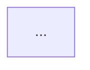
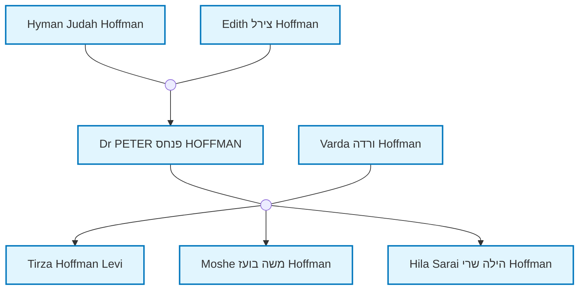

# שבוע 1 - דוח יישום והוראות הרצה

## סיכום מה בוצע

הושלם **שבוע 1** של תוכנית הפיתוח (סעיף 14.1.1 במפרט). הפרויקט מוכן עם:

### ✅ 1. התקנה והגדרה בסיסית
- הותקן Quartz 4 Template בתיקייה `site/`:
  - `git clone https://github.com/sosiristseng/template-quartz.git site`
  - Quartz כ-git submodule (גמיש ומסודר)
- הותקנו תלויות נוספות: `mermaid`, `family-chart`, `@types/node`
- נוצר מבנה תיקיות מלא לפי המפרט

### ✅ 2. מבנה קבצים
```
V4/
├── data/
│   ├── tree.ged                    # קובץ GEDCOM מקורי
│   └── place_mappings.json         # מיפוי מקומות לוויקיפדיה (ריק - לשלב הבא)
├── bios/
│   ├── I3.md                       # ביוגרפיות קיימות
│   └── I10.md
├── site/                          # אתר Quartz
│   ├── content/
│   │   ├── index.md               # דף בית
│   │   ├── profiles/              # פרופילים
│   │   │   ├── People/            # 546 פרופילים אינדיבידואליים!
│   │   │   ├── all-profiles.md
│   │   │   └── profiles-with-bios.md
│   │   ├── pages/                 # דפים סטטיים (עברית + אנגלית)
│   │   │   ├── about_en.md
│   │   │   ├── about_he.md
│   │   │   ├── history_en.md
│   │   │   └── history_he.md
│   │   └── dynamic/               # דפים דינמיים (עברית + אנגלית)
│   │       ├── family-tree_en.md
│   │       ├── family-tree_he.md
│   │       ├── search_en.md
│   │       └── search_he.md
│   ├── quartz.config.ts           # הוגדר עם שם הפרויקט
│   ├── quartz.layout.ts           # הוגדר עם קישורים לדפים
│   └── package.json
├── documents/                     # תיקייה למסמכים (ריקה - לשלב הבא)
├── profile_photos/                # תמונות פרופיל (ריקה - לשלב הבא)
├── comments/                      # הערות משתמשים (ריקה - לשלב הבא)
└── scripts/
    └── doit.py                    # עודכן ומשופר!
```

### ✅ 3. שיפור `doit.py`
הסקריפט עודכן והותאם למבנה החדש:
- **ברירת מחדל חדשה**: פלט ל-`site/content/profiles` במקום `ObsidianVault`
- **תיקיית ביוס**: ברירת מחדל `bios/` ברמת השורש
- **יצירת Frontmatter תקין**: `type: profile`, `title`, `ID`
- **דיאגרמות Mermaid אינטראקטיביות**: 
  - נוצרות אוטומטית לכל פרופיל (משפחה קרובה)
  - **✨ קישורים לחיצים!** כל קודקוד בדיאגרמה לחיץ וניתן לניווט
  - `click` handlers אוטומטיים לכל פרופיל
- **קישורי ויקיפדיה**: למקומות נפוצים (אוסטרליה, ישראל, אירופה)
- **קישורי Obsidian**: [[שמות]] להורים, אחים, בני זוג וילדים

### ✅ 4. תצורת Quartz
**`quartz.config.ts`** עודכן:
- כותרת אתר: "Family History | משפחה"
- BaseURL: localhost:8080 (לפיתוח)
- Locale: en-US

**`quartz.layout.ts`** עודכן:
- קישורי Footer: עץ משפחתי (עברית + אנגלית) ואודות (עברית + אנגלית)

### ✅ 5. יצירת פרופילים
- **546 פרופילים** נוצרו מה-GEDCOM!
- כל פרופיל כולל:
  - Frontmatter (type, title, ID)
  - מידע בסיסי (לידה, פטירה, מקצוע)
  - דיאגרמת Mermaid משפחה קרובה
  - קישורים להורים, אחים, בני זוג וילדים
  - הערות מה-GEDCOM

---

## התקנת Quartz - השיטה שבחרנו

השתמשנו ב-**template-quartz** - template מתקדם שמשתמש ב-Quartz כ-git submodule:

**יתרונות:**
- ✅ Template מסודר ונקי
- ✅ הגדרות טובות מראש
- ✅ מוכן ל-GitHub Pages
- ✅ Quartz כ-submodule = קל לעדכן
- ✅ פחות קבצים מיותרים

**מבנה:**
```
site/
├── content/           # התוכן שלנו (פרופילים, דפים)
├── quartz/            # Quartz submodule
├── quartz.config.ts   # הקונפיגורציה שלנו
└── quartz.layout.ts   # הפריסה שלנו
```

---

## איך להריץ ולבדוק

### 1. ייצור פרופילים מחדש מ-GEDCOM
אם יש עדכונים ב-GEDCOM או רוצים ליצור מחדש:

```powershell
# מתיקיית השורש V4
python scripts/doit.py data/tree.ged
```

הפרופילים ייווצרו ב-`site/content/profiles/People/`

**אפשרויות נוספות:**
```powershell
# שינוי תיקיית פלט
python scripts/doit.py data/tree.ged -o path/to/output

# שינוי תיקיית ביוגרפיות
python scripts/doit.py data/tree.ged --bios-dir path/to/bios

# ניתוח מקומות (לעזרה במיפוי ויקיפדיה)
python scripts/doit.py data/tree.ged --analyze-places
```

### 2. התקנת תלויות (פעם אחת)

```powershell
# הטמפלייט משתמש ב-Quartz כ-submodule, צריך להתקין אותו
cd site
git submodule update --init --recursive
cd quartz
npm install
npm install mermaid family-chart @types/node
```

### 3. בנייה והרצה של Quartz

```powershell
# קודם העתק את הקונפיגורציה
cd site
Copy-Item quartz.config.ts quartz/ -Force
Copy-Item quartz.layout.ts quartz/ -Force

# עכשיו בנה והרץ
cd quartz
npx quartz build --directory ../content --serve
```

האתר יהיה זמין ב: **http://localhost:8080**

### 4. מה לבדוק באתר

✅ **דף בית**: `http://localhost:8080`  
✅ **כל הפרופילים**: `http://localhost:8080/profiles/People/`  
✅ **פרופיל לדוגמה**: `http://localhost:8080/profiles/People/Dr%20PETER%20%D7%A4%D7%A0%D7%97%D7%A1%20HOFFMAN`
- ✅ בדוק שהדיאגרמת Mermaid מוצגת
- ✅ **בדוק שאפשר ללחוץ על קודקודים בדיאגרמה!** 🎯
- ✅ בדוק שקישורי הוויקיפדיה למקומות עובדים
- ✅ בדוק שקישורי Obsidian [[]] להורים/ילדים עובדים

✅ **דפים סטטיים**: 
- אודות (עברית): `http://localhost:8080/pages/about_he`
- About (English): `http://localhost:8080/pages/about_en`

✅ **חיפוש**: השתמש בשדה החיפוש (מימין למעלה) - Quartz מספק חיפוש אוטומטי

---

## בדיקת פרופיל ספציפי

```powershell
# בדיקת פרופיל מסוים (דוגמה: Dr. Peter Hoffman)
cat "site\content\profiles\People\Dr PETER פנחס HOFFMAN.md"
```

תראה:
```markdown
---
type: profile
title: Dr PETER פנחס HOFFMAN
ID: I105
---
**Birth**: November 28, 1946 at [Subiaco, Perth...](https://en.wikipedia.org/wiki/Subiaco,_Western_Australia)
**Death**: December 28, 2024
**Occupation**: medical practitioner, ophthalmologist

**Parents**: [[Hyman Judah Hoffman]]...
```

---

## מה צריך לוודא

### ✅ מבנה קבצים
```powershell
# ספירת פרופילים שנוצרו
(Get-ChildItem -Path "site/content/profiles/People" -Filter "*.md").Count
# אמור להיות 546 + index.md + bios.md = 548
```

### ✅ Frontmatter בפרופילים
כל פרופיל צריך להתחיל ב:
```yaml
---
type: profile
title: [שם]
ID: [Ixxx]
---
```

### ✅ דיאגרמות Mermaid
כל פרופיל צריך לכלול:
```markdown

```

### ✅ קישורי ויקיפדיה
מקומות נפוצים צריכים להיות עם קישור:
- `[Perth, Western Australia, Australia](https://en.wikipedia.org/wiki/Perth,_Western_Australia)`
- `[Rehovot, Israel](https://en.wikipedia.org/wiki/Rehovot)`

### ✅ קישורי Obsidian
קישורים בין פרופילים:
- `[[Hyman Judah Hoffman]]` - להורים
- `[[Tirza Hoffman Levi]]` - לילדים

---

## בעיות נפוצות ופתרונות

### ❌ "Module not found" בעת הרצת Quartz
**פתרון**: ודא שהתקנת את כל התלויות
```powershell
cd site
npm install
```

### ❌ דיאגרמות Mermaid לא מוצגות
**פתרון**: ודא ש-`mermaid` מותקן
```powershell
cd site
npm install mermaid
```

### ❌ קישורי Obsidian לא עובדים
**זה תקין בשלב זה** - Quartz צריך להמיר אותם לקישורי HTML. זה אמור לקרות בבנייה.

### ❌ פרופילים בעברית לא נקראים
**פתרון**: ודא שהקבצים נשמרים ב-UTF-8:
```powershell
# Python כבר מטפל בזה (encoding="utf-8")
```

---

## מה הלאה - שבוע 2

השלבים הבאים מסעיף 14.1.2 במפרט:
1. ✅ רכיב פרופיל משפחתי בסיסי - **כבר יש! (Quartz מטפל)**
2. ⏳ רכיב עץ משפחתי מתקדם - צריך להרחיב את הדיאגרמות
3. ⏳ עיצוב בסיסי - SCSS מותאם אישית
4. ⏳ מערכת טאבים - קורות חיים / תמונות / מסמכים

---

## סיכום תוצאות שבוע 1

| משימה | סטטוס | הערות |
|-------|--------|-------|
| התקנת Quartz 4 | ✅ הושלם | בתיקייה `site/` |
| התקנת תלויות | ✅ הושלם | mermaid, family-chart, @types/node |
| הכנת מבנה קבצים | ✅ הושלם | כל התיקיות והדפים הבסיסיים |
| עדכון doit.py | ✅ הושלם | מותאם למבנה החדש |
| יצירת frontmatter | ✅ הושלם | type, title, ID |
| יצירת דיאגרמות Mermaid | ✅ הושלם | לכל 546 פרופילים |
| הגדרת Quartz config | ✅ הושלם | שם, footer, תצורה בסיסית |
| יצירת פרופילים מ-GEDCOM | ✅ הושלם | 546 פרופילים! |

**הפרויקט מוכן לשבוע 2!** 🎉

---

## נספח: דוגמה לפרופיל מלא

```markdown
---
type: profile
title: Dr PETER פנחס HOFFMAN
ID: I105
---
**Birth**: November 28, 1946 at [Subiaco, Perth, Western Australia, Australia](https://en.wikipedia.org/wiki/Subiaco,_Western_Australia)
**Death**: December 28, 2024
**Occupation**: medical practitioner, ophthalmologist


**Parents**:
[[Hyman Judah Hoffman]]
[[Edith צירל Hoffman]]

**Siblings**:
[[Edward Denis אליהו Hoffman]]
[[Dianne Helen דינה Kemp]]

**Spouse**:
[[Varda ורדה Hoffman]]

**Children**:
[[Tirza Hoffman Levi]]
[[Moshe משה בועז Hoffman]]
[[Hila Sarai הילה שרי Hoffman]]

**Notes**:
Account type: basic
```

---

**תאריך**: אוקטובר 2025  
**גרסה**: 1.0  
**מחבר**: AI Assistant

