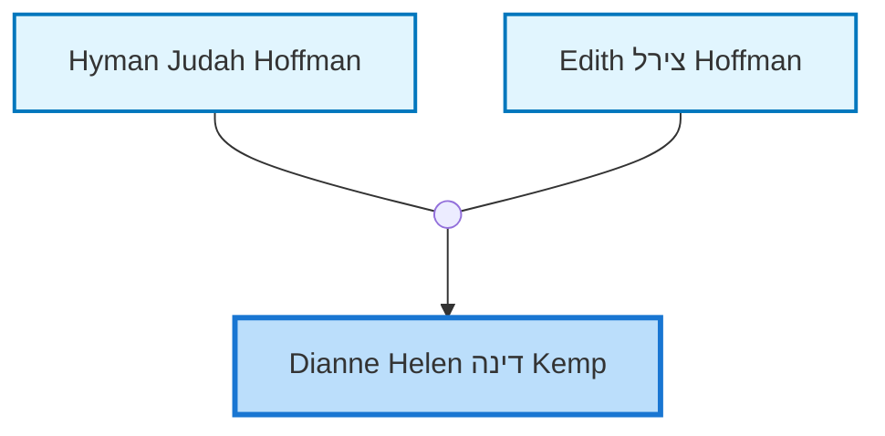
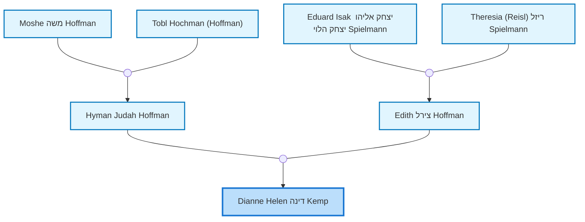

<dl class="profile-info-list">
<dt>Birth:</dt><dd>September 6, 1948 at <a href="https://en.wikipedia.org/wiki/Perth,_Western_Australia">Perth, Western Australia, Australia</a></dd>
<dt>Death:</dt><dd></dd>
<dt>Occupation:</dt><dd>—</dd>
<dt>Parents:</dt><dd><a href="/profiles/Hyman%20Judah%20Hoffman">Hyman Judah Hoffman</a>, <a href="/profiles/Edith%20%D7%A6%D7%99%D7%A8%D7%9C%20Hoffman">Edith צירל Hoffman</a></dd>
<dt>Siblings:</dt><dd><a href="/profiles/Edward%20Denis%20%D7%90%D7%9C%D7%99%D7%94%D7%95%20Hoffman">Edward Denis אליהו Hoffman</a>, <a href="/profiles/Dr%20PETER%20%D7%A4%D7%A0%D7%97%D7%A1%20HOFFMAN">Dr PETER פנחס HOFFMAN</a></dd>
<dt>Spouse:</dt><dd>—</dd>
<dt>Children:</dt><dd>—</dd>
<dt>Notes:</dt><dd>Account type: basic</dd>
</dl>

---

## Nuclear Family

## Ancestors (up to 2 Gen.)

## Descendants (up to 2 Gen.)

