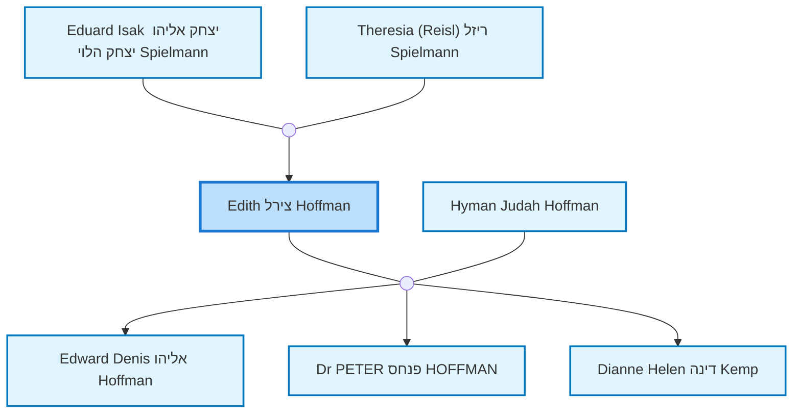
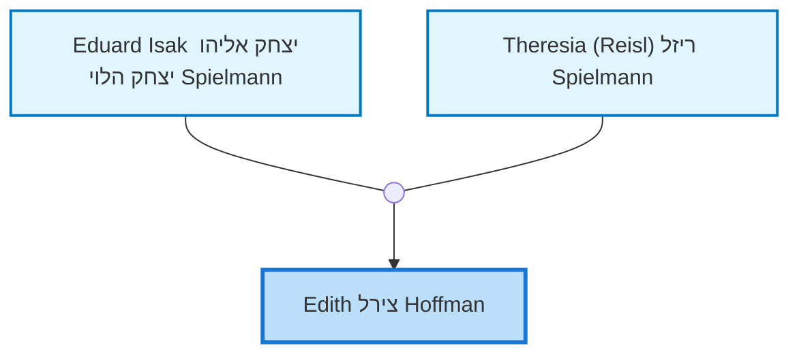
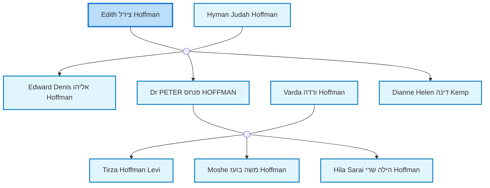

<dl class="profile-info-list">
<dt>Birth:</dt><dd>November 27, 1918 at <a href="https://en.wikipedia.org/wiki/Vienna">Wien, Austria</a></dd>
<dt>Death:</dt><dd>January 2, 2008 at <a href="https://en.wikipedia.org/wiki/Perth,_Western_Australia">Perth, Western Australia, Australia</a></dd>
<dt>Occupation:</dt><dd>—</dd>
<dt>Parents:</dt><dd><a href="/profiles/Eduard%20Isak%20%D7%99%D7%A6%D7%97%D7%A7%20%D7%90%D7%9C%D7%99%D7%94%D7%95%20%D7%99%D7%A6%D7%97%D7%A7%20%D7%94%D7%9C%D7%95%D7%99%20Spielmann">Eduard Isak יצחק אליהו יצחק הלוי Spielmann</a>, <a href="/profiles/Theresia%20%28Reisl%29%20%D7%A8%D7%99%D7%96%D7%9C%20Spielmann">Theresia (Reisl) ריזל Spielmann</a></dd>
<dt>Siblings:</dt><dd><a href="/profiles/Katharina%20K%C3%A4the%20Davis">Katharina Käthe Davis</a>, <a href="/profiles/Josef%20%D7%99%D7%95%D7%A1%D7%A3%20%D7%99%D7%95%D7%A1%D7%A3%20%D7%91%D7%9F%20%D7%90%D7%9C%D7%99%D7%94%D7%95%20%D7%94%D7%9C%D7%95%D7%99%20Spielmann">Josef יוסף יוסף בן אליהו הלוי Spielmann</a>, <a href="/profiles/Karl%20Ha%27im%20%D7%97%D7%99%D7%99%D7%9D%20Spielmann">Karl Ha'im חיים Spielmann</a></dd>
<dt>Spouse:</dt><dd><a href="/profiles/Hyman%20Judah%20Hoffman">Hyman Judah Hoffman</a></dd>
<dt>Children:</dt><dd><a href="/profiles/Edward%20Denis%20%D7%90%D7%9C%D7%99%D7%94%D7%95%20Hoffman">Edward Denis אליהו Hoffman</a>, <a href="/profiles/Dr%20PETER%20%D7%A4%D7%A0%D7%97%D7%A1%20HOFFMAN">Dr PETER פנחס HOFFMAN</a>, <a href="/profiles/Dianne%20Helen%20%D7%93%D7%99%D7%A0%D7%94%20Kemp">Dianne Helen דינה Kemp</a></dd>
<dt>Notes:</dt><dd>Created by: https://www.geni.com/api/user-3443484</dd>
</dl>

---

## Nuclear Family

## Ancestors (up to 2 Gen.)

## Descendants (up to 2 Gen.)

---

## Biography
נולדה בוינה  
** savta **
