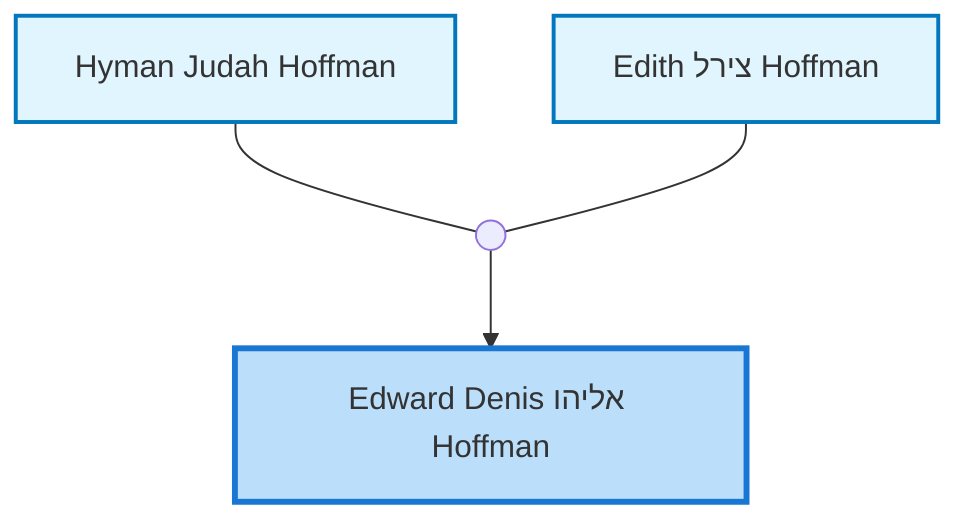
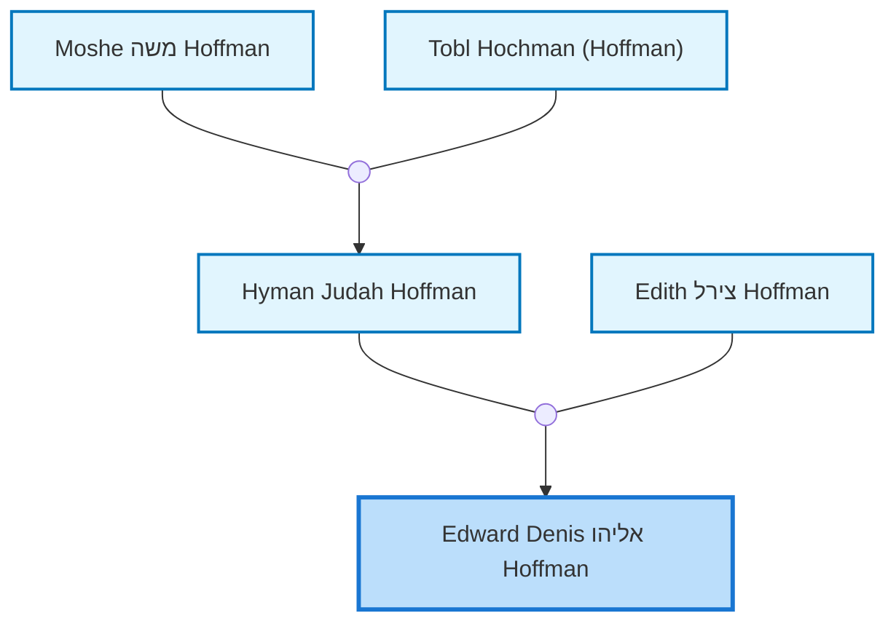
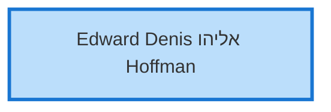

<dl class="profile-info-list">
<dt>Birth:</dt><dd>December 27, 1944</dd>
<dt>Death:</dt><dd>August 20, 2017</dd>
<dt>Occupation:</dt><dd>—</dd>
<dt>Parents:</dt><dd><a href="/profiles/Hyman-Judah-Hoffman">Hyman Judah Hoffman</a>, <a href="/profiles/Edith-%D7%A6%D7%99%D7%A8%D7%9C-Hoffman">Edith צירל Hoffman</a></dd>
<dt>Siblings:</dt><dd><a href="/profiles/Dr-PETER-%D7%A4%D7%A0%D7%97%D7%A1-HOFFMAN">Dr PETER פנחס HOFFMAN</a>, <a href="/profiles/Dianne-Helen-%D7%93%D7%99%D7%A0%D7%94-Kemp">Dianne Helen דינה Kemp</a></dd>
<dt>Spouse:</dt><dd>—</dd>
<dt>Children:</dt><dd>—</dd>
<dt>Notes:</dt><dd>Created by: https://www.geni.com/api/user-3443484</dd>
</dl>

---

## Nuclear Family

## Ancestors (up to 2 Gen.)

## Descendants (up to 2 Gen.)

