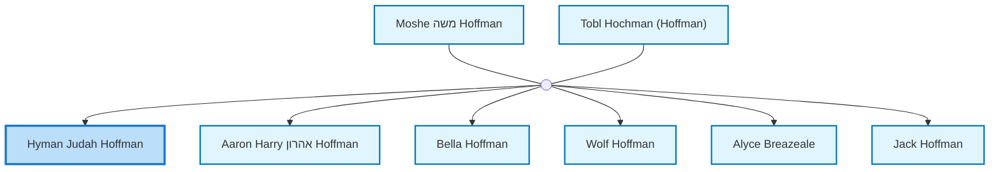
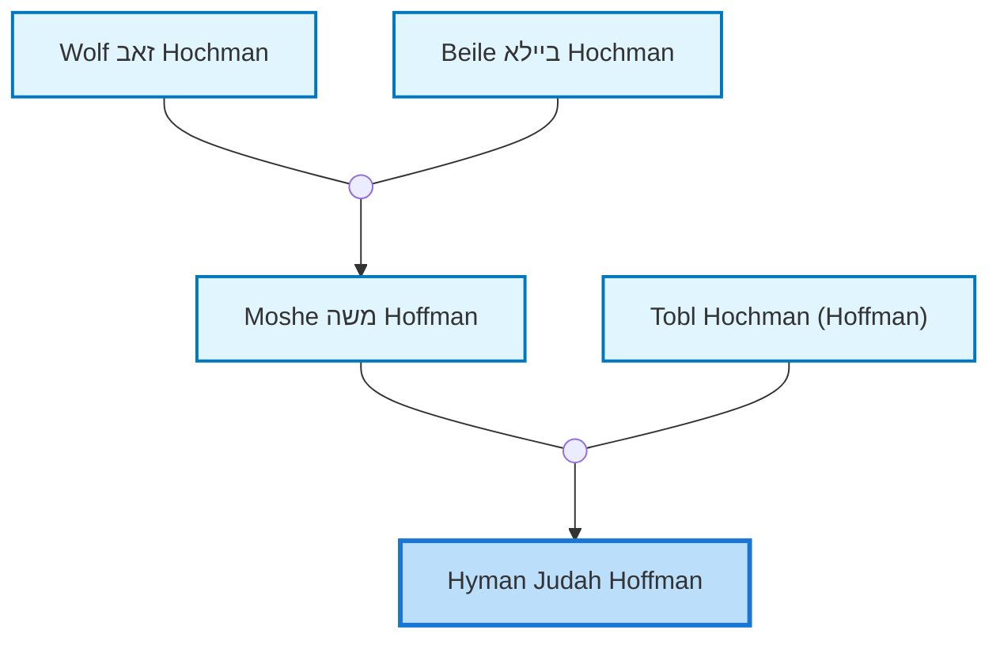
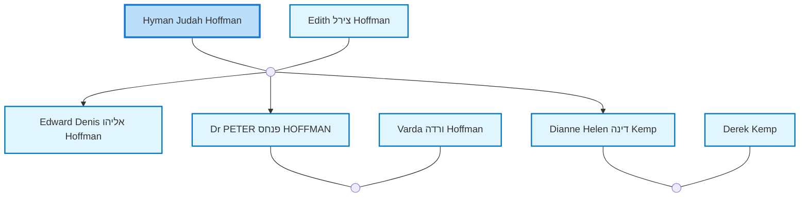

<dl class="profile-info-list">
<dt>Birth:</dt><dd>April 28, 1918 at <a href="https://en.wikipedia.org/wiki/Perth,_Western_Australia">Perth, Australia</a></dd>
<dt>Death:</dt><dd>July 17, 2007 at <a href="https://en.wikipedia.org/wiki/Perth,_Western_Australia">Perth, Australia</a></dd>
<dt>Occupation:</dt><dd>general practitioner, anaesthetist</dd>
<dt>Parents:</dt><dd><a href="/profiles/Moshe-%D7%9E%D7%A9%D7%94-Hoffman">Moshe משה Hoffman</a>, <a href="/profiles/Tobl-Hochman-%28Hoffman%29">Tobl Hochman (Hoffman)</a></dd>
<dt>Siblings:</dt><dd><a href="/profiles/Aaron-Harry-%D7%90%D7%94%D7%A8%D7%95%D7%9F-Hoffman">Aaron Harry אהרון Hoffman</a>, <a href="/profiles/Bella-Hoffman">Bella Hoffman</a>, <a href="/profiles/Wolf-Hoffman">Wolf Hoffman</a>, <a href="/profiles/Alyce-Breazeale">Alyce Breazeale</a>, <a href="/profiles/Jack-Hoffman">Jack Hoffman</a></dd>
<dt>Spouse:</dt><dd><a href="/profiles/Edith-%D7%A6%D7%99%D7%A8%D7%9C-Hoffman">Edith צירל Hoffman</a></dd>
<dt>Children:</dt><dd><a href="/profiles/Edward-Denis-%D7%90%D7%9C%D7%99%D7%94%D7%95-Hoffman">Edward Denis אליהו Hoffman</a>, <a href="/profiles/Dr-PETER-%D7%A4%D7%A0%D7%97%D7%A1-HOFFMAN">Dr PETER פנחס HOFFMAN</a>, <a href="/profiles/Dianne-Helen-%D7%93%D7%99%D7%A0%D7%94-Kemp">Dianne Helen דינה Kemp</a></dd>
<dt>Notes:</dt><dd>Created by: https://www.geni.com/api/user-1188948</dd>
</dl>

---

## Nuclear Family

## Ancestors (up to 2 Gen.)

## Descendants (up to 2 Gen.)

