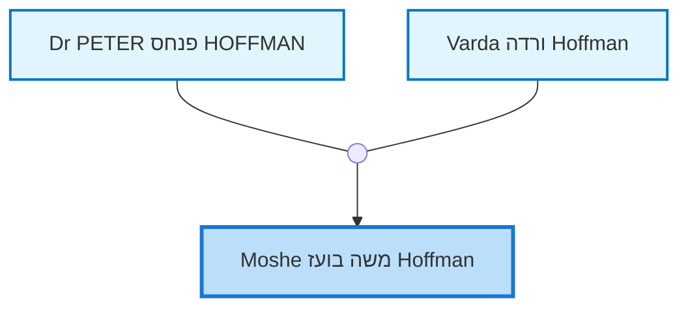
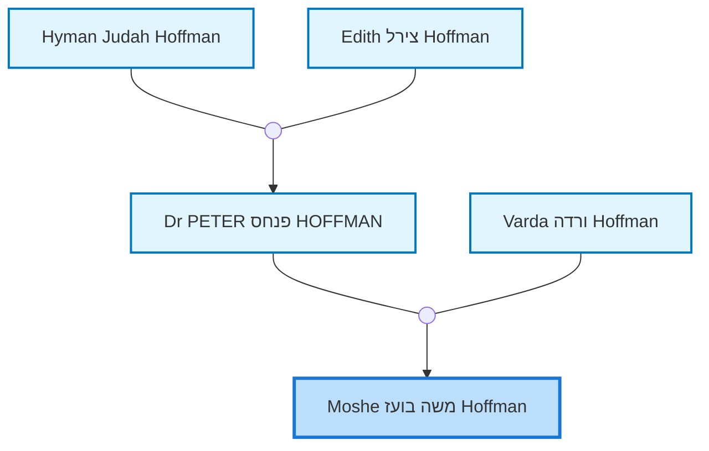

<dl class="profile-info-list">
<dt>Birth:</dt><dd>March 6, 1982 at <a href="https://en.wikipedia.org/wiki/Rehovot">Rehovot, Israel</a></dd>
<dt>Death:</dt><dd></dd>
<dt>Occupation:</dt><dd>M.Sc Tel Aviv Uni</dd>
<dt>Parents:</dt><dd><a href="/profiles/Dr%20PETER%20%D7%A4%D7%A0%D7%97%D7%A1%20HOFFMAN">Dr PETER פנחס HOFFMAN</a>, <a href="/profiles/Varda%20%D7%95%D7%A8%D7%93%D7%94%20Hoffman">Varda ורדה Hoffman</a></dd>
<dt>Siblings:</dt><dd><a href="/profiles/Tirza%20Hoffman%20Levi">Tirza Hoffman Levi</a>, <a href="/profiles/Hila%20Sarai%20%D7%94%D7%99%D7%9C%D7%94%20%D7%A9%D7%A8%D7%99%20Hoffman">Hila Sarai הילה שרי Hoffman</a></dd>
<dt>Spouse:</dt><dd>—</dd>
<dt>Children:</dt><dd>—</dd>
<dt>Notes:</dt><dd>Account type: basic</dd>
</dl>

---

## Nuclear Family

## Ancestors (up to 2 Gen.)

## Descendants (up to 2 Gen.)

