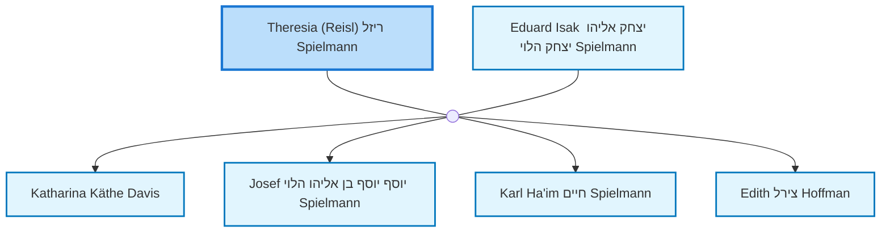
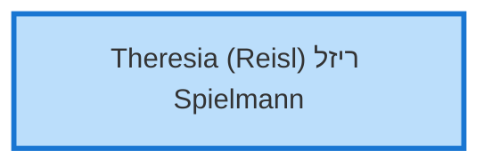
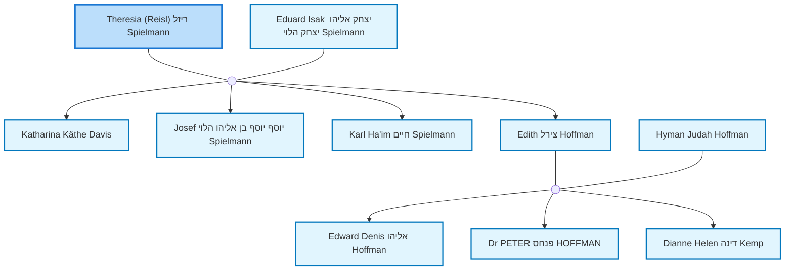

<dl class="profile-info-list">
<dt>Birth:</dt><dd>November 23, 1879 at <a href="https://en.wikipedia.org/wiki/Neunkirchen,_Lower_Austria">Pitten or Schwarzau am Steinfeld, near Neunkirchen, Lower Austria, Austria</a></dd>
<dt>Death:</dt><dd>1961 at <a href="https://en.wikipedia.org/wiki/Perth,_Western_Australia">Perth, WA, Australia</a></dd>
<dt>Occupation:</dt><dd>Seamstress</dd>
<dt>Parents:</dt><dd>—</dd>
<dt>Siblings:</dt><dd>—</dd>
<dt>Spouse:</dt><dd><a href="/profiles/Eduard%20Isak%20%D7%99%D7%A6%D7%97%D7%A7%20%D7%90%D7%9C%D7%99%D7%94%D7%95%20%D7%99%D7%A6%D7%97%D7%A7%20%D7%94%D7%9C%D7%95%D7%99%20Spielmann">Eduard Isak יצחק אליהו יצחק הלוי Spielmann</a></dd>
<dt>Children:</dt><dd><a href="/profiles/Katharina%20K%C3%A4the%20Davis">Katharina Käthe Davis</a>, <a href="/profiles/Josef%20%D7%99%D7%95%D7%A1%D7%A3%20%D7%99%D7%95%D7%A1%D7%A3%20%D7%91%D7%9F%20%D7%90%D7%9C%D7%99%D7%94%D7%95%20%D7%94%D7%9C%D7%95%D7%99%20Spielmann">Josef יוסף יוסף בן אליהו הלוי Spielmann</a>, <a href="/profiles/Karl%20Ha%27im%20%D7%97%D7%99%D7%99%D7%9D%20Spielmann">Karl Ha'im חיים Spielmann</a>, <a href="/profiles/Edith%20%D7%A6%D7%99%D7%A8%D7%9C%20Hoffman">Edith צירל Hoffman</a></dd>
<dt>Notes:</dt><dd>Created by: https://www.geni.com/api/user-1403714</dd>
</dl>

---

## Nuclear Family

## Ancestors (up to 2 Gen.)

## Descendants (up to 2 Gen.)

