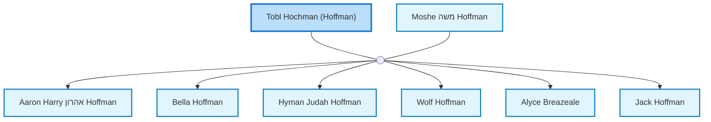
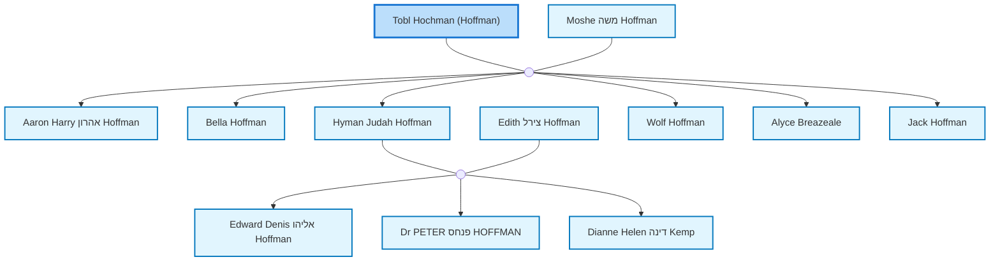

<dl class="profile-info-list">
<dt>Birth:</dt><dd>circa 1888 at <a href="https://en.wikipedia.org/wiki/Bershad">Bershad, Ukraine</a></dd>
<dt>Death:</dt><dd>September 15, 1958 at <a href="https://en.wikipedia.org/wiki/Perth,_Western_Australia">Perth, Australia</a></dd>
<dt>Occupation:</dt><dd>—</dd>
<dt>Parents:</dt><dd>—</dd>
<dt>Siblings:</dt><dd>—</dd>
<dt>Spouse:</dt><dd><a href="/profiles/Moshe%20%D7%9E%D7%A9%D7%94%20Hoffman">Moshe משה Hoffman</a></dd>
<dt>Children:</dt><dd><a href="/profiles/Aaron%20Harry%20%D7%90%D7%94%D7%A8%D7%95%D7%9F%20Hoffman">Aaron Harry אהרון Hoffman</a>, <a href="/profiles/Bella%20Hoffman">Bella Hoffman</a>, <a href="/profiles/Hyman%20Judah%20Hoffman">Hyman Judah Hoffman</a>, <a href="/profiles/Wolf%20Hoffman">Wolf Hoffman</a>, <a href="/profiles/Alyce%20Breazeale">Alyce Breazeale</a>, <a href="/profiles/Jack%20Hoffman">Jack Hoffman</a></dd>
<dt>Notes:</dt><dd>Created by: https://www.geni.com/api/user-1208372</dd>
</dl>

---

## Nuclear Family

## Ancestors (up to 2 Gen.)

## Descendants (up to 2 Gen.)

